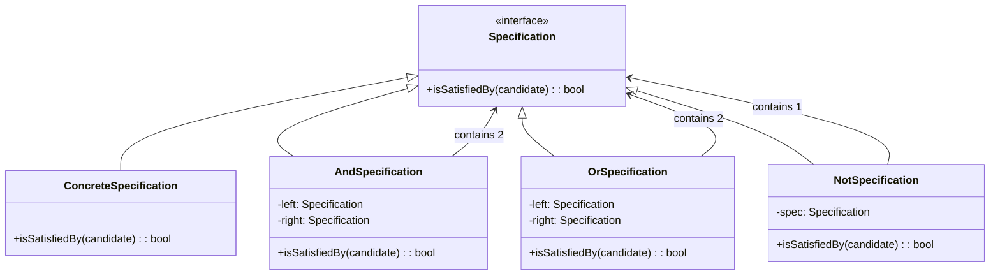

# 📋 Specification Pattern

## Definition

The Specification Pattern encapsulates business rules as objects, allowing rules to be combined through boolean logic and applied to domain objects for filtering, validation, and selection.

## Purpose

- 🎯 **Encapsulate business rules**: Place complex criteria in separate classes
- 🔄 **Improve reusability**: Reuse business rules across different parts of the application
- 🧩 **Enable composition**: Combine specifications using boolean operations (and, or, not)
- 🧪 **Enhance testability**: Test business rules in isolation
- 📝 **Declarative expression**: Express complex rules in a more readable way

## Structure



## Basic Implementation

```php
<?php
// Basic specification interface
interface Specification {
    public function isSatisfiedBy($candidate): bool;
}

// Example concrete specification
class CustomerEmailSpecification implements Specification {
    private $emailDomain;
    
    public function __construct(string $emailDomain) {
        $this->emailDomain = $emailDomain;
    }
    
    public function isSatisfiedBy($candidate): bool {
        if (!$candidate instanceof Customer) {
            return false;
        }
        
        $email = $candidate->getEmail();
        return substr($email, -strlen($this->emailDomain)) === $this->emailDomain;
    }
}

class CustomerPremiumSpecification implements Specification {
    private $minimumPurchaseAmount;
    
    public function __construct(float $minimumPurchaseAmount) {
        $this->minimumPurchaseAmount = $minimumPurchaseAmount;
    }
    
    public function isSatisfiedBy($candidate): bool {
        if (!$candidate instanceof Customer) {
            return false;
        }
        
        return $candidate->getTotalPurchases() >= $this->minimumPurchaseAmount;
    }
}
```

## Composite Specifications

```php
<?php
class AndSpecification implements Specification {
    private $specifications;
    
    public function __construct(Specification ...$specifications) {
        $this->specifications = $specifications;
    }
    
    public function isSatisfiedBy($candidate): bool {
        foreach ($this->specifications as $specification) {
            if (!$specification->isSatisfiedBy($candidate)) {
                return false;
            }
        }
        return true;
    }
}

class OrSpecification implements Specification {
    private $specifications;
    
    public function __construct(Specification ...$specifications) {
        $this->specifications = $specifications;
    }
    
    public function isSatisfiedBy($candidate): bool {
        foreach ($this->specifications as $specification) {
            if ($specification->isSatisfiedBy($candidate)) {
                return true;
            }
        }
        return false;
    }
}

class NotSpecification implements Specification {
    private $specification;
    
    public function __construct(Specification $specification) {
        $this->specification = $specification;
    }
    
    public function isSatisfiedBy($candidate): bool {
        return !$this->specification->isSatisfiedBy($candidate);
    }
}
```

## Usage Example

```php
<?php
// Create domain objects
class Customer {
    private $id;
    private $name;
    private $email;
    private $totalPurchases;
    private $createdAt;
    
    public function __construct(
        string $id, 
        string $name, 
        string $email, 
        float $totalPurchases, 
        DateTime $createdAt
    ) {
        $this->id = $id;
        $this->name = $name;
        $this->email = $email;
        $this->totalPurchases = $totalPurchases;
        $this->createdAt = $createdAt;
    }
    
    // Getters
    public function getEmail(): string {
        return $this->email;
    }
    
    public function getTotalPurchases(): float {
        return $this->totalPurchases;
    }
    
    public function getCreatedAt(): DateTime {
        return $this->createdAt;
    }
    
    public function getName(): string {
        return $this->name;
    }
}

// Create specifications
$premiumCustomerSpec = new CustomerPremiumSpecification(1000);
$corporateEmailSpec = new CustomerEmailSpecification('company.com');

// Create composite specifications
$premiumCorporateSpec = new AndSpecification($premiumCustomerSpec, $corporateEmailSpec);

// Use the specifications
$customers = [
    new Customer('1', 'John Doe', 'john@company.com', 1500, new DateTime('2020-01-15')),
    new Customer('2', 'Jane Smith', 'jane@gmail.com', 2000, new DateTime('2020-03-20')),
    new Customer('3', 'Bob Johnson', 'bob@company.com', 800, new DateTime('2020-05-10')),
];

echo "Premium Corporate Customers:\n";
foreach ($customers as $customer) {
    if ($premiumCorporateSpec->isSatisfiedBy($customer)) {
        echo "- {$customer->getName()}\n";
    }
}

// Using the Not specification
$notPremiumSpec = new NotSpecification($premiumCustomerSpec);
echo "\nNon-Premium Customers:\n";
foreach ($customers as $customer) {
    if ($notPremiumSpec->isSatisfiedBy($customer)) {
        echo "- {$customer->getName()}\n";
    }
}

/* Output:
Premium Corporate Customers:
- John Doe

Non-Premium Customers:
- Bob Johnson
*/
```

## Fluent Interface for Specifications

```php
<?php
// Add methods to the Specification interface for a fluent API
interface Specification {
    public function isSatisfiedBy($candidate): bool;
    
    public function and(Specification $other): Specification;
    public function or(Specification $other): Specification;
    public function not(): Specification;
}

// Base implementation with fluent API
abstract class BaseSpecification implements Specification {
    public function and(Specification $other): Specification {
        return new AndSpecification($this, $other);
    }
    
    public function or(Specification $other): Specification {
        return new OrSpecification($this, $other);
    }
    
    public function not(): Specification {
        return new NotSpecification($this);
    }
}

// Helper factory class for creating specifications
class Spec {
    public static function emailDomain(string $domain): Specification {
        return new CustomerEmailSpecification($domain);
    }
    
    public static function premium(float $amount): Specification {
        return new CustomerPremiumSpecification($amount);
    }
    
    public static function recentlyJoined(int $daysAgo): Specification {
        return new CustomerRecentlyJoinedSpecification($daysAgo);
    }
}

// Usage with fluent interface
$premiumCorporateSpec = Spec::premium(1000)
    ->and(Spec::emailDomain('company.com'));

$specialOffersSpec = Spec::premium(500)
    ->or(Spec::recentlyJoined(30))
    ->and(Spec::emailDomain('gmail.com')->not());

/* Usage:
$eligibleCustomers = [];
foreach ($customers as $customer) {
    if ($specialOffersSpec->isSatisfiedBy($customer)) {
        $eligibleCustomers[] = $customer;
    }
}
*/
```

## Query Specifications

```php
<?php
interface QuerySpecification extends Specification {
    public function toSql(): string;
    public function getParameters(): array;
}

class CustomerRepository {
    private $pdo;
    
    public function __construct(PDO $pdo) {
        $this->pdo = $pdo;
    }
    
    public function findBySpecification(QuerySpecification $spec): array {
        $sql = "SELECT * FROM customers WHERE " . $spec->toSql();
        $stmt = $this->pdo->prepare($sql);
        $stmt->execute($spec->getParameters());
        
        $customers = [];
        while ($row = $stmt->fetch(PDO::FETCH_ASSOC)) {
            $customers[] = $this->createCustomerFromRow($row);
        }
        
        return $customers;
    }
    
    private function createCustomerFromRow(array $row): Customer {
        return new Customer(
            $row['id'],
            $row['name'],
            $row['email'],
            $row['total_purchases'],
            new DateTime($row['created_at'])
        );
    }
}

class CustomerEmailQuerySpecification extends BaseSpecification implements QuerySpecification {
    private $emailDomain;
    
    public function __construct(string $emailDomain) {
        $this->emailDomain = $emailDomain;
    }
    
    public function isSatisfiedBy($candidate): bool {
        // Implementation as before
    }
    
    public function toSql(): string {
        return "email LIKE :emailPattern";
    }
    
    public function getParameters(): array {
        return ['emailPattern' => '%@' . $this->emailDomain];
    }
}

// Usage
$repository = new CustomerRepository($pdo);
$corpEmailSpec = new CustomerEmailQuerySpecification('company.com');
$corporateCustomers = $repository->findBySpecification($corpEmailSpec);

/* Output (SQL generated):
SELECT * FROM customers WHERE email LIKE :emailPattern
Parameters: ['emailPattern' => '%@company.com']
*/
```

## Real-world Example: Discount Rules

```php
<?php
interface DiscountSpecification extends Specification {
    public function getDiscountPercentage(): float;
}

abstract class BaseDiscountSpecification extends BaseSpecification implements DiscountSpecification {
    protected $percentage;
    
    public function __construct(float $percentage) {
        $this->percentage = $percentage;
    }
    
    public function getDiscountPercentage(): float {
        return $this->percentage;
    }
}

class PremiumCustomerDiscountSpecification extends BaseDiscountSpecification {
    private $minimumPurchaseAmount;
    
    public function __construct(float $percentage, float $minimumPurchaseAmount) {
        parent::__construct($percentage);
        $this->minimumPurchaseAmount = $minimumPurchaseAmount;
    }
    
    public function isSatisfiedBy($candidate): bool {
        return $candidate instanceof Customer && 
               $candidate->getTotalPurchases() >= $this->minimumPurchaseAmount;
    }
}

class DiscountCalculator {
    private $specifications = [];
    
    public function addDiscountSpecification(DiscountSpecification $spec): void {
        $this->specifications[] = $spec;
    }
    
    public function calculateDiscount(Customer $customer): float {
        $highestDiscount = 0;
        
        foreach ($this->specifications as $spec) {
            if ($spec->isSatisfiedBy($customer)) {
                $discount = $spec->getDiscountPercentage();
                $highestDiscount = max($highestDiscount, $discount);
            }
        }
        
        return $highestDiscount;
    }
}

// Usage
$calculator = new DiscountCalculator();
$calculator->addDiscountSpecification(
    new PremiumCustomerDiscountSpecification(0.10, 1000) // 10% discount
);

$customer = new Customer('1', 'John Doe', 'john@company.com', 1500, new DateTime());
$discount = $calculator->calculateDiscount($customer);

echo "Customer {$customer->getName()} qualifies for a " . ($discount * 100) . "% discount";

/* Output:
Customer John Doe qualifies for a 10% discount
*/
```

## Benefits of Specification Pattern

1. **✅ Single Responsibility Principle**: Each specification does one thing well
2. **✅ Open/Closed Principle**: Add new specifications without modifying existing code
3. **✅ Reusability**: Reuse specifications across different parts of the application
4. **✅ Composability**: Build complex rules from simple ones
5. **✅ Expressiveness**: Business rules become more explicit and readable
6. **✅ Testability**: Test each specification in isolation

## When to Use Specifications

Specifications are particularly useful for:

1. **🔍 Complex search operations**: When users need to perform searches with multiple filters
2. **⚙️ Business rule engines**: When rules are complex and need to be composed
3. **✓ Validation**: When validation rules can be reused across the application
4. **🔒 Access control**: When permissions are complex and context-dependent
5. **📊 Reporting**: When reports need to filter data based on various criteria

## When Not to Use Specifications

Specifications might not be the best choice when:

1. **🔄 Simple conditional logic**: For very simple conditions, direct if-statements are clearer
2. **🔄 No reuse potential**: If a rule is used in just one place
3. **⚡ Performance-critical code**: The pattern adds some overhead
4. **🧱 Static, unchanging rules**: When rules don't change and don't need to be composed

## Up Next

Learn about the [Data Transfer Object Pattern](./11-data-transfer-object.md), which helps move data between system layers efficiently.

[Back to Enterprise Patterns](./README.md) | [Previous: Dependency Injection Container](./09-dependency-injection-container.md) | [Next: Data Transfer Object](./11-data-transfer-object.md)
