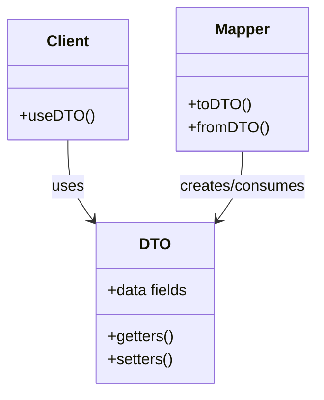

# 📦 Data Transfer Object Pattern (DTO)

## Intent

The Data Transfer Object (DTO) pattern is used to transfer data between software application subsystems, providing a simple container for moving data across boundaries with minimal logic.

## Problem It Solves

- 🔄 Multiple network calls between layers causing performance issues
- 🧩 Coupling between domain models and presentation layers
- 🌐 Need for simplified data structures for API responses/requests
- 📊 Complex data mapping between different system parts
- 🛡️ Domain model exposure to presentation layers

## Structure



## Implementation in PHP

### Basic DTO Example

```php
<?php
// A simple DTO for User data
class UserDTO {
    private $id;
    private $name;
    private $email;
    private $createdAt;
    
    public function __construct(
        ?int $id, 
        string $name, 
        string $email, 
        ?DateTime $createdAt = null
    ) {
        $this->id = $id;
        $this->name = $name;
        $this->email = $email;
        $this->createdAt = $createdAt ?? new DateTime();
    }
    
    // Getters
    public function getId(): ?int {
        return $this->id;
    }
    
    public function getName(): string {
        return $this->name;
    }
    
    public function getEmail(): string {
        return $this->email;
    }
    
    public function getCreatedAt(): DateTime {
        return $this->createdAt;
    }
    
    // Create from array (useful for API/form data)
    public static function fromArray(array $data): self {
        return new self(
            $data['id'] ?? null,
            $data['name'] ?? '',
            $data['email'] ?? '',
            isset($data['created_at']) ? new DateTime($data['created_at']) : null
        );
    }
    
    // Convert to array (useful for API responses)
    public function toArray(): array {
        return [
            'id' => $this->id,
            'name' => $this->name,
            'email' => $this->email,
            'created_at' => $this->createdAt->format('Y-m-d H:i:s')
        ];
    }
}
```

### Domain Model and Mapper

```php
<?php
// Domain model for User (with business logic and persistence)
class User {
    private $id;
    private $name;
    private $email;
    private $password;
    private $createdAt;
    private $updatedAt;
    private $lastLoginAt;
    private $status;
    
    // Business methods
    public function isActive(): bool {
        return $this->status === 'active';
    }
    
    public function recordLogin(): void {
        $this->lastLoginAt = new DateTime();
    }
    
    // Getters and setters...
}

// Mapper to transform between User and UserDTO
class UserMapper {
    public function toDTO(User $user): UserDTO {
        return new UserDTO(
            $user->getId(),
            $user->getName(),
            $user->getEmail(),
            $user->getCreatedAt()
        );
    }
    
    public function fromDTO(UserDTO $dto): User {
        $user = new User();
        $user->setName($dto->getName());
        $user->setEmail($dto->getEmail());
        // Note: we don't set sensitive fields like password from DTOs
        return $user;
    }
    
    // Map a collection of users to DTOs
    public function toDTOList(array $users): array {
        return array_map(
            fn($user) => $this->toDTO($user), 
            $users
        );
    }
}
```

### Usage in Controllers/Services

```php
<?php
// Example usage in a controller or service
class UserController {
    private $userService;
    private $userMapper;
    
    public function __construct(UserService $userService, UserMapper $userMapper) {
        $this->userService = $userService;
        $this->userMapper = $userMapper;
    }
    
    public function getUserProfile(int $userId): array {
        // Fetch user from repository/database
        $user = $this->userService->findUserById($userId);
        
        if (!$user) {
            return ['error' => 'User not found'];
        }
        
        // Convert to DTO and then to array for API response
        $userDTO = $this->userMapper->toDTO($user);
        return $userDTO->toArray();
    }
    
    public function createUser(array $userData): array {
        // Create DTO from request data
        $userDTO = UserDTO::fromArray($userData);
        
        // Create domain object from DTO
        $user = $this->userMapper->fromDTO($userDTO);
        
        // Save user
        $this->userService->saveUser($user);
        
        // Return DTO with generated ID
        $savedUserDTO = $this->userMapper->toDTO($user);
        return $savedUserDTO->toArray();
    }
}

/* Output (API Response):
{
    "id": 123,
    "name": "John Doe",
    "email": "john@example.com",
    "created_at": "2023-08-10 15:30:45"
}
*/
```

## Specialized DTO Types

### Read Models/Query DTOs

```php
<?php
// Read model DTO for a product listing page
class ProductListingDTO {
    public $id;
    public $name;
    public $price;
    public $imageUrl;
    public $averageRating;
}

// Read model DTO for product details page (more comprehensive)
class ProductDetailsDTO {
    public $id;
    public $name;
    public $description;
    public $price;
    public $category;
    public $specifications;
    public $images;
    public $reviews;
    public $relatedProducts;
}

// Query service that returns DTOs rather than domain objects
class ProductQueryService {
    private $connection;
    
    public function getProductListing(int $page, int $limit): array {
        $offset = ($page - 1) * $limit;
        
        $query = "SELECT p.id, p.name, p.price, p.image_url, 
                AVG(r.rating) as avg_rating
                FROM products p
                LEFT JOIN reviews r ON p.id = r.product_id
                GROUP BY p.id
                LIMIT $limit OFFSET $offset";
                
        $products = [];
        $result = $this->connection->query($query);
        
        while ($row = $result->fetch()) {
            $dto = new ProductListingDTO();
            $dto->id = $row['id'];
            $dto->name = $row['name'];
            $dto->price = $row['price'];
            $dto->imageUrl = $row['image_url'];
            $dto->averageRating = $row['avg_rating'];
            $products[] = $dto;
        }
        
        return $products;
    }
}

/* Output (Product listing):
[
    {
        "id": 1,
        "name": "Smartphone X",
        "price": 599.99,
        "imageUrl": "/images/smartphone-x.jpg",
        "averageRating": 4.5
    },
    // More products...
]
*/
```

### Immutable DTOs

```php
<?php
// Immutable DTO
final class OrderDTO {
    private $id;
    private $customerName;
    private $totalAmount;
    private $status;
    private $items;
    
    public function __construct(
        ?int $id, 
        string $customerName, 
        float $totalAmount, 
        string $status,
        array $items
    ) {
        $this->id = $id;
        $this->customerName = $customerName;
        $this->totalAmount = $totalAmount;
        $this->status = $status;
        $this->items = $items;
    }
    
    // Only getters, no setters
    public function getId(): ?int {
        return $this->id;
    }
    
    public function getCustomerName(): string {
        return $this->customerName;
    }
    
    public function getTotalAmount(): float {
        return $this->totalAmount;
    }
    
    public function getStatus(): string {
        return $this->status;
    }
    
    public function getItems(): array {
        // Return a copy to maintain immutability
        return array_map(fn($item) => clone $item, $this->items);
    }
    
    // Methods to create modified copies
    public function withStatus(string $newStatus): self {
        return new self(
            $this->id,
            $this->customerName,
            $this->totalAmount,
            $newStatus,
            $this->items
        );
    }
}

// Immutable Item DTO
final class OrderItemDTO {
    private $id;
    private $productName;
    private $quantity;
    private $unitPrice;
    
    public function __construct(
        ?int $id, 
        string $productName, 
        int $quantity, 
        float $unitPrice
    ) {
        $this->id = $id;
        $this->productName = $productName;
        $this->quantity = $quantity;
        $this->unitPrice = $unitPrice;
    }
    
    // Only getters
    public function getId(): ?int {
        return $this->id;
    }
    
    public function getProductName(): string {
        return $this->productName;
    }
    
    public function getQuantity(): int {
        return $this->quantity;
    }
    
    public function getUnitPrice(): float {
        return $this->unitPrice;
    }
    
    public function getSubtotal(): float {
        return $this->quantity * $this->unitPrice;
    }
}

// Usage example
$items = [
    new OrderItemDTO(1, "Laptop", 1, 999.99),
    new OrderItemDTO(2, "Mouse", 1, 24.99)
];

$orderDTO = new OrderDTO(null, "John Doe", 1024.98, "pending", $items);
$updatedOrderDTO = $orderDTO->withStatus("shipped");

echo "Original status: " . $orderDTO->getStatus() . "\n";
echo "Updated status: " . $updatedOrderDTO->getStatus() . "\n";

/* Output:
Original status: pending
Updated status: shipped
*/
```

## Benefits

- ✅ **Data Structure Clarity**: Provides explicit data structure definition
- ✅ **Reduced Network Traffic**: Minimizes data transfers between systems
- ✅ **Decoupling**: Separates domain models from external interfaces
- ✅ **API Versioning**: Simplifies maintaining multiple API versions
- ✅ **Security**: Controls what data is exposed to external layers
- ✅ **Validation**: Can centralize input validation on boundaries

## Considerations

- ⚠️ **Code Duplication**: Can lead to similar structures in domain and DTOs
- ⚠️ **Mapping Overhead**: Requires extra code for mapping between objects
- ⚠️ **Maintenance**: Changes might need to be reflected in multiple places
- ⚠️ **Complexity**: Adds extra classes to the project

## Best Practices

- 🎯 **Keep DTOs Simple**: Avoid business logic in DTOs
- 🔄 **Use Mappers**: Create dedicated mapper classes for transformations
- 🛡️ **Protect Domain Logic**: Don't expose domain objects directly in APIs
- 📝 **Documentation**: Document the purpose of each DTO type
- 🧩 **Purpose-Specific DTOs**: Create specific DTOs for different use cases

## When to Use DTOs

- 🌐 When transferring data across system boundaries (API, RPC)
- 📱 For mobile applications with limited bandwidth
- 🏢 In enterprise systems with complex domain models
- 📊 When the view needs data from multiple domain objects
- 🔄 When input/output data structure differs from domain model

## Up Next

Learn about the [Lazy Loading Pattern](./12-lazy-loading.md), which helps optimize resource usage by loading data only when needed.

[Back to Enterprise Patterns](./README.md) | [Previous: Specification Pattern](./10-specification-pattern.md) | [Next: Lazy Loading](./12-lazy-loading.md)
