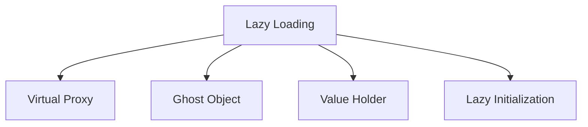

# ⏰ Lazy Loading Pattern

## Intent

The Lazy Loading pattern defers initialization of an object until the point at which it is needed, improving performance and resource utilization by loading data only when necessary.

## Problem It Solves

- 🐢 Slow application startup time due to loading unnecessary data
- 📈 High memory consumption from unused objects
- 🔄 Performance bottlenecks in resource-intensive operations
- 🔗 Costly database or network operations that may not be needed

## Types of Lazy Loading



## Implementation Examples

### 1. Lazy Initialization

```php
<?php
class Product {
    private $id;
    private $name;
    private $price;
    private $details = null; // Lazily loaded
    private $productRepository;
    
    public function __construct(
        int $id, 
        string $name, 
        float $price,
        ProductRepository $productRepository
    ) {
        $this->id = $id;
        $this->name = $name;
        $this->price = $price;
        $this->productRepository = $productRepository;
    }
    
    public function getDetails(): array {
        // Load details only when requested
        if ($this->details === null) {
            echo "Loading product details from database...\n";
            $this->details = $this->productRepository->loadProductDetails($this->id);
        }
        
        return $this->details;
    }
}

// Usage
$product = new Product(1, "Laptop", 999.99, $repository);
echo "Product: {$product->name}, Price: \${$product->price}\n";

// Details are loaded only when explicitly requested
$details = $product->getDetails();

/* Output:
Product: Laptop, Price: $999.99
Loading product details from database...
*/
```

### 2. Virtual Proxy

```php
<?php
interface Image {
    public function display(): void;
    public function getWidth(): int;
    public function getHeight(): int;
}

class RealImage implements Image {
    private $filename;
    private $width;
    private $height;
    
    public function __construct(string $filename) {
        $this->filename = $filename;
        $this->loadImageFromDisk();
    }
    
    private function loadImageFromDisk(): void {
        echo "Loading image from disk: {$this->filename}\n";
        // Simulate loading image and getting dimensions
        $this->width = 800;
        $this->height = 600;
    }
    
    public function display(): void {
        echo "Displaying image: {$this->filename}\n";
    }
    
    public function getWidth(): int {
        return $this->width;
    }
    
    public function getHeight(): int {
        return $this->height;
    }
}

class ProxyImage implements Image {
    private $filename;
    private $realImage = null;
    
    public function __construct(string $filename) {
        $this->filename = $filename;
    }
    
    public function display(): void {
        // Load the image only when display is called
        $this->getRealImage()->display();
    }
    
    public function getWidth(): int {
        return $this->getRealImage()->getWidth();
    }
    
    public function getHeight(): int {
        return $this->getRealImage()->getHeight();
    }
    
    private function getRealImage(): Image {
        if ($this->realImage === null) {
            $this->realImage = new RealImage($this->filename);
        }
        
        return $this->realImage;
    }
}

// Usage
$gallery = [
    new ProxyImage("image1.jpg"),
    new ProxyImage("image2.jpg"),
    new ProxyImage("image3.jpg")
];

// Images aren't loaded until displayed
echo "Gallery created with " . count($gallery) . " images\n";

// Only the first image is loaded and displayed
$gallery[0]->display();

/* Output:
Gallery created with 3 images
Loading image from disk: image1.jpg
Displaying image: image1.jpg
*/
```

### 3. Ghost Object

```php
<?php
class GhostCustomer {
    private $id;
    private $loaded = false;
    private $name;
    private $email;
    private $address;
    private $customerRepository;
    
    public function __construct(int $id, CustomerRepository $customerRepository) {
        $this->id = $id;
        $this->customerRepository = $customerRepository;
    }
    
    public function getId(): int {
        return $this->id;
    }
    
    public function getName(): string {
        $this->loadIfNeeded();
        return $this->name;
    }
    
    public function getEmail(): string {
        $this->loadIfNeeded();
        return $this->email;
    }
    
    public function getAddress(): string {
        $this->loadIfNeeded();
        return $this->address;
    }
    
    private function loadIfNeeded(): void {
        if (!$this->loaded) {
            echo "Loading customer data for ID: {$this->id}\n";
            $data = $this->customerRepository->findById($this->id);
            $this->name = $data['name'];
            $this->email = $data['email'];
            $this->address = $data['address'];
            $this->loaded = true;
        }
    }
}

// Usage
$customer = new GhostCustomer(42, $repository);

// No data loaded yet
echo "Customer ID: {$customer->getId()}\n";

// Now data will be loaded
echo "Customer name: {$customer->getName()}\n";
echo "Customer email: {$customer->getEmail()}\n";

/* Output:
Customer ID: 42
Loading customer data for ID: 42
Customer name: John Doe
Customer email: john@example.com
*/
```

### 4. Value Holder

```php
<?php
class ValueHolder {
    private $value = null;
    private $loader;
    
    public function __construct(callable $loader) {
        $this->loader = $loader;
    }
    
    public function getValue() {
        if ($this->value === null) {
            $loader = $this->loader;
            $this->value = $loader();
        }
        
        return $this->value;
    }
}

class OrderService {
    private $customerHolder;
    private $productsHolder;
    
    public function __construct(int $customerId, int $orderId) {
        // Create value holders with loaders
        $this->customerHolder = new ValueHolder(function() use ($customerId) {
            echo "Loading customer data...\n";
            return $this->loadCustomerById($customerId);
        });
        
        $this->productsHolder = new ValueHolder(function() use ($orderId) {
            echo "Loading order products...\n";
            return $this->loadOrderProducts($orderId);
        });
    }
    
    public function getOrderSummary(): array {
        // Get customer name (triggers customer loading)
        $customer = $this->customerHolder->getValue();
        
        return [
            'customer_name' => $customer['name'],
            'product_count' => count($this->productsHolder->getValue())
        ];
    }
    
    public function getOrderTotal(): float {
        // Calculate total from products (triggers products loading)
        $total = 0;
        foreach ($this->productsHolder->getValue() as $product) {
            $total += $product['price'] * $product['quantity'];
        }
        return $total;
    }
    
    private function loadCustomerById(int $id): array {
        // In real app, this would query a database
        return ['id' => $id, 'name' => 'Jane Smith', 'email' => 'jane@example.com'];
    }
    
    private function loadOrderProducts(int $orderId): array {
        // In real app, this would query a database
        return [
            ['id' => 1, 'name' => 'Laptop', 'price' => 999.99, 'quantity' => 1],
            ['id' => 2, 'name' => 'Mouse', 'price' => 24.99, 'quantity' => 1]
        ];
    }
}

// Usage
$orderService = new OrderService(42, 123);

// This only loads customer data
$summary = $orderService->getOrderSummary();
echo "Order for: {$summary['customer_name']}, Products: {$summary['product_count']}\n";

// This only loads product data
$total = $orderService->getOrderTotal();
echo "Order total: \${$total}\n";

/* Output:
Loading customer data...
Order for: Jane Smith, Products: 2
Loading order products...
Order total: $1024.98
*/
```

## Lazy Loading in ORMs

### Doctrine ORM Example

```php
<?php
/**
 * @Entity
 * @Table(name="products")
 */
class Product {
    /**
     * @Id
     * @GeneratedValue
     * @Column(type="integer")
     */
    private $id;
    
    /**
     * @Column(type="string")
     */
    private $name;
    
    /**
     * @Column(type="decimal", scale=2)
     */
    private $price;
    
    /**
     * @OneToMany(targetEntity="Review", mappedBy="product", fetch="LAZY")
     */
    private $reviews;
    
    /**
     * @ManyToOne(targetEntity="Category", fetch="EAGER")
     */
    private $category;
    
    // Constructor & methods...
}

// Usage
$product = $entityManager->find(Product::class, 1);

// Category is loaded immediately (EAGER)
echo "Product: {$product->getName()}, Category: {$product->getCategory()->getName()}\n";

// Reviews are loaded only when accessed (LAZY)
echo "This product has " . count($product->getReviews()) . " reviews\n";

/* Output:
SELECT p0_.id, p0_.name, p0_.price, p0_.category_id FROM products p0_ WHERE p0_.id = ?
SELECT c0_.id, c0_.name FROM categories c0_ WHERE c0_.id = ?
Product: Laptop, Category: Electronics
SELECT r0_.id, r0_.content, r0_.rating, r0_.product_id FROM reviews r0_ WHERE r0_.product_id = ?
This product has 3 reviews
*/
```

## Benefits

- ✅ **Improved Startup Time**: Application loads faster by deferring resource-intensive operations
- ✅ **Reduced Memory Usage**: Only needed objects are loaded into memory
- ✅ **Better Resource Utilization**: Resources are used only when needed
- ✅ **Enhanced User Experience**: Critical functionality is available sooner
- ✅ **Optimized Network/Database Usage**: Reduces unnecessary data fetching

## Considerations

- ⚠️ **Complexity**: Adds complexity to the codebase
- ⚠️ **Debugging**: Can make debugging more difficult
- ⚠️ **Hidden Costs**: May cause unexpected delays when lazy-loaded objects are accessed
- ⚠️ **Thread Safety**: Care needed in multi-threaded environments

## When to Use

- 🚀 When loading data has significant performance costs
- 📱 For mobile or memory-constrained applications
- 🌐 In distributed systems with network latency
- 📊 For large datasets that may not be entirely needed
- 🧩 When some features are rarely used by most users

## Up Next

Learn about the [Circuit Breaker Pattern](./13-circuit-breaker.md), which helps prevent cascading failures in distributed systems.

[Back to Enterprise Patterns](./README.md) | [Previous: Data Transfer Object](./11-data-transfer-object.md) | [Next: Circuit Breaker](./13-circuit-breaker.md)
