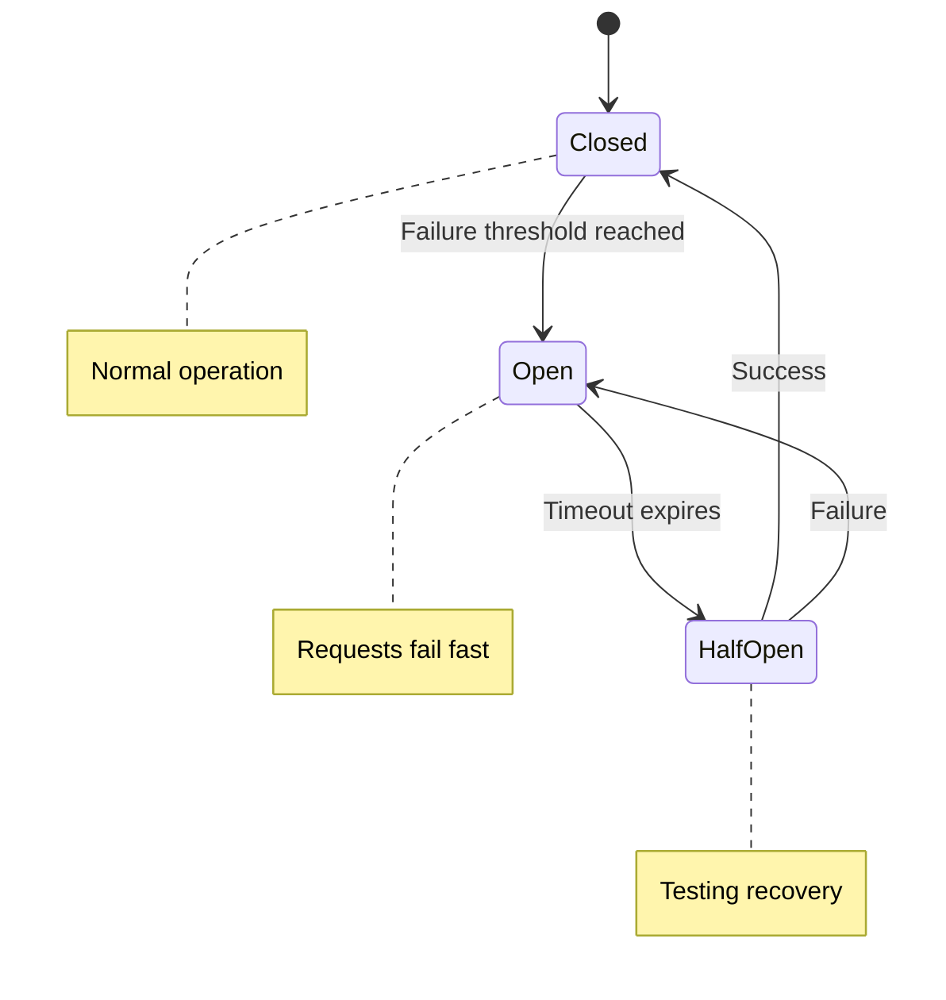

# 🔌 Circuit Breaker Pattern

## Intent

The Circuit Breaker pattern prevents cascading failures in distributed systems by detecting failures and encapsulating the logic of preventing a failure from constantly recurring.

## Problem It Solves

- 🔄 Repeated calls to failing services causing performance degradation
- ⏱️ Resource exhaustion from waiting for unresponsive services
- 🌋 Cascading failures across multiple services
- 🧩 Lack of graceful degradation during partial system failures

## How It Works



## Implementation

```php
<?php
class CircuitBreaker {
    private $failureThreshold;
    private $resetTimeout;
    private $state = 'CLOSED';
    private $failures = 0;
    private $lastFailureTime;
    
    public function __construct(int $failureThreshold = 5, int $resetTimeout = 30) {
        $this->failureThreshold = $failureThreshold;
        $this->resetTimeout = $resetTimeout;
    }
    
    public function execute(callable $operation, callable $fallback = null) {
        if (!$this->canExecute()) {
            return $fallback ? $fallback() : throw new Exception("Circuit open");
        }
        
        try {
            $result = $operation();
            $this->recordSuccess();
            return $result;
        } catch (Exception $e) {
            $this->recordFailure();
            return $fallback ? $fallback() : throw $e;
        }
    }
    
    private function canExecute(): bool {
        if ($this->state === 'CLOSED') {
            return true;
        }
        
        if ($this->state === 'OPEN') {
            // Check if timeout has elapsed and we should try again
            $now = time();
            if ($now - $this->lastFailureTime >= $this->resetTimeout) {
                $this->state = 'HALF-OPEN';
                return true;
            }
            return false;
        }
        
        // HALF-OPEN state allows one request through
        return true;
    }
    
    private function recordSuccess(): void {
        $this->failures = 0;
        $this->state = 'CLOSED';
    }
    
    private function recordFailure(): void {
        $this->failures++;
        $this->lastFailureTime = time();
        
        if ($this->state === 'HALF-OPEN' || $this->failures >= $this->failureThreshold) {
            $this->state = 'OPEN';
        }
    }
    
    public function getState(): string {
        return $this->state;
    }
}
```

## Usage Example

```php
<?php
$breaker = new CircuitBreaker(3, 10);
$api = new ExternalApiClient();

function getUserData($userId) {
    global $breaker, $api;
    
    return $breaker->execute(
        // Normal operation
        function() use ($api, $userId) {
            return $api->fetchUserData($userId);
        },
        // Fallback operation
        function() use ($userId) {
            return [
                'id' => $userId,
                'name' => 'Unknown User',
                'status' => 'cached'
            ];
        }
    );
}

// Usage
try {
    $userData = getUserData(123);
    echo "User: {$userData['name']}\n";
} catch (Exception $e) {
    echo "Error: {$e->getMessage()}\n";
}

/* Output in different scenarios:
Success: "User: John Doe"
After failures: "User: Unknown User"
*/
```

## Benefits

- ✅ **Fail Fast**: Prevents wasting resources on requests likely to fail
- ✅ **Self-Healing**: Automatically tests recovery through half-open state
- ✅ **Graceful Degradation**: Provides fallback mechanisms
- ✅ **System Protection**: Limits cascading failures across services
- ✅ **Visibility**: Makes failure states explicit and trackable

## Real-world Example: HTTP Service Client

```php
<?php
class ResilientHttpClient {
    private $breakers = [];
    private $client;
    
    public function __construct() {
        $this->client = new HttpClient();
    }
    
    public function get(string $service, string $endpoint, array $params = []) {
        if (!isset($this->breakers[$service])) {
            $this->breakers[$service] = new CircuitBreaker();
        }
        
        $breaker = $this->breakers[$service];
        
        return $breaker->execute(
            function() use ($service, $endpoint, $params) {
                return $this->client->get("https://{$service}/{$endpoint}", [
                    'query' => $params,
                    'timeout' => 5
                ]);
            },
            function() use ($service) {
                return new CachedResponse(
                    "Service {$service} unavailable", 
                    503
                );
            }
        );
    }
}
```

## When to Use

- 🌐 In microservice architectures with multiple service dependencies
- 🔌 When calling unreliable external services like APIs or databases
- ⚡ In high-traffic systems where failures can quickly cascade
- 🧩 When implementing resilient systems with graceful degradation

## Up Next

Learn about the [Saga Pattern](./14-saga.md), which helps manage distributed transactions across multiple services.

[Back to Enterprise Patterns](./README.md) |  [Previous: Lazy Loading](./12-lazy-loading.md) | [Next: Saga Pattern](./14-saga.md)
