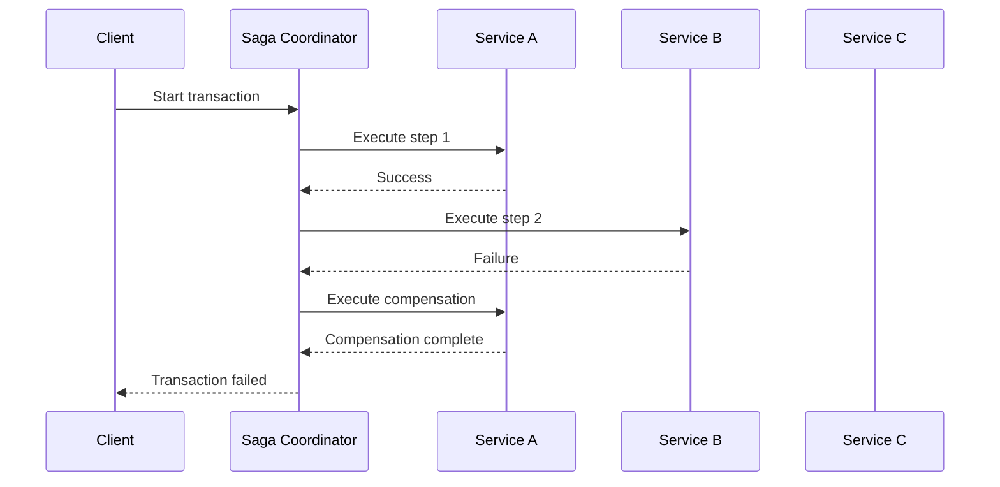

# 🔄 Saga Pattern

## Intent

The Saga Pattern manages failures in distributed transactions by coordinating a sequence of local transactions with compensating transactions to maintain data consistency across multiple services.

## Problem It Solves

- 🔄 Maintaining data consistency across microservices
- ⚠️ Handling partial failures in distributed transactions
- 🔄 Managing long-running business processes
- 🧩 Implementing complex workflows across service boundaries

## Structure



## Implementation Approaches

### 1. Choreography-based Saga

```php
<?php
// Order service publishes event
class OrderService {
    private $eventBus;
    
    public function createOrder(Order $order): void {
        // Local transaction
        $this->orderRepository->save($order);
        
        // Publish event
        $this->eventBus->publish(new OrderCreatedEvent($order->getId()));
    }
    
    // Compensation handler
    public function cancelOrder(int $orderId): void {
        $order = $this->orderRepository->findById($orderId);
        $order->setStatus('CANCELLED');
        $this->orderRepository->save($order);
    }
}

// Payment service listens and acts
class PaymentService {
    public function handleOrderCreated(OrderCreatedEvent $event): void {
        try {
            $this->processPayment($event->getOrderId());
            $this->eventBus->publish(new PaymentCompletedEvent($event->getOrderId()));
        } catch (Exception $e) {
            $this->eventBus->publish(new PaymentFailedEvent($event->getOrderId()));
        }
    }
}

/* Output (Event sequence):
OrderCreatedEvent(id: 1234)
PaymentCompletedEvent(orderId: 1234)
ShipmentProcessedEvent(orderId: 1234)
OrderCompletedEvent(orderId: 1234)
*/
```

### 2. Orchestration-based Saga

```php
<?php
class OrderSaga {
    private $orderService;
    private $paymentService;
    private $inventoryService;
    private $shippingService;
    
    public function process(Order $order): void {
        try {
            // Step 1: Create order
            $this->orderService->createOrder($order);
            
            // Step 2: Process payment
            $this->paymentService->processPayment($order->getId(), $order->getTotal());
            
            // Step 3: Update inventory
            $this->inventoryService->reserveItems($order->getItems());
            
            // Step 4: Schedule shipping
            $this->shippingService->scheduleDelivery($order->getId());
            
        } catch (PaymentFailedException $e) {
            // Compensate: Cancel order
            $this->orderService->cancelOrder($order->getId());
            throw $e;
            
        } catch (InventoryException $e) {
            // Compensate: Refund payment and cancel order
            $this->paymentService->refundPayment($order->getId());
            $this->orderService->cancelOrder($order->getId());
            throw $e;
        }
    }
}

/* Output (Success scenario):
Order 1234 created
Payment of $99.95 processed for order 1234
3 items reserved from inventory
Delivery scheduled for order 1234
*/
```

## Benefits

- ✅ **Data Consistency**: Ensures consistency across distributed services
- ✅ **Resilience**: Handles failures gracefully through compensations
- ✅ **Service Independence**: Each service maintains its own data and business logic
- ✅ **Visibility**: Provides clear tracking of transaction steps
- ✅ **Scalability**: Works well in distributed, microservice architectures

## When to Use

- 🌐 In microservice architectures when transactions span multiple services
- 🔄 For long-running business processes with multiple steps
- ⚠️ When you need eventual consistency across systems
- 🧩 When implementing complex workflows with compensation logic

## Up Next

Learn about the [Circuit Breaker Pattern](./13-circuit-breaker.md), which helps prevent cascading failures in distributed systems.

[Back to Enterprise Patterns](./README.md) | [Previous: CQRS](./08-cqrs.md)
