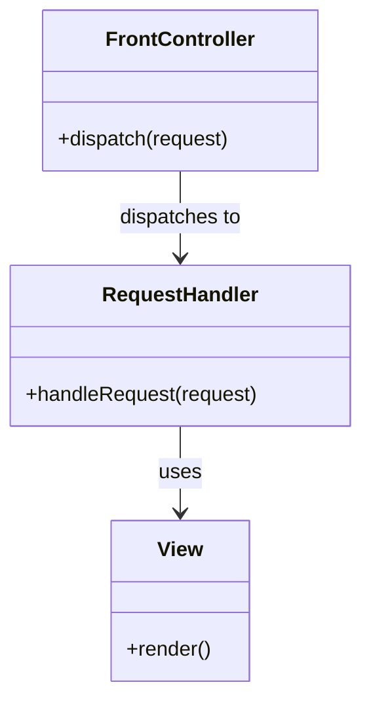

# 🚪 Front Controller Pattern

## Intent

The Front Controller pattern provides a centralized entry point for handling all requests to a web application. It manages request processing, authentication, authorization, and dispatching to the appropriate handlers.

## Problem It Solves

- 🔀 Inconsistent request handling across different entry points
- 🔄 Duplicate code for common operations (authentication, logging)
- 🧩 Scattered business logic across multiple controller files
- 🔍 Difficulty in tracking request flow

## Structure



## Implementation

```php
<?php
// Simple Front Controller implementation
class FrontController {
    private $router;
    private $authManager;
    
    public function __construct(Router $router, AuthManager $authManager) {
        $this->router = $router;
        $this->authManager = $authManager;
    }
    
    public function dispatch(Request $request) {
        // Pre-processing (logging, authentication)
        $this->logRequest($request);
        
        if (!$this->authManager->isAuthenticated($request)) {
            return new RedirectResponse('/login');
        }
        
        // Route the request
        $handler = $this->router->resolve($request->getPath());
        
        // Execute the handler
        return $handler->handleRequest($request);
    }
    
    private function logRequest(Request $request) {
        // Log request details
    }
}

// Usage
$frontController = new FrontController($router, $authManager);
$response = $frontController->dispatch($request);
$response->send();

/* Output:
HTTP/1.1 200 OK
Content-Type: text/html

<html>...</html>
*/
```

## Benefits

- ✅ **Centralized Control**: Single entry point for all requests
- ✅ **Code Reuse**: Common tasks handled once
- ✅ **Better Security**: Consistent authentication and authorization
- ✅ **Simplified Maintenance**: Core application flow in one place
- ✅ **Clean Separation**: Decouples request handling from business logic

## Framework Examples

### Symfony

```php
// Symfony front controller (public/index.php)
require_once dirname(__DIR__).'/vendor/autoload_runtime.php';

return function (array $context) {
    return new Symfony\Component\HttpKernel\Kernel($context['APP_ENV'], $context['APP_DEBUG']);
};
```

### Laravel

```php
// Laravel front controller (public/index.php)
require __DIR__.'/../vendor/autoload.php';
$app = require_once __DIR__.'/../bootstrap/app.php';
$kernel = $app->make(Illuminate\Contracts\Http\Kernel::class);
$response = $kernel->handle($request = Illuminate\Http\Request::capture());
$response->send();
$kernel->terminate($request, $response);
```

## Up Next

Learn about the [Observer Pattern](./16-observer.md), which enables objects to notify other objects about state changes.

[Back to Enterprise Patterns](./README.md) | [Previous: Dependency Injection Container](./09-dependency-injection-container.md)
