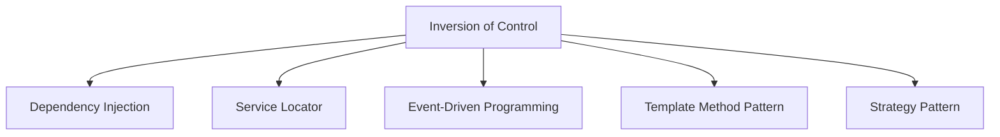

# 🔄 Inversion of Control (IoC) Pattern

## Intent

Inversion of Control is a design principle where the control flow of a program is inverted: instead of the programmer controlling the flow of a program, the external sources (framework, services, other components) take control of it. This promotes loose coupling, better testability, and more modular code.

## Problem It Solves

- 🔗 Tight coupling between components
- 🧪 Difficulty in testing classes in isolation
- 🧩 Rigid dependencies that can't be easily replaced
- 🔄 Complex lifecycle management of objects
- 📝 Code that's hard to extend or modify

## Forms of IoC

IoC is a broad principle that can be implemented in several ways:



## 1. Dependency Injection

The most common form of IoC:

```php
<?php
// Without Dependency Injection
class UserService {
    private $repository;
    
    public function __construct() {
        // Creating dependency directly - tight coupling
        $this->repository = new MySQLUserRepository();
    }
}

// With Dependency Injection
class UserService {
    private $repository;
    
    // Dependencies are provided from outside
    public function __construct(UserRepositoryInterface $repository) {
        $this->repository = $repository;
    }
}

// Usage
$repository = new MySQLUserRepository();
$service = new UserService($repository);

// For testing, we can inject a mock
$mockRepository = new MockUserRepository();
$testService = new UserService($mockRepository);
```

## 2. Service Locator

Rather than injecting dependencies directly, components retrieve dependencies from a central registry:

```php
<?php
class ServiceLocator {
    private static $services = [];
    
    public static function register(string $name, $service): void {
        self::$services[$name] = $service;
    }
    
    public static function get(string $name) {
        if (!isset(self::$services[$name])) {
            throw new Exception("Service '$name' not found");
        }
        return self::$services[$name];
    }
}

// Register services
ServiceLocator::register('logger', new FileLogger());
ServiceLocator::register('mailer', new SMTPMailer());

class OrderProcessor {
    public function process(Order $order): void {
        // Get dependencies from the service locator
        $logger = ServiceLocator::get('logger');
        $mailer = ServiceLocator::get('mailer');
        
        // Process order...
        $logger->log("Processing order #{$order->getId()}");
        $mailer->send($order->getCustomerEmail(), 'Order Confirmation');
    }
}
```

## 3. Event-Driven Programming

Control flow is determined by events:

```php
<?php
class EventDispatcher {
    private $listeners = [];
    
    public function addListener(string $event, callable $listener): void {
        if (!isset($this->listeners[$event])) {
            $this->listeners[$event] = [];
        }
        $this->listeners[$event][] = $listener;
    }
    
    public function dispatch(string $event, array $data = []): void {
        if (!isset($this->listeners[$event])) {
            return;
        }
        
        foreach ($this->listeners[$event] as $listener) {
            $listener($data);
        }
    }
}

// Usage
$dispatcher = new EventDispatcher();

// Register event listeners
$dispatcher->addListener('order.created', function($data) {
    echo "New order #{$data['id']} received\n";
});

$dispatcher->addListener('order.created', function($data) {
    echo "Sending confirmation email for order #{$data['id']}\n";
});

// Trigger an event
$dispatcher->dispatch('order.created', ['id' => 12345]);

/* Output:
New order #12345 received
Sending confirmation email for order #12345
*/
```

## 4. Template Method Pattern

Base classes define the skeleton of an algorithm, but let subclasses override specific steps:

```php
<?php
abstract class DocumentGenerator {
    // Template method defines the algorithm structure
    public final function generateDocument(): string {
        $content = $this->createHeader();
        $content .= $this->createBody();
        $content .= $this->createFooter();
        return $content;
    }
    
    // Steps to be implemented by subclasses
    protected abstract function createHeader(): string;
    protected abstract function createBody(): string;
    protected abstract function createFooter(): string;
}

class HTMLDocument extends DocumentGenerator {
    protected function createHeader(): string {
        return "<html><head><title>Document</title></head><body>";
    }
    
    protected function createBody(): string {
        return "<h1>Document Content</h1><p>This is an HTML document.</p>";
    }
    
    protected function createFooter(): string {
        return "</body></html>";
    }
}

class MarkdownDocument extends DocumentGenerator {
    protected function createHeader(): string {
        return "# Document\n\n";
    }
    
    protected function createBody(): string {
        return "This is a Markdown document.\n\n";
    }
    
    protected function createFooter(): string {
        return "---\nGenerated on " . date('Y-m-d');
    }
}

// Usage
$htmlDoc = new HTMLDocument();
$mdDoc = new MarkdownDocument();

echo $htmlDoc->generateDocument();
echo "\n\n";
echo $mdDoc->generateDocument();
```

## 5. Strategy Pattern

Defines a family of algorithms, encapsulates each one, and makes them interchangeable:

```php
<?php
interface PaymentStrategy {
    public function pay(float $amount): bool;
}

class CreditCardPayment implements PaymentStrategy {
    private $cardNumber;
    private $cvv;
    
    public function __construct(string $cardNumber, string $cvv) {
        $this->cardNumber = $cardNumber;
        $this->cvv = $cvv;
    }
    
    public function pay(float $amount): bool {
        echo "Paying $amount using Credit Card\n";
        return true;
    }
}

class PayPalPayment implements PaymentStrategy {
    private $email;
    
    public function __construct(string $email) {
        $this->email = $email;
    }
    
    public function pay(float $amount): bool {
        echo "Paying $amount using PayPal\n";
        return true;
    }
}

// Context that uses a strategy
class Order {
    private $paymentStrategy;
    private $amount;
    
    public function __construct(float $amount) {
        $this->amount = $amount;
    }
    
    // The payment strategy is injected
    public function setPaymentStrategy(PaymentStrategy $paymentStrategy): void {
        $this->paymentStrategy = $paymentStrategy;
    }
    
    public function checkout(): bool {
        return $this->paymentStrategy->pay($this->amount);
    }
}

// Usage
$order = new Order(99.99);

// User selects payment method
$order->setPaymentStrategy(new CreditCardPayment('1234-5678-9012-3456', '123'));
$order->checkout();

// Later, user can switch to a different payment method
$order->setPaymentStrategy(new PayPalPayment('user@example.com'));
$order->checkout();

/* Output:
Paying 99.99 using Credit Card
Paying 99.99 using PayPal
*/
```

## IoC Containers

IoC Containers (like Dependency Injection Containers) take IoC to the next level by automating dependency management:

```php
<?php
class Container {
    private $services = [];
    
    public function register(string $name, callable $factory): void {
        $this->services[$name] = $factory;
    }
    
    public function get(string $name) {
        if (!isset($this->services[$name])) {
            throw new Exception("Service '$name' not found");
        }
        
        return $this->services[$name]($this);
    }
}

// Register services
$container = new Container();
$container->register('logger', function($c) {
    return new FileLogger('/path/to/log');
});

$container->register('mailer', function($c) {
    return new SMTPMailer('smtp.example.com', $c->get('logger'));
});

$container->register('userService', function($c) {
    $repository = new UserRepository();
    return new UserService($repository, $c->get('logger'));
});

// Use the container to get a fully configured service
$userService = $container->get('userService');
```

## IoC in Frameworks

Modern PHP frameworks heavily use IoC to manage dependencies:

### Laravel Example

```php
<?php
// Laravel's service provider
class AppServiceProvider extends ServiceProvider {
    public function register() {
        $this->app->singleton(Logger::class, function ($app) {
            return new FileLogger(storage_path('logs/app.log'));
        });
        
        $this->app->bind(UserRepositoryInterface::class, function ($app) {
            return new EloquentUserRepository();
        });
    }
}

// Usage in a controller
class UserController extends Controller {
    public function __construct(UserRepositoryInterface $users, Logger $logger) {
        $this->users = $users;
        $this->logger = $logger;
    }
}
```

### Symfony Example

```php
<?php
// Symfony service configuration (services.yaml)
/*
services:
    logger:
        class: App\Services\FileLogger
        arguments: ['%kernel.logs_dir%/app.log']
    
    user_repository:
        class: App\Repository\DoctrineUserRepository
    
    user_service:
        class: App\Service\UserService
        arguments: ['@user_repository', '@logger']
*/

// Controller using DI
class UserController extends AbstractController {
    private $userService;
    
    public function __construct(UserService $userService) {
        $this->userService = $userService;
    }
}
```

## Benefits

- ✅ **Loose Coupling**: Components depend on abstractions, not implementations
- ✅ **Enhanced Testability**: Dependencies can be replaced with test doubles
- ✅ **Better Separation of Concerns**: Each class focuses on its core responsibility
- ✅ **Increased Modularity**: Components are more self-contained and interchangeable
- ✅ **Greater Flexibility**: System behavior can be changed by swapping components

## Considerations

- ⚠️ **Increased Complexity**: More interfaces and classes to manage
- ⚠️ **Learning Curve**: Understanding IoC principles takes time
- ⚠️ **Configuration Overhead**: Configuring dependencies can be verbose
- ⚠️ **Runtime vs. Compile-time**: Some IoC mechanisms defer errors to runtime

## When to Use

- 🧩 In medium to large applications with multiple components
- 🧪 When unit testing is important
- 🏗️ For building extensible, plugin-based architectures
- 🔄 When dependencies need to be swapped based on environment
- 👥 With larger development teams working on different components

## Up Next

Learn about the [Mediator/Middleware Pattern](./17-middleware.md), which provides a way to reduce chaotic dependencies between objects.

[Back to Enterprise Patterns](./README.md) | [Previous: Front Controller](./15-front-controller.md) | [Next: Mediator/Middleware](./17-middleware.md)
