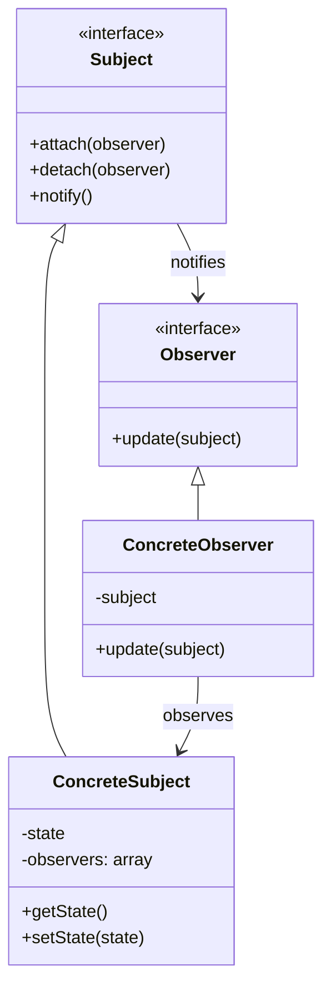

# 👀 Observer Pattern

## Intent

The Observer pattern defines a one-to-many dependency between objects so that when one object (the subject) changes state, all its dependents (observers) are notified and updated automatically.

## Problem It Solves

- 🔄 Need for objects to be notified when another object changes
- 🧩 Maintaining consistency across related objects
- 🔌 Loosely coupling components that interact with each other
- 📢 Broadcasting changes to multiple interested parties

## Structure



## Basic Implementation

```php
<?php
// Observer Interface
interface Observer {
    public function update(Subject $subject): void;
}

// Subject Interface
interface Subject {
    public function attach(Observer $observer): void;
    public function detach(Observer $observer): void;
    public function notify(): void;
}

// Concrete Subject
class Product implements Subject {
    private $observers = [];
    private $name;
    private $price;
    private $availability;
    
    public function __construct(string $name, float $price) {
        $this->name = $name;
        $this->price = $price;
        $this->availability = false;
    }
    
    public function attach(Observer $observer): void {
        $observerId = spl_object_hash($observer);
        $this->observers[$observerId] = $observer;
    }
    
    public function detach(Observer $observer): void {
        $observerId = spl_object_hash($observer);
        unset($this->observers[$observerId]);
    }
    
    public function notify(): void {
        foreach ($this->observers as $observer) {
            $observer->update($this);
        }
    }
    
    public function updatePrice(float $price): void {
        $this->price = $price;
        $this->notify();
    }
    
    public function setAvailability(bool $availability): void {
        $this->availability = $availability;
        $this->notify();
    }
    
    // Getters
    public function getName(): string {
        return $this->name;
    }
    
    public function getPrice(): float {
        return $this->price;
    }
    
    public function isAvailable(): bool {
        return $this->availability;
    }
}

// Concrete Observers
class PriceNotifier implements Observer {
    public function update(Subject $subject): void {
        if ($subject instanceof Product) {
            echo "PRICE NOTIFICATION: The price of {$subject->getName()} has been updated to \${$subject->getPrice()}\n";
        }
    }
}

class AvailabilityNotifier implements Observer {
    public function update(Subject $subject): void {
        if ($subject instanceof Product) {
            $status = $subject->isAvailable() ? 'in stock' : 'out of stock';
            echo "AVAILABILITY NOTIFICATION: {$subject->getName()} is now $status\n";
        }
    }
}

// Usage example
$laptop = new Product('Laptop XPS', 999.99);

$priceNotifier = new PriceNotifier();
$availabilityNotifier = new AvailabilityNotifier();

$laptop->attach($priceNotifier);
$laptop->attach($availabilityNotifier);

$laptop->updatePrice(899.99);
$laptop->setAvailability(true);

/* Output:
PRICE NOTIFICATION: The price of Laptop XPS has been updated to $899.99
AVAILABILITY NOTIFICATION: Laptop XPS is now in stock
*/
```

## Using SplObserver and SplSubject

PHP's Standard Library provides built-in interfaces for the Observer pattern:

```php
<?php
class StockItem implements \SplSubject {
    private $observers = [];
    private $name;
    private $quantity;
    
    public function __construct(string $name, int $quantity = 0) {
        $this->name = $name;
        $this->quantity = $quantity;
    }
    
    public function attach(\SplObserver $observer): void {
        $this->observers[] = $observer;
    }
    
    public function detach(\SplObserver $observer): void {
        $key = array_search($observer, $this->observers, true);
        if ($key !== false) {
            unset($this->observers[$key]);
        }
    }
    
    public function notify(): void {
        foreach ($this->observers as $observer) {
            $observer->update($this);
        }
    }
    
    public function updateStock(int $quantity): void {
        $oldQuantity = $this->quantity;
        $this->quantity = $quantity;
        
        if ($oldQuantity <= 0 && $quantity > 0) {
            // Item back in stock
            $this->notify();
        } elseif ($oldQuantity > 0 && $quantity <= 0) {
            // Item out of stock
            $this->notify();
        }
    }
    
    public function getName(): string {
        return $this->name;
    }
    
    public function getQuantity(): int {
        return $this->quantity;
    }
}

class StockObserver implements \SplObserver {
    private $email;
    
    public function __construct(string $email) {
        $this->email = $email;
    }
    
    public function update(\SplSubject $subject): void {
        if ($subject instanceof StockItem) {
            $status = $subject->getQuantity() > 0 ? 'back in stock' : 'out of stock';
            echo "Sending email to {$this->email}: {$subject->getName()} is $status.\n";
        }
    }
}

// Usage
$phone = new StockItem('Smartphone', 0);

$observer1 = new StockObserver('customer1@example.com');
$observer2 = new StockObserver('customer2@example.com');

$phone->attach($observer1);
$phone->attach($observer2);

$phone->updateStock(10);

/* Output:
Sending email to customer1@example.com: Smartphone is back in stock.
Sending email to customer2@example.com: Smartphone is back in stock.
*/
```

## Event System Implementation

The Observer pattern can be extended to create a more flexible event system:

```php
<?php
class EventDispatcher {
    private $listeners = [];
    
    public function addListener(string $eventName, callable $listener): void {
        if (!isset($this->listeners[$eventName])) {
            $this->listeners[$eventName] = [];
        }
        
        $this->listeners[$eventName][] = $listener;
    }
    
    public function removeListener(string $eventName, callable $listener): void {
        if (!isset($this->listeners[$eventName])) {
            return;
        }
        
        $this->listeners[$eventName] = array_filter(
            $this->listeners[$eventName],
            function ($existingListener) use ($listener) {
                return $existingListener !== $listener;
            }
        );
    }
    
    public function dispatch(string $eventName, array $data = []): void {
        if (!isset($this->listeners[$eventName])) {
            return;
        }
        
        $event = new Event($eventName, $data);
        
        foreach ($this->listeners[$eventName] as $listener) {
            $listener($event);
        }
    }
}

class Event {
    private $name;
    private $data;
    
    public function __construct(string $name, array $data = []) {
        $this->name = $name;
        $this->data = $data;
    }
    
    public function getName(): string {
        return $this->name;
    }
    
    public function getData(): array {
        return $this->data;
    }
    
    public function getParam(string $key) {
        return $this->data[$key] ?? null;
    }
}

// Using the event dispatcher
class UserService {
    private $eventDispatcher;
    
    public function __construct(EventDispatcher $eventDispatcher) {
        $this->eventDispatcher = $eventDispatcher;
    }
    
    public function registerUser(string $email, string $password): void {
        // Register user logic...
        
        // Dispatch event after user registration
        $this->eventDispatcher->dispatch('user.registered', [
            'email' => $email,
            'timestamp' => time()
        ]);
    }
}

$dispatcher = new EventDispatcher();

// Add listeners
$dispatcher->addListener('user.registered', function(Event $event) {
    $email = $event->getParam('email');
    echo "Sending welcome email to $email\n";
});

$dispatcher->addListener('user.registered', function(Event $event) {
    $email = $event->getParam('email');
    echo "Adding user $email to CRM\n";
});

// Use the service
$userService = new UserService($dispatcher);
$userService->registerUser('john@example.com', 'password123');

/* Output:
Sending welcome email to john@example.com
Adding user john@example.com to CRM
*/
```

## Observer Synchronization Issues

The Observer pattern can face synchronization issues in certain scenarios:

```php
<?php
class Observable implements \SplSubject {
    private $observers = [];
    private $state;
    
    // Standard SplSubject implementation...
    public function attach(\SplObserver $observer): void {
        $this->observers[] = $observer;
    }
    
    public function detach(\SplObserver $observer): void {
        $key = array_search($observer, $this->observers, true);
        if ($key !== false) {
            unset($this->observers[$key]);
        }
    }
    
    public function notify(): void {
        foreach ($this->observers as $observer) {
            $observer->update($this);
        }
    }
    
    // State management
    public function setState($state): void {
        $this->state = $state;
        $this->notify();
    }
    
    public function getState() {
        return $this->state;
    }
}

class ModifyingObserver implements \SplObserver {
    public function update(\SplSubject $subject): void {
        // This observer modifies the subject during notification
        echo "Observer changing subject state\n";
        
        // This could cause problems if we're iterating through observers
        $subject->setState('modified by observer');
    }
}

// Usage
$subject = new Observable();
$observer1 = new ModifyingObserver();
$observer2 = new ModifyingObserver();

$subject->attach($observer1);
$subject->attach($observer2);

// This might lead to an infinite loop or unexpected behavior
// as observer1 changes the state, which triggers notify again
$subject->setState('initial state');

/* Potential output (or could cause infinite loop):
Observer changing subject state
Observer changing subject state
Observer changing subject state
...
*/
```

## Observer Pattern in Laravel

Laravel's event system is built on the Observer pattern:

```php
<?php
// Laravel Event
class UserRegistered {
    public $user;
    
    public function __construct($user) {
        $this->user = $user;
    }
}

// Laravel Listener (Observer)
class SendWelcomeEmail {
    public function handle(UserRegistered $event) {
        // Send welcome email to $event->user
    }
}

// Laravel EventServiceProvider registration
$events->listen(
    UserRegistered::class,
    SendWelcomeEmail::class
);

// Dispatching events
event(new UserRegistered($user));

// Using model observers
class UserObserver {
    public function created(User $user) {
        // Handle user created event
    }
    
    public function updated(User $user) {
        // Handle user updated event
    }
    
    public function deleted(User $user) {
        // Handle user deleted event
    }
}

// Register the observer
User::observe(UserObserver::class);
```

## Benefits

- ✅ **Loose Coupling**: Subject and observers are not tightly coupled
- ✅ **Open/Closed Principle**: Add new observers without modifying the subject
- ✅ **Supports Broadcast Communication**: One-to-many notification
- ✅ **Established Relationships at Runtime**: Observers can be attached/detached dynamically

## Considerations

- ⚠️ **Unexpected Update Order**: Order of notification may not be predictable
- ⚠️ **Memory Leaks**: If subjects don't properly detach observers
- ⚠️ **Update Overhead**: Sends notifications to all observers regardless of relevance
- ⚠️ **Potential Cascading Updates**: Updates can cause cascading changes

## When to Use

- 🔔 When one object's change affects others
- 🧩 When the number of observers is unknown or dynamic
- 🔄 For implementing event handling systems
- 📊 For implementing MVC (Model-View-Controller) systems
- 🔌 When objects need to be notified without being tightly coupled

## Up Next

Learn about the [Mediator Pattern](./17-middleware.md), which helps manage complex interactions between objects.

[Back to Enterprise Patterns](./README.md) | [Previous: Front Controller](./15-front-controller.md) | [Next: Mediator/Middleware](./17-middleware.md)
