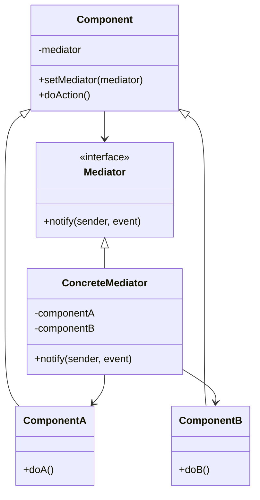
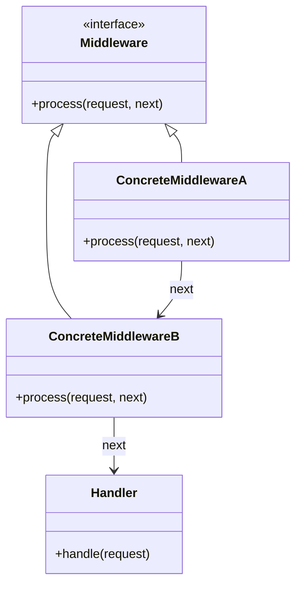

# 🔄 Mediator & Middleware Pattern

## Intent

The Mediator pattern defines an object that encapsulates how a set of objects interact, reducing direct connections between objects and promoting loose coupling. 

The Middleware pattern (a variation of Mediator) allows you to process requests and responses by passing them through a chain of handlers.

## Problem It Solves

- 🕸️ Spaghetti code with many-to-many relationships
- 🧩 Tight coupling between interacting components
- 🔄 Complex communication flows between objects
- 🧠 Distributed behavior that's hard to understand
- 🔌 Reusability of cross-cutting concerns (logging, authentication, etc.)

## Structure

### Mediator Pattern



### Middleware Pattern



## Basic Mediator Implementation

```php
<?php
// Mediator interface
interface ChatMediator {
    public function sendMessage(string $message, User $user): void;
    public function addUser(User $user): void;
}

// Concrete mediator
class ChatRoom implements ChatMediator {
    private $users = [];
    
    public function addUser(User $user): void {
        $this->users[] = $user;
        echo "{$user->getName()} has joined the chat room\n";
    }
    
    public function sendMessage(string $message, User $sender): void {
        echo "\n{$sender->getName()}: $message\n";
        
        // Distribute message to all users except sender
        foreach ($this->users as $user) {
            if ($user !== $sender) {
                $user->receive($message, $sender);
            }
        }
    }
}

// Component class
abstract class User {
    protected $mediator;
    protected $name;
    
    public function __construct(string $name, ChatMediator $mediator) {
        $this->name = $name;
        $this->mediator = $mediator;
        $this->mediator->addUser($this);
    }
    
    public function send(string $message): void {
        $this->mediator->sendMessage($message, $this);
    }
    
    public function getName(): string {
        return $this->name;
    }
    
    abstract public function receive(string $message, User $sender): void;
}

// Concrete component
class ChatUser extends User {
    public function receive(string $message, User $sender): void {
        echo "[{$this->getName()} received from {$sender->getName()}]: $message\n";
    }
}

// Usage
$chatroom = new ChatRoom();

$john = new ChatUser('John', $chatroom);
$alice = new ChatUser('Alice', $chatroom);
$bob = new ChatUser('Bob', $chatroom);

$john->send("Hey everyone!");
$alice->send("Hi John, how are you?");
$bob->send("Hello all!");

/* Output:
John has joined the chat room
Alice has joined the chat room
Bob has joined the chat room

John: Hey everyone!
[Alice received from John]: Hey everyone!
[Bob received from John]: Hey everyone!

Alice: Hi John, how are you?
[John received from Alice]: Hi John, how are you?
[Bob received from Alice]: Hi John, how are you?

Bob: Hello all!
[John received from Bob]: Hello all!
[Alice received from Bob]: Hello all!
*/
```

## Middleware Implementation

```php
<?php
// Basic PSR-15 style middleware
interface Middleware {
    public function process(Request $request, callable $next);
}

class Request {
    private $attributes = [];
    private $path;
    
    public function __construct(string $path) {
        $this->path = $path;
    }
    
    public function getPath(): string {
        return $this->path;
    }
    
    public function getAttribute(string $name, $default = null) {
        return $this->attributes[$name] ?? $default;
    }
    
    public function withAttribute(string $name, $value): self {
        $clone = clone $this;
        $clone->attributes[$name] = $value;
        return $clone;
    }
}

class Response {
    private $content;
    private $statusCode;
    
    public function __construct(string $content, int $statusCode = 200) {
        $this->content = $content;
        $this->statusCode = $statusCode;
    }
    
    public function getContent(): string {
        return $this->content;
    }
    
    public function getStatusCode(): int {
        return $this->statusCode;
    }
}

// Middleware pipeline
class MiddlewarePipeline {
    private $middlewares = [];
    private $handler;
    
    public function __construct(callable $handler) {
        $this->handler = $handler;
    }
    
    public function addMiddleware(Middleware $middleware): void {
        $this->middlewares[] = $middleware;
    }
    
    public function handle(Request $request): Response {
        // Build the pipeline
        $pipeline = array_reduce(
            array_reverse($this->middlewares),
            function($next, $middleware) {
                return function($request) use ($middleware, $next) {
                    return $middleware->process($request, $next);
                };
            },
            function($request) {
                $handler = $this->handler;
                return $handler($request);
            }
        );
        
        return $pipeline($request);
    }
}
```

## Middleware Examples

```php
<?php
// Authentication middleware
class AuthMiddleware implements Middleware {
    public function process(Request $request, callable $next) {
        echo "AuthMiddleware: Checking authentication...\n";
        
        // Example: Check for auth token in request
        $token = $request->getAttribute('token');
        if (!$token) {
            return new Response('Unauthorized', 401);
        }
        
        // Add authenticated user to request
        $user = ['id' => 123, 'name' => 'John'];
        $request = $request->withAttribute('user', $user);
        
        return $next($request);
    }
}

// Logging middleware
class LoggingMiddleware implements Middleware {
    public function process(Request $request, callable $next) {
        echo "LoggingMiddleware: Request to path '{$request->getPath()}'\n";
        
        $response = $next($request);
        
        echo "LoggingMiddleware: Response with status {$response->getStatusCode()}\n";
        
        return $response;
    }
}

// Rate limiting middleware
class RateLimitMiddleware implements Middleware {
    private $requestsPerMinute;
    private $requestCounts = [];
    
    public function __construct(int $requestsPerMinute = 60) {
        $this->requestsPerMinute = $requestsPerMinute;
    }
    
    public function process(Request $request, callable $next) {
        echo "RateLimitMiddleware: Checking rate limits...\n";
        
        $user = $request->getAttribute('user');
        $userId = $user['id'] ?? 'anonymous';
        
        // Simple in-memory rate limiting (would use Redis in production)
        if (!isset($this->requestCounts[$userId])) {
            $this->requestCounts[$userId] = 0;
        }
        
        $this->requestCounts[$userId]++;
        
        if ($this->requestCounts[$userId] > $this->requestsPerMinute) {
            return new Response('Too Many Requests', 429);
        }
        
        return $next($request);
    }
}

// Usage
$handler = function (Request $request) {
    echo "Handler: Processing request to '{$request->getPath()}'...\n";
    $user = $request->getAttribute('user', []);
    return new Response("Hello, {$user['name'] ?? 'Guest'}!");
};

$pipeline = new MiddlewarePipeline($handler);

$pipeline->addMiddleware(new LoggingMiddleware());
$pipeline->addMiddleware(new AuthMiddleware());
$pipeline->addMiddleware(new RateLimitMiddleware(100));

$request = new Request('/dashboard');
$request = $request->withAttribute('token', 'valid-token');

$response = $pipeline->handle($request);

echo "Final response: {$response->getContent()} (Status: {$response->getStatusCode()})\n";

/* Output:
LoggingMiddleware: Request to path '/dashboard'
AuthMiddleware: Checking authentication...
RateLimitMiddleware: Checking rate limits...
Handler: Processing request to '/dashboard'...
LoggingMiddleware: Response with status 200
Final response: Hello, John! (Status: 200)
*/
```

## Middleware in Laravel

```php
<?php
namespace App\Http\Middleware;

use Closure;
use Illuminate\Http\Request;

class EnsureUserIsAdmin
{
    public function handle(Request $request, Closure $next)
    {
        if (!$request->user() || !$request->user()->isAdmin()) {
            return redirect('home')->with('error', 'Unauthorized access');
        }

        return $next($request);
    }
}

// Registration in App\Http\Kernel.php
protected $routeMiddleware = [
    'admin' => \App\Http\Middleware\EnsureUserIsAdmin::class,
];

// Usage in routes
Route::get('/admin/dashboard', function () {
    // Admin dashboard code
})->middleware('admin');
```

## API Gateway with Middleware

```php
<?php
class ApiGateway {
    private $routes = [];
    private $pipeline;
    
    public function __construct() {
        $this->pipeline = new MiddlewarePipeline([$this, 'routeRequest']);
    }
    
    public function addRoute(string $path, callable $handler): void {
        $this->routes[$path] = $handler;
    }
    
    public function addMiddleware(Middleware $middleware): void {
        $this->pipeline->addMiddleware($middleware);
    }
    
    public function routeRequest(Request $request): Response {
        $path = $request->getPath();
        
        if (!isset($this->routes[$path])) {
            return new Response('Not Found', 404);
        }
        
        $handler = $this->routes[$path];
        return $handler($request);
    }
    
    public function process(Request $request): Response {
        return $this->pipeline->handle($request);
    }
}

// Usage
$gateway = new ApiGateway();

// Add global middleware
$gateway->addMiddleware(new LoggingMiddleware());
$gateway->addMiddleware(new AuthMiddleware());

// Add routes
$gateway->addRoute('/users', function (Request $request) {
    return new Response('List of users');
});

$gateway->addRoute('/products', function (Request $request) {
    return new Response('List of products');
});

// Process request
$request = new Request('/users');
$request = $request->withAttribute('token', 'valid-token');
$response = $gateway->process($request);
```

## Mediator vs. Middleware

Both patterns help decouple components, but in different ways:

| Mediator | Middleware |
|----------|------------|
| Central hub for communication | Linear chain of responsibility |
| Many-to-many interactions | Sequential request/response flow |
| Objects know about mediator | Chain members don't know each other |
| Handles complex relationships | Focuses on request processing |
| Examples: Chat rooms, traffic controller | Examples: Web frameworks, API gateways |

## Benefits

- ✅ **Loose Coupling**: Components don't need direct references to each other
- ✅ **Centralized Control**: Communication logic is in one place
- ✅ **Reusable Components**: Middleware can be reused across different pipelines
- ✅ **Single Responsibility**: Each middleware handles one specific concern
- ✅ **Extensibility**: Easy to add new components or middleware

## Considerations

- ⚠️ **Mediator Complexity**: The mediator can become complex in large systems
- ⚠️ **Performance Overhead**: Each middleware adds processing time
- ⚠️ **Debugging Challenges**: Request flow can be harder to trace
- ⚠️ **Shared State Management**: Care needed when modifying request state

## When to Use

- 🔄 For complex communication between components 
- 🔌 When you need cross-cutting concerns (logging, authentication)
- 🧩 To add behavior without modifying existing components
- 🔍 For reusable request/response processing steps
- 🛡️ To implement security, caching, or validation logic

## Up Next

Learn about the [Observer Pattern](./18-observer.md), which establishes a subscription mechanism between objects.

[Back to Enterprise Patterns](./README.md) | [Previous: Inversion of Control](./16-inversion-of-control.md) | [Next: Observer](./18-observer.md)
