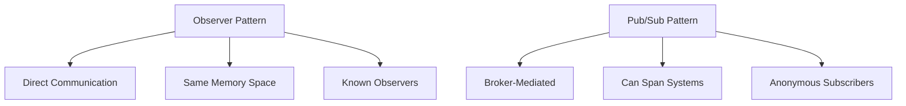
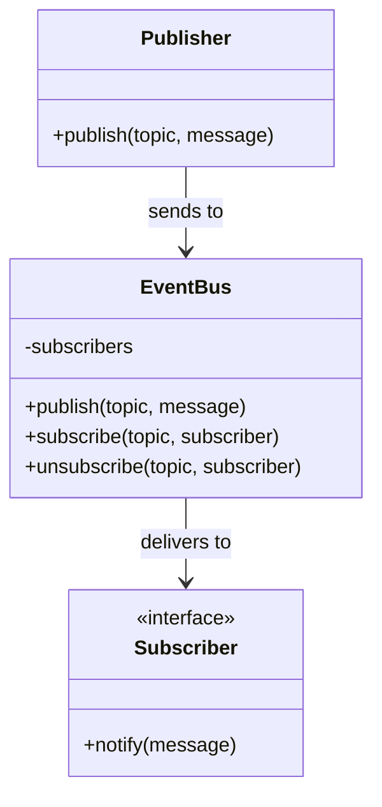

# 📡 Publish-Subscribe Pattern

## Intent

The Publish-Subscribe (Pub/Sub) pattern provides a framework for messaging between publishers and subscribers that want to exchange information on specific topics, decoupling senders and receivers by introducing a message broker/event bus between them.

## Problem It Solves

- 🔌 Tight coupling between message producers and consumers
- 🔄 Synchronous communication constraints
- 📊 One-to-many message distribution complexity
- 🏭 System components that need to work independently
- 🌍 Cross-system event notification challenges

## Difference from Observer Pattern

While the Observer pattern involves direct notification from subjects to observers, Pub/Sub introduces a third component (the broker) and focuses on distributed communication:



## Structure



## Basic Implementation

```php
<?php
class EventBus {
    private $subscribers = [];
    
    // Subscribe to a topic
    public function subscribe(string $topic, callable $callback): void {
        if (!isset($this->subscribers[$topic])) {
            $this->subscribers[$topic] = [];
        }
        
        $this->subscribers[$topic][] = $callback;
        echo "Subscription added to topic: $topic\n";
    }
    
    // Unsubscribe from a topic
    public function unsubscribe(string $topic, callable $callback): void {
        if (!isset($this->subscribers[$topic])) {
            return;
        }
        
        $this->subscribers[$topic] = array_filter(
            $this->subscribers[$topic],
            function ($subscribedCallback) use ($callback) {
                return $subscribedCallback !== $callback;
            }
        );
        
        echo "Subscription removed from topic: $topic\n";
    }
    
    // Publish a message to a topic
    public function publish(string $topic, $message): void {
        if (!isset($this->subscribers[$topic])) {
            echo "No subscribers for topic: $topic\n";
            return;
        }
        
        echo "Publishing to topic: $topic\n";
        
        foreach ($this->subscribers[$topic] as $callback) {
            $callback($message);
        }
    }
}

// Usage example
$eventBus = new EventBus();

// Create subscribers
$logSubscriber = function ($message) {
    echo "LOG: " . json_encode($message) . "\n";
};

$emailSubscriber = function ($message) {
    echo "EMAIL: Sending notification about: {$message['title']}\n";
};

$analyticsSubscriber = function ($message) {
    echo "ANALYTICS: Recording event: {$message['type']}\n";
};

// Subscribe to topics
$eventBus->subscribe('user.registered', $logSubscriber);
$eventBus->subscribe('user.registered', $emailSubscriber);
$eventBus->subscribe('order.created', $logSubscriber);
$eventBus->subscribe('order.created', $analyticsSubscriber);

// Publish messages
$eventBus->publish('user.registered', [
    'type' => 'registration',
    'title' => 'New user registered',
    'userId' => 123,
    'timestamp' => time()
]);

$eventBus->publish('order.created', [
    'type' => 'order',
    'title' => 'New order placed',
    'orderId' => 'ORD-123456',
    'amount' => 99.95,
    'timestamp' => time()
]);

// Unsubscribe and publish again
$eventBus->unsubscribe('user.registered', $emailSubscriber);
$eventBus->publish('user.registered', [
    'type' => 'registration',
    'title' => 'Another user registered',
    'userId' => 124,
    'timestamp' => time()
]);

/* Output:
Subscription added to topic: user.registered
Subscription added to topic: user.registered
Subscription added to topic: order.created
Subscription added to topic: order.created
Publishing to topic: user.registered
LOG: {"type":"registration","title":"New user registered","userId":123,"timestamp":1623456789}
EMAIL: Sending notification about: New user registered
Publishing to topic: order.created
LOG: {"type":"order","title":"New order placed","orderId":"ORD-123456","amount":99.95,"timestamp":1623456789}
ANALYTICS: Recording event: order
Subscription removed from topic: user.registered
Publishing to topic: user.registered
LOG: {"type":"registration","title":"Another user registered","userId":124,"timestamp":1623456789}
*/
```

## Enhanced Implementation with Message Classes

```php
<?php
interface Message {
    public function getTopic(): string;
    public function getPayload(): array;
    public function getTimestamp(): int;
}

class EventMessage implements Message {
    private $topic;
    private $payload;
    private $timestamp;
    
    public function __construct(string $topic, array $payload) {
        $this->topic = $topic;
        $this->payload = $payload;
        $this->timestamp = time();
    }
    
    public function getTopic(): string {
        return $this->topic;
    }
    
    public function getPayload(): array {
        return $this->payload;
    }
    
    public function getTimestamp(): int {
        return $this->timestamp;
    }
}

interface Subscriber {
    public function notify(Message $message): void;
    public function getSubscribedTopics(): array;
}

class LoggingSubscriber implements Subscriber {
    public function notify(Message $message): void {
        echo "[LOG] Topic: {$message->getTopic()}, Data: " . 
             json_encode($message->getPayload()) . 
             ", Time: " . date('Y-m-d H:i:s', $message->getTimestamp()) . "\n";
    }
    
    public function getSubscribedTopics(): array {
        return ['*']; // Subscribe to all topics
    }
}

class EmailNotifier implements Subscriber {
    public function notify(Message $message): void {
        $payload = $message->getPayload();
        $recipient = $payload['email'] ?? 'admin@example.com';
        
        echo "[EMAIL] Sending email to {$recipient} regarding {$message->getTopic()}\n";
    }
    
    public function getSubscribedTopics(): array {
        return ['user.registered', 'order.completed'];
    }
}

class EventBus {
    private $subscribers = [];
    
    public function registerSubscriber(Subscriber $subscriber): void {
        foreach ($subscriber->getSubscribedTopics() as $topic) {
            $this->addSubscriber($topic, $subscriber);
        }
    }
    
    public function publish(Message $message): void {
        $topic = $message->getTopic();
        echo "Publishing message to topic: $topic\n";
        
        // Notify topic-specific subscribers
        if (isset($this->subscribers[$topic])) {
            foreach ($this->subscribers[$topic] as $subscriber) {
                $subscriber->notify($message);
            }
        }
        
        // Notify wildcard subscribers
        if (isset($this->subscribers['*'])) {
            foreach ($this->subscribers['*'] as $subscriber) {
                $subscriber->notify($message);
            }
        }
    }
    
    private function addSubscriber(string $topic, Subscriber $subscriber): void {
        if (!isset($this->subscribers[$topic])) {
            $this->subscribers[$topic] = [];
        }
        
        $this->subscribers[$topic][] = $subscriber;
        echo "Subscriber registered for topic: $topic\n";
    }
}

// Usage
$eventBus = new EventBus();

// Register subscribers
$logger = new LoggingSubscriber();
$emailNotifier = new EmailNotifier();

$eventBus->registerSubscriber($logger);
$eventBus->registerSubscriber($emailNotifier);

// Publish messages
$userMessage = new EventMessage('user.registered', [
    'userId' => 123,
    'email' => 'john@example.com',
    'name' => 'John Doe'
]);

$orderMessage = new EventMessage('order.created', [
    'orderId' => 'ORD-123',
    'userId' => 123,
    'amount' => 99.99
]);

$eventBus->publish($userMessage);
$eventBus->publish($orderMessage);

/* Output:
Subscriber registered for topic: *
Subscriber registered for topic: user.registered
Subscriber registered for topic: order.completed
Publishing message to topic: user.registered
[EMAIL] Sending email to john@example.com regarding user.registered
[LOG] Topic: user.registered, Data: {"userId":123,"email":"john@example.com","name":"John Doe"}, Time: 2023-08-10 15:30:45
Publishing message to topic: order.created
[LOG] Topic: order.created, Data: {"orderId":"ORD-123","userId":123,"amount":99.99}, Time: 2023-08-10 15:30:45
*/
```

## Distributed Pub/Sub with Redis

```php
<?php
// Using Redis for pub/sub across multiple applications
class RedisEventBus {
    private $redis;
    private $subscribers = [];
    
    public function __construct(Redis $redis) {
        $this->redis = $redis;
    }
    
    // Start listening for messages
    public function startListening(): void {
        // Loop through subscribed topics
        foreach ($this->subscribers as $topic => $callbacks) {
            $this->redis->subscribe([$topic], function ($redis, $channel, $message) {
                $this->notifySubscribers($channel, json_decode($message, true));
            });
        }
    }
    
    // Subscribe to a topic
    public function subscribe(string $topic, callable $callback): void {
        if (!isset($this->subscribers[$topic])) {
            $this->subscribers[$topic] = [];
        }
        
        $this->subscribers[$topic][] = $callback;
    }
    
    // Publish a message to a topic
    public function publish(string $topic, array $message): void {
        $this->redis->publish($topic, json_encode($message));
    }
    
    // Notify subscribers of a received message
    private function notifySubscribers(string $topic, array $message): void {
        if (!isset($this->subscribers[$topic])) {
            return;
        }
        
        foreach ($this->subscribers[$topic] as $callback) {
            $callback($message);
        }
    }
}

// Usage in Producer app
$redis = new Redis();
$redis->connect('127.0.0.1', 6379);
$eventBus = new RedisEventBus($redis);

// Publish a message
$eventBus->publish('orders', [
    'type' => 'order.created',
    'data' => [
        'id' => 'ORD-123',
        'customer' => 'John Doe',
        'total' => 99.99
    ]
]);

// Usage in Consumer app
$redis = new Redis();
$redis->connect('127.0.0.1', 6379);
$eventBus = new RedisEventBus($redis);

// Subscribe to messages
$eventBus->subscribe('orders', function ($message) {
    echo "Received order event: " . $message['type'] . "\n";
    // Process the order...
});

// Start listening for messages
$eventBus->startListening();
```

## Queue-Based Pub/Sub with RabbitMQ

```php
<?php
// Using RabbitMQ for reliable pub/sub with queuing
class RabbitMQEventBus {
    private $channel;
    
    public function __construct(AMQPChannel $channel) {
        $this->channel = $channel;
    }
    
    // Publish a message to a topic (exchange)
    public function publish(string $exchange, string $routingKey, array $message): void {
        $msg = new AMQPMessage(json_encode($message), [
            'delivery_mode' => AMQPMessage::DELIVERY_MODE_PERSISTENT
        ]);
        
        $this->channel->basic_publish($msg, $exchange, $routingKey);
        echo "Message published to exchange '$exchange' with routing key '$routingKey'\n";
    }
    
    // Subscribe to a topic
    public function subscribe(string $exchange, string $routingKey, string $queue, callable $callback): void {
        // Ensure exchange exists
        $this->channel->exchange_declare($exchange, 'topic', false, true, false);
        
        // Declare queue and bind to exchange
        $this->channel->queue_declare($queue, false, true, false, false);
        $this->channel->queue_bind($queue, $exchange, $routingKey);
        
        // Set up consumer
        $this->channel->basic_consume(
            $queue,
            '',
            false,
            false,
            false,
            false,
            function (AMQPMessage $msg) use ($callback) {
                $message = json_decode($msg->body, true);
                $callback($message);
                $msg->delivery_info['channel']->basic_ack($msg->delivery_info['delivery_tag']);
            }
        );
        
        echo "Subscribed to exchange '$exchange' with routing key '$routingKey' on queue '$queue'\n";
    }
    
    // Start consuming messages
    public function startConsuming(): void {
        echo "Starting to consume messages...\n";
        
        while ($this->channel->is_consuming()) {
            $this->channel->wait();
        }
    }
}

// Usage (example stub code)
/*
// Producer
$connection = new AMQPStreamConnection('localhost', 5672, 'guest', 'guest');
$channel = $connection->channel();
$eventBus = new RabbitMQEventBus($channel);

$eventBus->publish('orders', 'order.created', [
    'order_id' => 'ORD-123',
    'customer_id' => 456,
    'amount' => 99.99
]);

// Consumer
$connection = new AMQPStreamConnection('localhost', 5672, 'guest', 'guest');
$channel = $connection->channel();
$eventBus = new RabbitMQEventBus($channel);

$eventBus->subscribe('orders', 'order.created', 'order_processing', function ($message) {
    echo "Processing order " . $message['order_id'] . "\n";
});

$eventBus->startConsuming();
*/
```

## Benefits

- ✅ **Decoupling**: Publishers don't need to know about subscribers and vice versa
- ✅ **Scalability**: Easily add or remove subscribers without affecting publishers
- ✅ **Flexibility**: Define complex routing patterns using topics
- ✅ **Asynchronous Communication**: Publishers don't need to wait for subscribers
- ✅ **Distributed Processing**: Components can run on different systems

## Considerations

- ⚠️ **Complexity**: Introduces additional infrastructure and complexity
- ⚠️ **Delivery Guarantees**: Need to handle message loss and duplication
- ⚠️ **Order of Messages**: May not guarantee message ordering
- ⚠️ **State Management**: Stateful subscribers need special handling
- ⚠️ **Debugging Challenges**: Harder to trace message flows across systems

## When to Use Pub/Sub

- 🌐 In distributed systems with many independent components
- 🔄 For event-driven architectures and reactive systems
- 🧩 When adding new features should not impact existing components
- 📊 For broadcasting information to multiple recipients
- 🔌 When producers and consumers have different lifecycles

## Pub/Sub with Laravel

```php
<?php
// Laravel Event Broadcasting

// Event definition
class OrderShipped implements ShouldBroadcast {
    use Dispatchable, InteractsWithSockets, SerializesModels;
    
    public $order;
    
    public function __construct(Order $order) {
        $this->order = $order;
    }
    
    public function broadcastOn() {
        return new Channel('orders');
    }
}

// Publishing the event
event(new OrderShipped($order));

// Listener in a different app or component
class OrderShippedListener {
    public function handle(OrderShipped $event) {
        // Process the order shipped event
    }
}

/* In EventServiceProvider
$events->listen(
    OrderShipped::class,
    [OrderShippedListener::class, 'handle']
);
*/
```

## Up Next

Learn about the [Adapter/Wrapper Pattern](./20-adapter.md), which allows incompatible interfaces to work together.

[Back to Enterprise Patterns](./README.md) | [Previous: Observer](./18-observer.md) | [Next: Adapter/Wrapper](./20-adapter.md)
