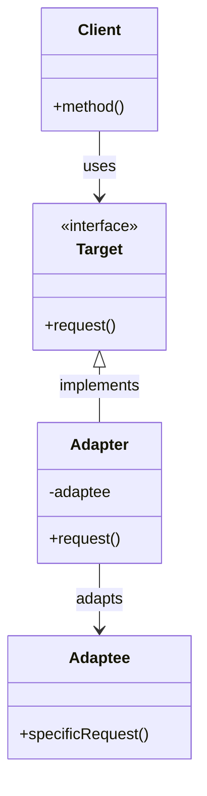

# 🔌 Adapter/Wrapper Pattern

## Intent

The Adapter pattern converts the interface of a class into another interface that clients expect. It allows classes to work together that couldn't otherwise because of incompatible interfaces.

## Problem It Solves

- 🧩 Integrating legacy code with new systems
- 🔄 Using third-party libraries with incompatible interfaces
- 📦 Harmonizing different data formats between components
- 🔌 Connecting subsystems without modifying their code
- 📝 Making existing classes work with others without changing their source code

## Structure



## Basic Implementation

### Object Adapter (Composition)

```php
<?php
// Target interface that the client expects to work with
interface MessageSender {
    public function send(string $message, string $recipient): bool;
}

// Existing class with incompatible interface
class SMSApi {
    public function sendSMS(string $phoneNumber, string $content): string {
        // This might be a third-party API or legacy code
        echo "SMS API: Sending message to $phoneNumber\n";
        return 'SMS-' . rand(10000, 99999); // Return message ID
    }
    
    public function checkStatus(string $messageId): string {
        return 'delivered';
    }
}

// Adapter that makes SMSApi compatible with MessageSender interface
class SMSAdapter implements MessageSender {
    private $smsApi;
    
    public function __construct(SMSApi $smsApi) {
        $this->smsApi = $smsApi;
    }
    
    public function send(string $message, string $recipient): bool {
        try {
            // Adapt the call to the SMSApi format
            $messageId = $this->smsApi->sendSMS($recipient, $message);
            
            // Check if the message was delivered
            $status = $this->smsApi->checkStatus($messageId);
            return $status === 'delivered';
        } catch (Exception $e) {
            return false;
        }
    }
}

// Client code that works with MessageSender interface
class NotificationService {
    private $messageSender;
    
    public function __construct(MessageSender $messageSender) {
        $this->messageSender = $messageSender;
    }
    
    public function notify(string $message, string $recipient): bool {
        echo "NotificationService: Sending notification\n";
        return $this->messageSender->send($message, $recipient);
    }
}

// Usage
$smsApi = new SMSApi();
$adapter = new SMSAdapter($smsApi);
$service = new NotificationService($adapter);

$result = $service->notify("Your order has been shipped!", "+1234567890");
echo "Message sent: " . ($result ? "Yes" : "No") . "\n";

/* Output:
NotificationService: Sending notification
SMS API: Sending message to +1234567890
Message sent: Yes
*/
```

### Class Adapter (Inheritance)

```php
<?php
// Target interface
interface JsonData {
    public function getJsonData(): string;
}

// Existing class with incompatible interface
class LegacyXmlFormatter {
    protected $data;
    
    public function __construct(array $data) {
        $this->data = $data;
    }
    
    public function getXml(): string {
        // Convert data to XML string (simplified for example)
        $xml = "<root>\n";
        foreach ($this->data as $key => $value) {
            $xml .= "  <$key>$value</$key>\n";
        }
        $xml .= "</root>";
        
        return $xml;
    }
}

// Class adapter using inheritance
class XmlToJsonAdapter extends LegacyXmlFormatter implements JsonData {
    public function getJsonData(): string {
        // Get XML from the parent method
        $xml = $this->getXml();
        
        // Convert XML to JSON (simplified for example)
        // In real code, you'd use proper XML parsing
        $simpleXml = simplexml_load_string($xml);
        return json_encode($simpleXml);
    }
}

// Client code
function displayData(JsonData $dataSource) {
    echo "Data as JSON: " . $dataSource->getJsonData() . "\n";
}

// Usage
$data = ['name' => 'John', 'age' => 30, 'city' => 'New York'];
$adapter = new XmlToJsonAdapter($data);
displayData($adapter);

/* Output:
Data as JSON: {"name":"John","age":"30","city":"New York"}
*/
```

## Real-world Examples

### Payment Gateway Adapter

```php
<?php
// Common interface for payment processing
interface PaymentProcessor {
    public function processPayment(float $amount, array $cardDetails): array;
    public function refundPayment(string $transactionId, float $amount): bool;
}

// First payment gateway - Stripe
class StripeGateway {
    public function charge(array $card, int $amountInCents, string $currency = 'usd'): array {
        echo "Stripe: Charging {$amountInCents} cents to card ending with {$card['last4']}\n";
        
        // Simulate Stripe API response
        return [
            'id' => 'ch_' . uniqid(),
            'amount' => $amountInCents,
            'currency' => $currency,
            'status' => 'succeeded'
        ];
    }
    
    public function refund(string $chargeId, int $amountInCents = null): array {
        echo "Stripe: Refunding charge $chargeId\n";
        
        // Simulate Stripe API response
        return [
            'id' => 're_' . uniqid(),
            'charge' => $chargeId,
            'amount' => $amountInCents,
            'status' => 'succeeded'
        ];
    }
}

// Second payment gateway - PayPal
class PayPalApi {
    public function makePayment(float $amount, array $creditCard, string $currency = 'USD'): object {
        echo "PayPal: Processing payment of \${$amount} {$currency}\n";
        
        // Simulate PayPal API response
        return (object) [
            'transaction_id' => 'PAY-' . strtoupper(uniqid()),
            'amount' => $amount,
            'currency' => $currency,
            'success' => true,
            'timestamp' => time()
        ];
    }
    
    public function createRefund($transactionId, $amount): object {
        echo "PayPal: Refunding transaction $transactionId\n";
        
        return (object) [
            'refund_id' => 'REF-' . strtoupper(uniqid()),
            'transaction_id' => $transactionId,
            'success' => true
        ];
    }
}

// Stripe adapter
class StripePaymentAdapter implements PaymentProcessor {
    private $stripeGateway;
    
    public function __construct(StripeGateway $stripeGateway) {
        $this->stripeGateway = $stripeGateway;
    }
    
    public function processPayment(float $amount, array $cardDetails): array {
        // Convert dollars to cents for Stripe
        $amountInCents = (int)($amount * 100);
        
        // Format card details for Stripe
        $stripeCardDetails = [
            'number' => $cardDetails['number'],
            'exp_month' => $cardDetails['expiry_month'],
            'exp_year' => $cardDetails['expiry_year'],
            'cvc' => $cardDetails['cvv'],
            'last4' => substr($cardDetails['number'], -4)
        ];
        
        // Make the Stripe API call
        $result = $this->stripeGateway->charge($stripeCardDetails, $amountInCents);
        
        // Standardize the response
        return [
            'transaction_id' => $result['id'],
            'amount' => $amount,
            'success' => ($result['status'] === 'succeeded'),
            'response' => $result
        ];
    }
    
    public function refundPayment(string $transactionId, float $amount): bool {
        $amountInCents = (int)($amount * 100);
        $result = $this->stripeGateway->refund($transactionId, $amountInCents);
        
        return ($result['status'] === 'succeeded');
    }
}

// PayPal adapter
class PayPalPaymentAdapter implements PaymentProcessor {
    private $paypalApi;
    
    public function __construct(PayPalApi $paypalApi) {
        $this->paypalApi = $paypalApi;
    }
    
    public function processPayment(float $amount, array $cardDetails): array {
        // Format card details for PayPal
        $paypalCardDetails = [
            'card_number' => $cardDetails['number'],
            'expiry_month' => $cardDetails['expiry_month'],
            'expiry_year' => $cardDetails['expiry_year'],
            'cvv2' => $cardDetails['cvv']
        ];
        
        // Make the PayPal API call
        $result = $this->paypalApi->makePayment($amount, $paypalCardDetails);
        
        // Standardize the response
        return [
            'transaction_id' => $result->transaction_id,
            'amount' => $result->amount,
            'success' => $result->success,
            'response' => $result
        ];
    }
    
    public function refundPayment(string $transactionId, float $amount): bool {
        $result = $this->paypalApi->createRefund($transactionId, $amount);
        
        return $result->success;
    }
}

// Client code using the payment processor
class OrderCheckout {
    private $paymentProcessor;
    
    public function __construct(PaymentProcessor $paymentProcessor) {
        $this->paymentProcessor = $paymentProcessor;
    }
    
    public function processOrder(Order $order, array $paymentDetails): bool {
        echo "Processing order #{$order->getId()} for \${$order->getTotal()}\n";
        
        $result = $this->paymentProcessor->processPayment(
            $order->getTotal(),
            $paymentDetails
        );
        
        if ($result['success']) {
            $order->markAsPaid($result['transaction_id']);
            echo "Order #{$order->getId()} payment successful\n";
            return true;
        } else {
            echo "Order #{$order->getId()} payment failed\n";
            return false;
        }
    }
}

// Simple Order class for the example
class Order {
    private $id;
    private $total;
    private $status = 'pending';
    private $transactionId;
    
    public function __construct(string $id, float $total) {
        $this->id = $id;
        $this->total = $total;
    }
    
    public function getId(): string {
        return $this->id;
    }
    
    public function getTotal(): float {
        return $this->total;
    }
    
    public function markAsPaid(string $transactionId): void {
        $this->status = 'paid';
        $this->transactionId = $transactionId;
    }
}

// Usage example
// Create the order
$order = new Order('ORD-1234', 99.99);

// Choose between payment gateways
$usePaypal = false;

if ($usePaypal) {
    $paymentProcessor = new PayPalPaymentAdapter(new PayPalApi());
} else {
    $paymentProcessor = new StripePaymentAdapter(new StripeGateway());
}

// Process the order with the chosen payment provider
$checkout = new OrderCheckout($paymentProcessor);
$checkout->processOrder($order, [
    'number' => '4242424242424242',
    'expiry_month' => '12',
    'expiry_year' => '2025',
    'cvv' => '123'
]);

/* Output when using Stripe:
Processing order #ORD-1234 for $99.99
Stripe: Charging 9999 cents to card ending with 4242
Order #ORD-1234 payment successful
*/

/* Output when using PayPal:
Processing order #ORD-1234 for $99.99
PayPal: Processing payment of $99.99 USD
Order #ORD-1234 payment successful
*/
```

### Database Adapter

```php
<?php
// Target interface for database operations
interface DatabaseInterface {
    public function connect(string $host, string $username, string $password, string $database): bool;
    public function query(string $sql): array;
    public function escape(string $value): string;
    public function close(): bool;
}

// First database library (e.g., legacy/custom DB layer)
class LegacyDatabase {
    protected $connection;
    
    public function dbConnect(string $host, string $user, string $pass, string $db) {
        echo "Legacy DB: Connecting to $db on $host\n";
        $this->connection = true; // Simplified for demo
        return true;
    }
    
    public function dbQuery(string $sql) {
        echo "Legacy DB: Executing query: $sql\n";
        return ['id' => 1, 'name' => 'John']; // Simulated result
    }
    
    public function dbEscape(string $value) {
        return addslashes($value);
    }
    
    public function dbClose() {
        $this->connection = null;
        return true;
    }
}

// Second database library (e.g., PDO)
class PDOWrapper {
    private $pdo;
    
    public function open(string $dsn, string $username, string $password) {
        echo "PDO: Opening connection with DSN: $dsn\n";
        // In a real implementation, we'd use:
        // $this->pdo = new PDO($dsn, $username, $password);
        $this->pdo = true; // Simplified for demo
        return true;
    }
    
    public function execute(string $statement) {
        echo "PDO: Executing statement: $statement\n";
        return [
            ['id' => 1, 'name' => 'John'],
            ['id' => 2, 'name' => 'Jane']
        ]; // Simulated result
    }
    
    public function quote(string $value) {
        return "'" . str_replace("'", "''", $value) . "'";
    }
    
    public function disconnect() {
        $this->pdo = null;
    }
}

// Adapter for Legacy Database
class LegacyDatabaseAdapter implements DatabaseInterface {
    private $legacyDb;
    
    public function __construct(LegacyDatabase $legacyDb) {
        $this->legacyDb = $legacyDb;
    }
    
    public function connect(string $host, string $username, string $password, string $database): bool {
        return $this->legacyDb->dbConnect($host, $username, $password, $database);
    }
    
    public function query(string $sql): array {
        $result = $this->legacyDb->dbQuery($sql);
        return [$result]; // Convert to array of rows format
    }
    
    public function escape(string $value): string {
        return $this->legacyDb->dbEscape($value);
    }
    
    public function close(): bool {
        return $this->legacyDb->dbClose();
    }
}

// Adapter for PDO
class PDOAdapter implements DatabaseInterface {
    private $pdo;
    
    public function __construct(PDOWrapper $pdo) {
        $this->pdo = $pdo;
    }
    
    public function connect(string $host, string $username, string $password, string $database): bool {
        $dsn = "mysql:host=$host;dbname=$database";
        return $this->pdo->open($dsn, $username, $password);
    }
    
    public function query(string $sql): array {
        return $this->pdo->execute($sql);
    }
    
    public function escape(string $value): string {
        return $this->pdo->quote($value);
    }
    
    public function close(): bool {
        $this->pdo->disconnect();
        return true;
    }
}

// Client code using the database interface
class UserRepository {
    private $db;
    
    public function __construct(DatabaseInterface $db) {
        $this->db = $db;
    }
    
    public function connect(): void {
        $this->db->connect('localhost', 'user', 'password', 'app_db');
    }
    
    public function findUserById(int $id): ?array {
        $id = $this->db->escape((string)$id);
        $results = $this->db->query("SELECT * FROM users WHERE id = $id");
        
        return !empty($results) ? $results[0] : null;
    }
    
    public function close(): void {
        $this->db->close();
    }
}

// Usage with Legacy Database
$legacyDb = new LegacyDatabaseAdapter(new LegacyDatabase());
$userRepo1 = new UserRepository($legacyDb);
$userRepo1->connect();
$user1 = $userRepo1->findUserById(1);
$userRepo1->close();

echo "\n";

// Usage with PDO
$pdoDb = new PDOAdapter(new PDOWrapper());
$userRepo2 = new UserRepository($pdoDb);
$userRepo2->connect();
$user2 = $userRepo2->findUserById(1);
$userRepo2->close();

/* Output:
Legacy DB: Connecting to app_db on localhost
Legacy DB: Executing query: SELECT * FROM users WHERE id = 1
Legacy DB: Connecting to app_db on localhost

PDO: Opening connection with DSN: mysql:host=localhost;dbname=app_db
PDO: Executing statement: SELECT * FROM users WHERE id = '1'
*/
```

## Adapter vs Bridge Pattern

The Adapter and Bridge patterns have some similarities but different intents:

- **Adapter**: Makes incompatible interfaces work together (retrofitting)
- **Bridge**: Separates an abstraction from its implementation (planned)

```php
<?php
// Adapter (converts one interface to another)
class LegacyPrinterAdapter implements ModernPrinter {
    private $legacyPrinter;
    
    public function __construct(LegacyPrinter $legacyPrinter) {
        $this->legacyPrinter = $legacyPrinter;
    }
    
    public function printDocument(Document $document): void {
        // Convert modern interface to legacy interface
        $this->legacyPrinter->print($document->getRawContent());
    }
}

// Bridge (separates abstraction from implementation)
abstract class PrinterAbstraction {
    protected $implementation;
    
    public function __construct(PrinterImplementation $implementation) {
        $this->implementation = $implementation;
    }
    
    abstract public function print(Document $document): void;
}

class ColorPrinter extends PrinterAbstraction {
    public function print(Document $document): void {
        $this->implementation->printColor($document);
    }
}
```

## Adapter in Frameworks

### Symfony HTTP Foundation

```php
<?php
// Symfony's PSR-7 adapter
// Converting Symfony's request/response objects to PSR-7 compatible ones

// Pure PSR-7 code
function handleRequest(RequestInterface $request): ResponseInterface {
    // Process the request and return a response
}

// Using with Symfony
$symfonyRequest = Request::createFromGlobals();
$psr7Request = (new Psr7Converter())->createRequest($symfonyRequest);

$psr7Response = handleRequest($psr7Request);
$symfonyResponse = (new Psr7Converter())->createResponse($psr7Response);

$symfonyResponse->send();
```

### Laravel Filesystem

```php
<?php
// Laravel's filesystem adapters
$s3Adapter = Storage::disk('s3');
$localAdapter = Storage::disk('local');

// Same interface, different underlying implementations
$s3Adapter->put('file.txt', 'Contents');
$localAdapter->put('file.txt', 'Contents');
```

## Benefits

- ✅ **Class Reuse**: Use existing classes that wouldn't be compatible otherwise
- ✅ **Separation of Concerns**: Client doesn't need to know about the adapted interface
- ✅ **Open/Closed Principle**: Add new adapters without changing existing code
- ✅ **Single Responsibility Principle**: Adaptation logic is in its own class
- ✅ **Flexibility**: Switch between different adapters easily

## Considerations

- ⚠️ **Extra Layer**: Adds another layer of indirection
- ⚠️ **Complexity**: Additional classes to maintain
- ⚠️ **Performance**: Slight overhead due to the additional method calls
- ⚠️ **Adaptation Limits**: Some adaptations might be challenging or incomplete
- ⚠️ **Documentation**: Need to document what is being adapted and why

## When to Use

- 🔌 When you need to use existing classes with incompatible interfaces
- 🧩 When integrating with third-party libraries or APIs
- 📦 When you want to reuse existing code without modifying it
- 🔌 When interfacing between different components of a system
- 🏗️ When standardizing on a specific interface in your application

## Related Patterns

- **🌉 Bridge**: Separates abstraction from implementation
- **🎭 Decorator**: Adds functionality to objects without changing their interface
- **🏭 Factory**: Can create the appropriate adapter based on the environment
- **📦 Facade**: Simplifies a complex subsystem, while Adapter changes its interface

## Up Next

Learn about the practical application of these Enterprise Patterns in real-world PHP projects.

[Back to Enterprise Patterns](./README.md) | [Previous: Publish-Subscribe](./19-pub-sub.md)
