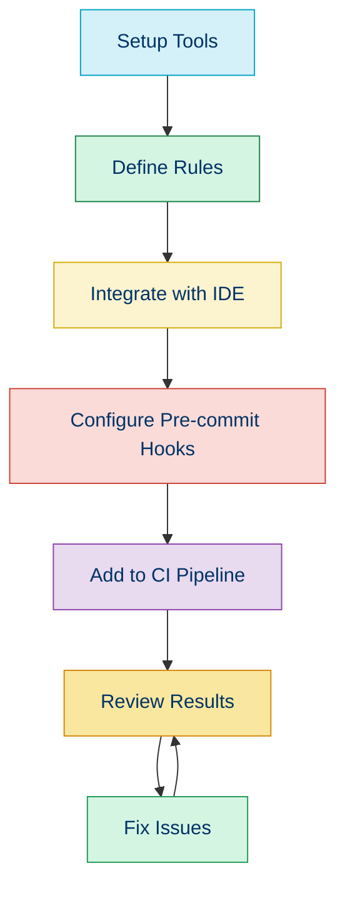

# 📏 Coding Standards in PHP

## 📚 Overview

Coding standards are a set of guidelines and best practices that developers follow to write clean, consistent, and maintainable code. In PHP, several well-established standards exist to ensure code quality and interoperability between different projects and frameworks.

## 🌟 Benefits of Following Coding Standards

- ✅ **Improved Readability**: Consistent formatting makes code easier to understand
- 🤝 **Better Collaboration**: Teams can work more efficiently when code follows conventions
- 🔍 **Easier Debugging**: Standardized code structure helps identify issues faster
- 🔄 **Simplified Maintenance**: Future developers can understand and modify code more easily
- 🌐 **Community Integration**: Standards facilitate using community libraries and frameworks

## 🏛️ PHP Standards Recommendations (PSRs)

The PHP Framework Interop Group (PHP-FIG) maintains a series of standards known as PSRs. These are accepted standards for PHP development:

| PSR | Description | Status |
|-----|-------------|--------|
| [PSR-1](./01b-psr-1.md) | Basic Coding Standard | ✅ Accepted |
| [PSR-4](./01d-psr-4.md) | Autoloading Standard | ✅ Accepted |
| [PSR-12](./01c-psr-12.md) | Extended Coding Style | ✅ Accepted |
| PSR-2 | Coding Style Guide | ⚠️ Deprecated |

## 🛠️ Implementing Coding Standards

### Using PHP_CodeSniffer

PHP_CodeSniffer is a tool that helps enforce coding standards in your projects.

```bash
# Install PHP_CodeSniffer
composer require --dev squizlabs/php_codesniffer

# Check code against PSR-12
./vendor/bin/phpcs --standard=PSR12 src/
```

**Output:**
```
FILE: /home/user/project/src/Example.php
----------------------------------------------------------------------
FOUND 2 ERRORS AFFECTING 2 LINES
----------------------------------------------------------------------
 5 | ERROR | [x] Line indented incorrectly; expected 4 spaces, found 2
 7 | ERROR | [ ] Opening brace should be on a new line
----------------------------------------------------------------------
```

### Using PHP-CS-Fixer

PHP-CS-Fixer automatically fixes code to comply with standards.

```bash
# Install PHP-CS-Fixer
composer require --dev friendsofphp/php-cs-fixer

# Fix code to follow PSR-12
./vendor/bin/php-cs-fixer fix src/ --rules=@PSR12
```

## 📝 Example: Before and After Applying PSR-12

### Before

```php
<?php
namespace App\Controllers;
class UserController
{
  public function index() {
    // Some code
    if($condition){
        return true;
    }else{
        return false;
    }
  }
}
```

### After

```php
<?php

namespace App\Controllers;

class UserController
{
    public function index()
    {
        // Some code
        if ($condition) {
            return true;
        } else {
            return false;
        }
    }
}
```

## 🔄 Integrating Standards in Your Workflow



## 🧭 Navigation

- [← Back to Code Quality](./README.md)
- [→ PSR Standards Overview](./01a-psr-standards.md)

## 📚 Further Reading

- [PHP-FIG Website](https://www.php-fig.org/)
- [PHP_CodeSniffer Documentation](https://github.com/squizlabs/PHP_CodeSniffer/wiki)
- [PHP-CS-Fixer Documentation](https://github.com/FriendsOfPHP/PHP-CS-Fixer)
- [PHPStorm and Coding Standards](https://www.jetbrains.com/help/phpstorm/using-php-code-sniffer.html)
