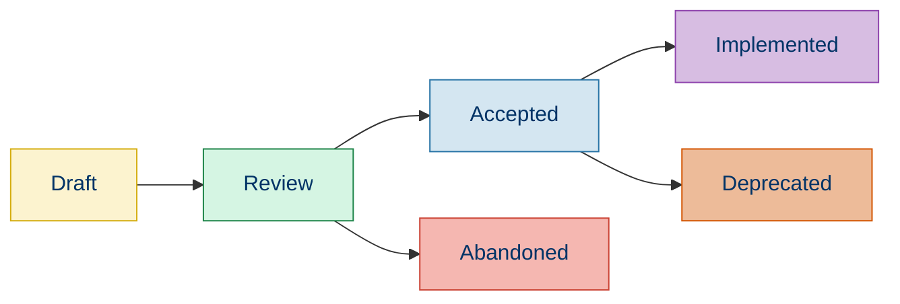

# 📜 PSR Standards Overview

## 📚 Introduction

The PHP Standard Recommendations (PSRs) are a collection of PHP coding standards developed by the PHP Framework Interop Group (PHP-FIG). These standards aim to promote interoperability between PHP frameworks and libraries.

## 🏛️ PHP-FIG and Its Role

PHP-FIG was created in 2009 during php|tek with representatives from major PHP projects including:
- Drupal
- Symfony
- Zend Framework
- Laravel
- CodeIgniter

The goal was to find ways for projects to work together, leading to the creation of standardized coding conventions.

## 🌟 Key PSR Standards

| PSR | Name | Purpose | Status |
|-----|------|---------|--------|
| PSR-1 | [Basic Coding Standard](./01b-psr-1.md) | Defines basic coding style rules | ✅ Accepted |
| PSR-2 | Coding Style Guide | Extended coding style guide (replaced by PSR-12) | ⚠️ Deprecated |
| PSR-3 | Logger Interface | Defines a common interface for logging libraries | ✅ Accepted |
| PSR-4 | [Autoloading Standard](./01d-psr-4.md) | Defines a specification for autoloading classes | ✅ Accepted |
| PSR-6 | Caching Interface | Defines a common interface for caching libraries | ✅ Accepted |
| PSR-7 | HTTP Message Interfaces | Defines common interfaces for HTTP messages | ✅ Accepted |
| PSR-11 | Container Interface | Defines a common interface for dependency injection containers | ✅ Accepted |
| PSR-12 | [Extended Coding Style](./01c-psr-12.md) | Extended coding style guide (replaces PSR-2) | ✅ Accepted |
| PSR-14 | Event Dispatcher | Standardizes event dispatching | ✅ Accepted |
| PSR-15 | HTTP Handlers | Standardizes HTTP server request handlers | ✅ Accepted |
| PSR-16 | Simple Cache | Defines a simple interface for caching | ✅ Accepted |
| PSR-17 | HTTP Factories | Defines factory interfaces for PSR-7 | ✅ Accepted |
| PSR-18 | HTTP Client | Defines an interface for HTTP clients | ✅ Accepted |

## 🔄 PSR Adoption Lifecycle



## 💻 Example: PSR-4 Autoloading Implementation

### Directory Structure
```
project/
├── composer.json
├── src/
│   └── Example/
│       ├── Class1.php
│       └── Nested/
│           └── Class2.php
└── vendor/
```

### Composer Configuration
```json
{
    "name": "vendor/project",
    "autoload": {
        "psr-4": {
            "Example\\": "src/Example/"
        }
    }
}
```

### Class Definition (src/Example/Nested/Class2.php)
```php
<?php

namespace Example\Nested;

class Class2
{
    public function demo()
    {
        return "This class is autoloaded via PSR-4";
    }
}
```

### Usage Example
```php
<?php
// autoload.php is generated by Composer
require_once 'vendor/autoload.php';

// Class is automatically loaded
$object = new Example\Nested\Class2();
echo $object->demo();
```

**Output:**
```
This class is autoloaded via PSR-4
```

## 🔍 Benefits of Following PSR Standards

- 🔄 **Interoperability**: Code works seamlessly with other PSR-compliant libraries
- 👥 **Community Compatibility**: Easier integration with popular frameworks and packages
- 📦 **Portability**: Developers familiar with PSRs can quickly understand your code
- 🛠️ **Tooling Support**: Many development tools are designed to work with PSR standards
- 📈 **Future-Proof**: Standards evolve with the PHP ecosystem, keeping code modern

## ⚖️ PSR Compliance vs. Project Requirements

While PSRs provide excellent guidelines, it's important to balance standardization with project-specific needs:

| Consideration | Approach |
|---------------|----------|
| **Legacy Projects** | Implement PSRs gradually during refactoring |
| **Team Preferences** | May extend PSRs with additional project-specific standards |
| **Framework Guidelines** | Some frameworks may have their own standards that extend PSRs |
| **Performance Concerns** | Evaluate impact of standards on performance-critical code paths |

## 🧭 Navigation

- [← Back to Coding Standards](./01-coding-standards.md)
- [→ PSR-1: Basic Coding Standard](./01b-psr-1.md)

## 📚 Further Reading

- [Official PHP-FIG Website](https://www.php-fig.org/)
- [PHP-FIG GitHub Repository](https://github.com/php-fig/fig-standards)
- [Composer PSR-4 Autoloading Documentation](https://getcomposer.org/doc/04-schema.md#psr-4)
- [Modern PHP by Josh Lockhart (O'Reilly Media)](https://www.oreilly.com/library/view/modern-php/9781491905173/)
