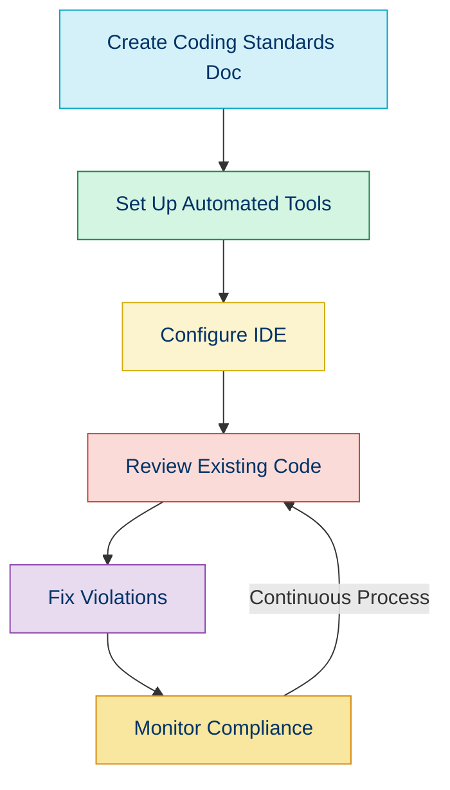

# 📐 PSR-1: Basic Coding Standard

## 📚 Overview

PSR-1 establishes the fundamental coding standards for PHP code. It represents the bare minimum requirements that ensure code from different authors can be combined without causing issues related to coding styles.

## ✅ Key Requirements

### 1. 📄 Files

- Files **MUST** use only `<?php` and `<?=` tags
- Files **MUST** use only UTF-8 without BOM for PHP code
- Files **SHOULD** either declare symbols (classes, functions, constants) *OR* cause side-effects (e.g., generate output), but **SHOULD NOT** do both

### 2. 🧩 Namespaces and Classes

- Classes **MUST** be declared in `StudlyCaps` (PascalCase)
- Class constants **MUST** be declared in all uppercase with underscore separators

### 3. 🔧 Methods and Functions

- Method names **MUST** be declared in `camelCase`

## 💡 Examples of PSR-1 Compliance

### ✅ Good File Structure

```php
<?php

// Side effects (include) in one file
require_once 'some-file.php';
```

And in another file:

```php
<?php

// Class declaration in separate file
namespace Vendor\Package;

class ClassName
{
    const VERSION = '1.0';
    
    public function doSomething()
    {
        // Method body
    }
}
```

### ❌ Bad Structure (Mixing Declarations and Side Effects)

```php
<?php

// Side effect
echo "Hello world!";

// Declaration - This violates PSR-1
class ClassName
{
    // Class body
}
```

### ✅ Good Naming Conventions

```php
<?php

namespace Vendor\Model;

class UserProfile
{
    const MAX_LENGTH = 100;
    
    public function getUserName()
    {
        // Method body
    }
}
```

### ❌ Bad Naming Conventions

```php
<?php

namespace Vendor\Model;

// Incorrect: class names should use StudlyCaps
class user_profile
{
    // Incorrect: constants should be ALL_CAPS
    const maxLength = 100;
    
    // Incorrect: method names should be camelCase
    public function GetUserName()
    {
        // Method body
    }
}
```

## 🔍 Verifying PSR-1 Compliance

You can use PHP_CodeSniffer to verify PSR-1 compliance:

```bash
# Install PHP_CodeSniffer
composer require --dev squizlabs/php_codesniffer

# Check code against PSR-1
./vendor/bin/phpcs --standard=PSR1 src/
```

**Output for non-compliant code:**
```
FILE: /home/user/project/src/Example.php
----------------------------------------------------------------------
FOUND 3 ERRORS AFFECTING 3 LINES
----------------------------------------------------------------------
 5 | ERROR | Class name "example" is not in PascalCase format
 7 | ERROR | Constants must be uppercase; expected VERSION but found Version
 9 | ERROR | Method name "GetData" is not in camelCase format
----------------------------------------------------------------------
```

## 🛠️ Enforcing PSR-1 in Your Projects

To enforce PSR-1 standards in your projects:

1. **Create a Coding Standards Document**
   - Reference PSR-1
   - Explain any project-specific extensions or exceptions

2. **Set Up Automated Checks**
   - Configure PHP_CodeSniffer in your CI/CD pipeline
   - Add pre-commit hooks to check for compliance

3. **IDE Configuration**
   - Configure your IDE to highlight PSR-1 violations
   - Set up automatic code formatting



## ⚖️ PSR-1 vs. Other Standards

| Standard | Scope | Compatibility with PSR-1 |
|----------|-------|--------------------------|
| PSR-2 (deprecated) | Extended coding style | ✅ Extends PSR-1 |
| PSR-12 | Extended coding style | ✅ Extends PSR-1 |
| Symfony Coding Standards | Framework-specific | ✅ Compatible (extends PSR) |
| WordPress Coding Standards | CMS-specific | ⚠️ Partially compatible |
| Zend Framework Coding Standard | Framework-specific | ✅ Compatible (extends PSR) |

## 🧭 Navigation

- [← Back to PSR Standards Overview](./01a-psr-standards.md) 
- [→ PSR-12: Extended Coding Style](./01c-psr-12.md)

## 📚 Further Reading

- [Official PSR-1 Documentation](https://www.php-fig.org/psr/psr-1/)
- [PHP_CodeSniffer](https://github.com/squizlabs/PHP_CodeSniffer)
- [PHP: The Right Way - Standards](https://phptherightway.com/#standards)
- [PhpStorm and PSR Support](https://www.jetbrains.com/help/phpstorm/psr-compatibility-in-phpstorm.html)
