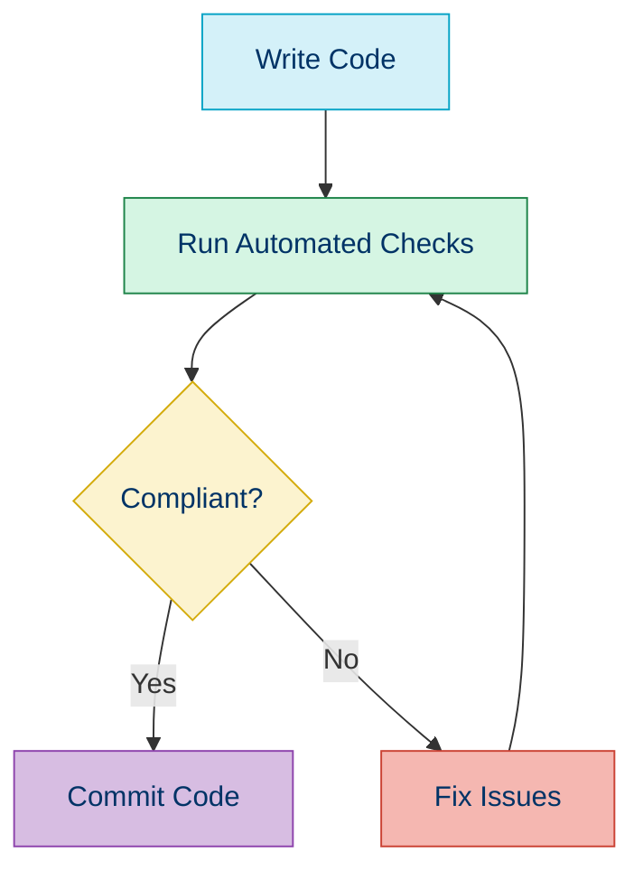

# 📏 PSR-12: Extended Coding Style

## 📚 Overview

PSR-12 is an extended coding style guide that builds upon [PSR-1](./01b-psr-1.md). It was accepted in August 2019 and replaces the now-deprecated PSR-2. The standard accounts for modern PHP features that weren't common when PSR-2 was published.

## 🌟 Key Features of PSR-12

PSR-12 extends PSR-1 with more detailed specifications for:

- 📄 General code layout and whitespace
- 🔤 Naming conventions
- 🔠 Keywords and types
- 📂 Control structures
- 🧰 Closures and more

## 📋 Core Requirements

### 1️⃣ General Rules

- Files **MUST** use only UTF-8 without BOM
- All PHP files **MUST** end with a single blank line
- The closing `?>` tag **MUST** be omitted from files containing only PHP
- Lines **SHOULD** be 80 characters or less
- Lines **MUST NOT** exceed 120 characters
- There **MUST** be one blank line after namespace declarations
- Opening braces for classes **MUST** go on the next line
- Opening braces for methods **MUST** go on the next line
- Visibility **MUST** be declared on all properties and methods

### 2️⃣ PHP Tags

```php
<?php

// PHP code goes here

// No closing tag
```

### 3️⃣ Control Structures

```php
if ($expr1) {
    // if body
} elseif ($expr2) {
    // elseif body
} else {
    // else body
}

switch ($expr) {
    case 0:
        echo 'First case';
        break;
    default:
        echo 'Default case';
        break;
}
```

## 📝 Before and After PSR-12

### Before (Non-Compliant)

```php
<?php
namespace Vendor\Package;

class ClassName extends ParentClass implements
    \ArrayAccess,
    \Countable,
    \Serializable
{
    private $foo;
    
    function __construct(int $foo) {
      $this->foo=$foo;
    }

    public function sampleFunction(int $a, int $b = null)
    {
        if($a === $b) {
            bar();
        } else if($a > $b) {
            $foo->bar($arg1);
        }
        else {
            BazClass::bar($arg2, $arg3);
        }
    }

    final static public function bar()
    {
        // method body
    }
}
?>
```

### After (PSR-12 Compliant)

```php
<?php

declare(strict_types=1);

namespace Vendor\Package;

class ClassName extends ParentClass implements
    \ArrayAccess,
    \Countable,
    \Serializable
{
    private $foo;
    
    public function __construct(int $foo) 
    {
        $this->foo = $foo;
    }

    public function sampleFunction(int $a, int $b = null)
    {
        if ($a === $b) {
            bar();
        } elseif ($a > $b) {
            $foo->bar($arg1);
        } else {
            BazClass::bar($arg2, $arg3);
        }
    }

    final public static function bar()
    {
        // method body
    }
}
```

## 🚫 Common Mistakes

| Mistake | PSR-12 Rule |
|---------|-------------|
| Using tabs for indentation | **MUST** use 4 spaces |
| `elseif` written as `else if` | **MUST** use `elseif` |
| Improper spacing around operators | **MUST** have one space around operators |
| Multiple blank lines | **MUST NOT** have multiple consecutive blank lines |
| Wrong order of method modifiers | Use canonical order: `final` `abstract` `public`/`protected`/`private` `static` |

## 🧪 Automated Code Formatting

### PHP_CodeSniffer

```bash
# Install PHP_CodeSniffer
composer require --dev squizlabs/php_codesniffer

# Check code against PSR-12
vendor/bin/phpcs --standard=PSR12 src/
```

**Output:**
```
FILE: src/Example.php
--------------------------------------------------------------------------------
FOUND 3 ERRORS AFFECTING 3 LINES
--------------------------------------------------------------------------------
 9 | ERROR | [x] Expected 1 space after closing parenthesis; found 0
 11 | ERROR | [x] Expected 1 space after "="; found 0
 14 | ERROR | [x] expected "elseif"; found "else if"
--------------------------------------------------------------------------------
```

### PHP CS Fixer

```bash
# Install PHP CS Fixer
composer require --dev friendsofphp/php-cs-fixer

# Create a config file (.php-cs-fixer.dist.php)
echo '<?php
return (new PhpCsFixer\Config())
    ->setRules([
        "@PSR12" => true,
    ])
    ->setFinder(
        PhpCsFixer\Finder::create()->in(__DIR__)
    );
' > .php-cs-fixer.dist.php

# Fix files
vendor/bin/php-cs-fixer fix
```

## 🔄 Integration in Workflow



## 💻 IDE Integration

Most modern IDEs support PSR-12 formatting:

### PhpStorm

1. Go to **Settings → Editor → Code Style → PHP**
2. Click the gear icon and select **Predefined Style → PSR12**

### VS Code

Install the PHP Intelephense or PHP CS Fixer extensions and configure them to use PSR-12.

## 🧭 Navigation

- [← Back to PSR-1: Basic Coding Standard](./01b-psr-1.md)
- [→ PSR-4: Autoloading Standard](./01d-psr-4.md)

## 📚 Further Reading

- [Official PSR-12 Documentation](https://www.php-fig.org/psr/psr-12/)
- [PHP CS Fixer Documentation](https://github.com/FriendsOfPHP/PHP-CS-Fixer)
- [PHP_CodeSniffer PSR-12 Ruleset](https://github.com/squizlabs/PHP_CodeSniffer/blob/master/src/Standards/PSR12/ruleset.xml)
- [Migrating from PSR-2 to PSR-12](https://dev.to/fadymr/php-psr-2-vs-psr-12-3aoo)