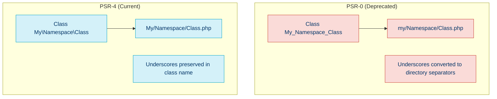

# 🔄 PSR-4: Autoloading Standard

## 📚 Overview

PSR-4 defines a specification for autoloading classes from file paths. It builds on PSR-0 (now deprecated) and makes autoloading more flexible and efficient. PSR-4 is widely adopted in the PHP ecosystem and is the standard autoloading method used by Composer.

## 🎯 Key Objectives

- 📁 Establish a standardized way to map namespaces to directory structures
- 🔄 Allow for easy class autoloading without manual `require`/`include` statements
- 🛠️ Provide a consistent approach that works across different projects and frameworks

## ⚙️ How PSR-4 Works

PSR-4 autoloading follows these key principles:

1. A **fully qualified class name** has the following structure:
   
   ```
   \<NamespacePrefix>\<RelativeClassName>
   ```

2. The **namespace prefix** maps to a "base directory"
3. The **relative class name** maps to a subdirectory and/or filename

### 🗺️ Mapping Rules

| Component | Filesystem Mapping |
|-----------|-------------------|
| Namespace prefix | Base directory |
| Namespace separator (`\`) | Directory separator (`/` or `\`) |
| Class name | Filename with `.php` extension |

## 📝 Example Implementation

### Directory Structure

```
vendor/
    - composer.json
    - composer.lock
src/
    - Database/
        - Connection.php
        - Query/
            - Builder.php
    - Http/
        - Controller.php
        - Request.php
        - Response.php
```

### Namespace Structure

```php
<?php

// File: src/Database/Connection.php
namespace App\Database;

class Connection
{
    // Class implementation
}

// File: src/Database/Query/Builder.php
namespace App\Database\Query;

class Builder
{
    // Class implementation
}
```

### Composer Configuration

```json
{
    "name": "example/project",
    "autoload": {
        "psr-4": {
            "App\\": "src/"
        }
    },
    "require": {
        // Dependencies
    }
}
```

## 🔄 Using Autoloaded Classes

Once configured, you can use the classes without explicit `require` statements:

```php
<?php

// Automatically loads src/Database/Connection.php
$connection = new App\Database\Connection();

// Automatically loads src/Http/Request.php
$request = new App\Http\Request();

// Automatically loads src/Database/Query/Builder.php
$queryBuilder = new App\Database\Query\Builder();
```

## 🧰 Implementing PSR-4 Autoloading

### 1. With Composer (Recommended)

```json
{
    "autoload": {
        "psr-4": {
            "App\\": "src/",
            "Tests\\": "tests/"
        }
    }
}
```

After updating the composer.json file, run:

```bash
composer dump-autoload
```

**Usage:**

```php
<?php

require_once 'vendor/autoload.php';

// Classes are now autoloaded
$obj = new App\SomeClass();
```

### 2. Manual Implementation

```php
<?php

// Simple PSR-4 Autoloader
spl_autoload_register(function ($class) {
    // Base namespace prefix
    $prefix = 'App\\';

    // Base directory for the namespace prefix
    $base_dir = __DIR__ . '/src/';

    // If the class doesn't use the namespace prefix, skip
    $len = strlen($prefix);
    if (strncmp($prefix, $class, $len) !== 0) {
        return;
    }

    // Get the relative class name
    $relative_class = substr($class, $len);

    // Replace namespace separators with directory separators
    // and add .php extension
    $file = $base_dir . str_replace('\\', '/', $relative_class) . '.php';

    // If the file exists, require it
    if (file_exists($file)) {
        require $file;
    }
});
```

## 🔄 PSR-4 vs. PSR-0



## 🛠️ Best Practices for PSR-4

1. **Align namespaces with directory structure**
   - Keep your directory structure clean and aligned with namespaces

2. **Use meaningful namespace names**
   - Namespaces should represent logical groups of related classes

3. **Avoid deep nesting**
   - While PSR-4 supports deep nesting, excessive depth can make code harder to navigate

4. **Match case exactly**
   - Ensure filenames match class names exactly, including case

5. **One class per file**
   - Each file should contain only one class, matching the filename

## 💡 Advanced Composer Autoloading

Composer allows you to combine PSR-4 with other autoloading methods:

```json
{
    "autoload": {
        "psr-4": {
            "App\\": "src/"
        },
        "files": [
            "src/helpers.php"
        ],
        "classmap": [
            "legacy/"
        ]
    }
}
```

## 🚫 Common Issues and Solutions

| Issue | Solution |
|-------|----------|
| Class not found | Verify namespace matches directory structure |
| Case sensitivity errors | Ensure file and class names match exactly, including case |
| Missing `vendor/autoload.php` | Run `composer install` or `composer dump-autoload` |
| Multiple autoloaders conflict | Ensure PSR-4 autoloader is registered before others |

## 🧭 Navigation

- [← Back to PSR-12: Extended Coding Style](./01c-psr-12.md)
- [→ Code Analysis Tools](../06-code-quality/02-code-analysis-tools.md)

## 📚 Further Reading

- [Official PSR-4 Documentation](https://www.php-fig.org/psr/psr-4/)
- [Composer Autoloading Documentation](https://getcomposer.org/doc/04-schema.md#autoload)
- [PHP Autoloading Best Practices](https://www.php-fig.org/psr/psr-4/examples/)
- [Understanding PSR-4 Autoloading](https://www.sitepoint.com/psr-4-autoloading-with-composer/)
