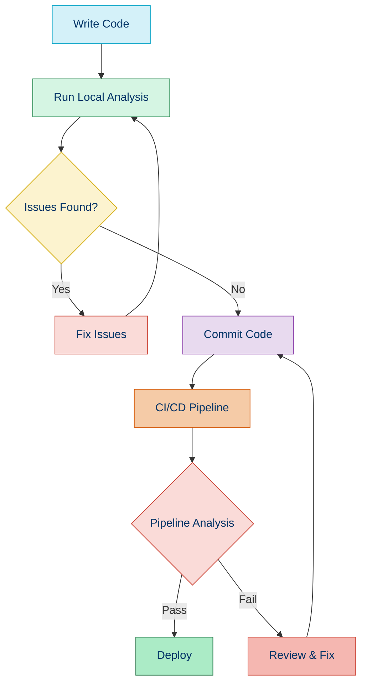
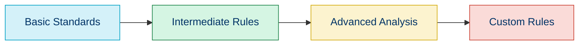

# 🔍 Code Analysis Tools for PHP

## 📚 Overview

Code analysis tools help you identify potential issues, enforce coding standards, and improve the overall quality of your PHP codebase. These tools can detect bugs, security vulnerabilities, poor design patterns, and style inconsistencies before they make it to production.

## 🛠️ Types of Code Analysis

### 1. Static Analysis

Static analysis examines code without executing it, identifying potential issues through pattern recognition and rule sets.

### 2. Dynamic Analysis

Dynamic analysis evaluates code during runtime, finding issues that only appear when the code is executed.

### 3. Metrics Analysis

Metrics analysis provides quantitative measurements about code complexity, maintainability, and technical debt.

## 🧰 Essential PHP Code Analysis Tools

| Tool | Type | Purpose | Difficulty |
|------|------|---------|------------|
| 🕵️ [PHPStan](./02a-phpstan.md) | Static | Type checking and error detection | ⭐⭐⭐ |
| 🔍 [PHP_CodeSniffer](./02b-phpcs.md) | Static | Coding standards enforcement | ⭐⭐ |
| 🔎 [PHP Mess Detector](./02c-phpmd.md) | Static | Code complexity and potential bugs | ⭐⭐⭐ |
| 📊 [PHP Insights](./02d-php-insights.md) | Metrics | Code quality metrics dashboard | ⭐⭐ |
| 🔬 [Psalm](https://psalm.dev/) | Static | Type checking and security analysis | ⭐⭐⭐⭐ |
| 📈 [PHPLOC](https://github.com/sebastianbergmann/phploc) | Metrics | Code size and structure analysis | ⭐ |
| 🔄 [PHP Copy/Paste Detector](https://github.com/sebastianbergmann/phpcpd) | Static | Duplicate code detection | ⭐ |

## 📝 Example Implementation

### Setting Up Multiple Analysis Tools

Here's how to configure multiple code analysis tools for a PHP project:

```bash
# Install key analysis tools
composer require --dev phpstan/phpstan
composer require --dev squizlabs/php_codesniffer
composer require --dev phpmd/phpmd
composer require --dev nunomaduro/phpinsights

# Create a composer script for easy execution
```

### Composer Configuration

```json
{
    "scripts": {
        "analyze": [
            "@phpstan",
            "@phpcs",
            "@phpmd"
        ],
        "phpstan": "phpstan analyse src tests --level=5",
        "phpcs": "phpcs --standard=PSR12 src tests",
        "phpmd": "phpmd src,tests ansi cleancode,codesize,controversial,design,naming,unusedcode",
        "insights": "phpinsights analyse src --no-interaction --min-quality=80 --min-complexity=80 --min-architecture=80 --min-style=80"
    }
}
```

### Usage

```bash
# Run all analysis tools
composer analyze

# Run specific tool
composer phpstan
```

## 🔄 Integration in Development Workflow



## 🌟 Benefits of Using Analysis Tools

1. **Early Issue Detection**: Find problems before they reach production
2. **Consistent Code Quality**: Enforce standards across the team
3. **Reduced Technical Debt**: Address code smells and potential issues proactively
4. **Security Enhancement**: Detect security vulnerabilities
s5. **Better Documentation**: Some tools help improve code documentation
6. **Continuous Learning**: Developers learn best practices through tool feedback

## 🚀 Getting Started with Analysis Tools

### 1. Start Simple

Begin with basic tools and gradually increase strictness:

```bash
# Start with a lower strictness level for PHPStan
phpstan analyse src --level=3
```

### 2. Create a Baseline

For existing projects, create a baseline to ignore existing issues:

```bash
# Create a PHPStan baseline
phpstan analyse src --generate-baseline
```

### 3. Gradually Increase Standards



## 📋 Recommended Configuration Files

### PHPStan Configuration (phpstan.neon)

```yaml
parameters:
    level: 5
    paths:
        - src
        - tests
    excludePaths:
        - vendor/*
    ignoreErrors:
        - '#Call to an undefined method [a-zA-Z0-9\\_]+::method\(\)#'
```

### PHPCS Configuration (phpcs.xml)

```xml
<?xml version="1.0"?>
<ruleset name="Custom Standard">
    <description>Custom Coding Standard</description>
    <rule ref="PSR12"/>
    <file>src</file>
    <file>tests</file>
    <exclude-pattern>*/vendor/*</exclude-pattern>
</ruleset>
```

## 🤖 CI/CD Integration

### GitHub Actions Example

```yaml
name: Code Analysis

on:
  push:
    branches: [ main ]
  pull_request:
    branches: [ main ]

jobs:
  analyze:
    runs-on: ubuntu-latest
    
    steps:
    - uses: actions/checkout@v3
    
    - name: Setup PHP
      uses: shivammathur/setup-php@v2
      with:
        php-version: '8.1'
        
    - name: Install dependencies
      run: composer install --prefer-dist --no-progress
        
    - name: Run PHPStan
      run: vendor/bin/phpstan analyse src
      
    - name: Run PHPCS
      run: vendor/bin/phpcs src
```

## 🧭 Navigation

- [← Back to PSR-4: Autoloading Standard](./01d-psr-4.md)
- [→ Static Analysis with PHPStan](./02a-phpstan.md)

## 📚 Further Reading

- [Static Analysis in PHP](https://tsh.io/blog/static-analysis-in-php/)
- [PHPStan Documentation](https://phpstan.org/user-guide/getting-started)
- [PHP_CodeSniffer Documentation](https://github.com/squizlabs/PHP_CodeSniffer/wiki)
- [PHP Mess Detector Documentation](https://phpmd.org/documentation/index.html)
- [PHP Insights Documentation](https://phpinsights.com/get-started.html)
