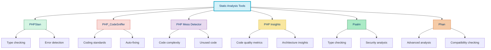
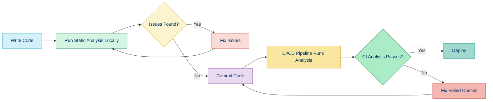

# 🔍 Static Analysis

## 📚 Overview

Static analysis is the process of analyzing code without executing it. This type of analysis can detect potential bugs, security vulnerabilities, and code quality issues before your code reaches production. In PHP, several powerful tools have emerged to help developers write more reliable and maintainable code.

## 🎯 Benefits of Static Analysis

- **Early Bug Detection**: Find bugs before they reach production
- **Code Quality Improvement**: Enforce coding standards and best practices
- **Security Enhancement**: Identify potential security vulnerabilities
- **Better Documentation**: Enforce proper type declarations and PHPDoc comments
- **Reduced Technical Debt**: Address issues systematically rather than accumulating them
- **Team Consistency**: Ensure all team members follow the same standards

## 🛠️ Popular PHP Static Analysis Tools



### Key Tools in Depth

| Tool | Focus | Difficulty | Best For |
|------|-------|------------|----------|
| [PHPStan](./02a-phpstan.md) | Type checking | Medium | Catching type errors |
| [PHP_CodeSniffer](./02b-phpcs.md) | Coding standards | Easy | Enforcing consistent style |
| [PHP Mess Detector](./02c-phpmd.md) | Code quality | Medium | Finding complex/problematic code |
| [PHP Insights](./02d-php-insights.md) | All-in-one | Easy | Getting multiple analyses in one tool |
| [Psalm](https://psalm.dev/) | Type checking | Medium-Hard | Advanced type checking |
| [Phan](https://github.com/phan/phan) | Advanced analysis | Hard | Finding subtle bugs |

## 🚀 Getting Started with Static Analysis

### Basic Setup Example

```bash
# Install key tools via Composer
composer require --dev phpstan/phpstan
composer require --dev squizlabs/php_codesniffer
composer require --dev phpmd/phpmd
```

### Incremental Adoption Strategy

For existing projects, follow this approach:

1. **Start at a lower level**: Begin with the most permissive settings
2. **Fix reported issues**: Address the initial set of issues
3. **Gradually increase strictness**: Incrementally raise the standards
4. **Integrate with CI/CD**: Automate checks in your pipeline
5. **Add to pre-commit hooks**: Enforce checks before code is committed

## 📊 Understanding Analysis Results

Static analysis tools provide different types of feedback:

### Error Levels (PHPStan Example)

PHPStan and other tools use "levels" to indicate strictness:

- **Level 0**: Basic checks (undefined variables, methods, etc.)
- **Level 1**: Basic types, dead code
- **Level 2**: More complex type checking
- ...
- **Level 8/9**: The strictest checks (all possible issues)

### Error Categories

Most tools categorize issues in ways that help you understand their impact:

- **Errors**: Must be fixed (potentially breaking issues)
- **Warnings**: Should be fixed (bad practices)
- **Info/Notices**: Consider fixing (style issues)

## 🔄 Integration with Development Workflow



### Editor Integration

Most modern editors and IDEs offer integration with these tools:

- **PHPStorm**: Built-in support for PHPStan, PHPCS, and PHPMD
- **VS Code**: Extensions available for all major tools
- **Sublime Text**: Plugins available for static analysis tools

## 🧰 Setting Up a Complete Analysis Suite

### Composer Scripts

Add these to your `composer.json` for convenience:

```json
"scripts": {
    "phpstan": "phpstan analyse src tests",
    "phpcs": "phpcs --standard=PSR12 src",
    "phpmd": "phpmd src text cleancode,codesize,controversial,design,naming,unusedcode",
    "analyse": [
        "@phpstan",
        "@phpcs",
        "@phpmd"
    ]
}
```

### Configuration Files

#### phpstan.neon

```yaml
parameters:
    level: 5
    paths:
        - src
    excludePaths:
        - tests/Fixtures
    checkMissingIterableValueType: false
```

#### phpcs.xml

```xml
<?xml version="1.0"?>
<ruleset name="Custom Standard">
    <description>Custom coding standard</description>
    
    <file>src</file>
    
    <rule ref="PSR12"/>
    
    <rule ref="Generic.Files.LineLength">
        <properties>
            <property name="lineLimit" value="120"/>
        </properties>
    </rule>
</ruleset>
```

#### phpmd.xml

```xml
<?xml version="1.0"?>
<ruleset name="Custom PHPMD ruleset"
         xmlns="http://pmd.sf.net/ruleset/1.0.0"
         xmlns:xsi="http://www.w3.org/2001/XMLSchema-instance"
         xsi:schemaLocation="http://pmd.sf.net/ruleset/1.0.0 http://pmd.sf.net/ruleset_xml_schema.xsd"
         xsi:noNamespaceSchemaLocation="http://pmd.sf.net/ruleset_xml_schema.xsd">
    <description>Custom ruleset for static analysis</description>
    
    <rule ref="rulesets/cleancode.xml"/>
    <rule ref="rulesets/codesize.xml"/>
    <rule ref="rulesets/design.xml"/>
    <rule ref="rulesets/naming.xml"/>
    <rule ref="rulesets/unusedcode.xml"/>
</ruleset>
```

## 📋 Best Practices

1. **Type Everything**: Use strict typing and type declarations wherever possible
2. **PhpDoc All Methods**: Add thorough PHPDoc comments to all methods and classes
3. **Run Before Commits**: Use Git hooks to run analysis before committing
4. **Start Strict, Selectively Relax**: Begin with strict standards and add exceptions only when needed
5. **Address Issues Promptly**: Don't let static analysis warnings accumulate
6. **Customize to Your Project**: Tailor the rules to what makes sense for your codebase

## 🌐 Real-World Examples

### Laravel with PHPStan

```php
// Before static analysis
function getUserData($id) {
    $user = User::find($id);
    return [
        'name' => $user->name,
        'email' => $user->email,
    ];
}
```

**PHPStan Error:**
```
Access to property $name on possibly null value of type App\Models\User|null.
```

```php
// After fixing
function getUserData($id): ?array {
    $user = User::find($id);
    
    if ($user === null) {
        return null;
    }
    
    return [
        'name' => $user->name,
        'email' => $user->email,
    ];
}
```

### Symfony with PHP_CodeSniffer

```php
// Before PHPCS
class UserController extends AbstractController
{
function store(Request $request){
$name=$request->request->get('name');
        $email = $request->request->get('email');
    $user = new User($name,$email);
    $this->userRepository->save($user);
return $this->redirectToRoute('user_list');
}
}
```

**PHPCS Output:**
```
FILE: .../UserController.php
----------------------------------------------------------------------
FOUND 8 ERRORS AFFECTING 6 LINES
----------------------------------------------------------------------
  3 | ERROR | [x] Opening brace of a class must be on the line after
    |       |     the definition
  4 | ERROR | [x] Line indented incorrectly; expected 4 spaces, found 0
  4 | ERROR | [ ] Missing doc comment for function store()
```

```php
// After fixing
class UserController extends AbstractController
{
    /**
     * Store a new user
     */
    public function store(Request $request): Response
    {
        $name = $request->request->get('name');
        $email = $request->request->get('email');
        $user = new User($name, $email);
        $this->userRepository->save($user);
        
        return $this->redirectToRoute('user_list');
    }
}
```

## 🔍 In-Depth Static Analysis Guides

- [PHPStan](./02a-phpstan.md) - Type checking and error detection
- [PHP_CodeSniffer](./02b-phpcs.md) - Coding standards enforcement
- [PHP Mess Detector](./02c-phpmd.md) - Code complexity analysis
- [PHP Insights](./02d-php-insights.md) - All-in-one analysis with beautiful metrics

## 🧭 Navigation

- [← Back to Coding Standards](./01-coding-standards.md)
- [→ PHPStan](./02a-phpstan.md)

## 📚 Further Reading

- [PHPStan Documentation](https://phpstan.org/user-guide/getting-started)
- [PHP_CodeSniffer Wiki](https://github.com/squizlabs/PHP_CodeSniffer/wiki)
- [PHP Mess Detector Documentation](https://phpmd.org/documentation/index.html)
- [Psalm Documentation](https://psalm.dev/docs/)
- [Static Analysis in Modern PHP Applications](https://matthiasnoback.nl/book/static-analysis-in-php/)
