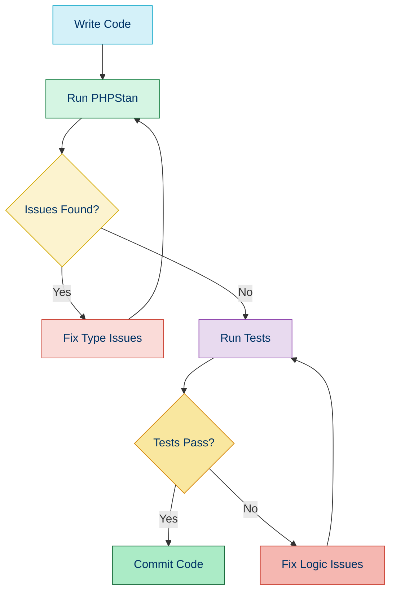

# 🕵️ Static Analysis with PHPStan

## 📚 Overview

PHPStan is a powerful static analysis tool that finds errors in your code without actually running it. It focuses on finding bugs, type inconsistencies, and logical errors by analyzing PHP code against a set of rules at various strictness levels.

## 🌟 Key Features

- 📊 Multiple levels of strictness (0-9)
- 🧩 Type inference and checking
- 🔍 Dead code detection
- 🔒 Strict mode analysis
- 🧰 Extensible through plugins
- 📝 Custom rule creation
- 🛠️ Configuration options
- 🔄 Baseline feature for existing codebases

## 🛠️ Installation

```bash
# Installation via Composer
composer require --dev phpstan/phpstan

# For Laravel projects, you may want the extension
composer require --dev nunomaduro/larastan
```

## 📈 PHPStan Analysis Levels

PHPStan provides 9 levels of strictness (0-8), with each level building upon the previous one:

| Level | Focus | Strictness |
|-------|-------|------------|
| 0 | Basic checks, undefined variables, classes, methods | ⭐ |
| 1 | Level 0 + unknown methods on known classes | ⭐⭐ |
| 2 | Level 1 + unknown properties | ⭐⭐ |
| 3 | Level 2 + return types, phpdocs | ⭐⭐⭐ |
| 4 | Level 3 + type hints | ⭐⭐⭐ |
| 5 | Level 4 + argument checking | ⭐⭐⭐⭐ |
| 6 | Level 5 + check for existing classes in instanceof | ⭐⭐⭐⭐ |
| 7 | Level 6 + check for unused exceptions | ⭐⭐⭐⭐⭐ |
| 8 | Level 7 + strict rules | ⭐⭐⭐⭐⭐ |
| 9 (max) | All available checks | ⭐⭐⭐⭐⭐⭐ |

## 📊 Basic Usage

```bash
# Run analysis at level 5
vendor/bin/phpstan analyse src --level=5

# More verbose output
vendor/bin/phpstan analyse src --level=5 -v

# Generate a baseline
vendor/bin/phpstan analyse src --level=5 --generate-baseline

# Use a config file
vendor/bin/phpstan analyse --configuration=phpstan.neon
```

## 📝 Configuration File (phpstan.neon)

```yaml
parameters:
    level: 5
    paths:
        - src
        - tests
    excludePaths:
        - tests/Fixtures
        - src/Legacy
    ignoreErrors:
        - '#Call to an undefined method [a-zA-Z0-9\\_]+::nonExistentMethod\(\)#'
    checkMissingIterableValueType: false
```

## 🔍 Example Analysis

### Sample PHP Code with Issues

```php
<?php

namespace App\Service;

class Calculator
{
    public function add($a, $b)
    {
        return $a + $b;
    }
    
    public function divide($a, $b)
    {
        return $a / $b;
    }
    
    public function complexOperation(array $data)
    {
        $result = 0;
        foreach ($data as $item) {
            $result += $item->value;
        }
        return $result;
    }
}
```

### PHPStan Output

```
 ------ ------------------------------------------------------------ 
  Line   Service/Calculator.php                                      
 ------ ------------------------------------------------------------ 
  8      Parameter $a of method App\Service\Calculator::add() has    
         no type specified.                                          
  8      Parameter $b of method App\Service\Calculator::add() has    
         no type specified.                                          
  13     Parameter $a of method App\Service\Calculator::divide()     
         has no type specified.                                      
  13     Parameter $b of method App\Service\Calculator::divide()     
         has no type specified.                                      
  20     Cannot access property $value on mixed.                     
 ------ ------------------------------------------------------------ 
```

### Fixed Code

```php
<?php

namespace App\Service;

class Calculator
{
    public function add(int|float $a, int|float $b): int|float
    {
        return $a + $b;
    }
    
    public function divide(int|float $a, int|float $b): float
    {
        if ($b === 0) {
            throw new \InvalidArgumentException('Division by zero');
        }
        return $a / $b;
    }
    
    /**
     * @param array<int, object> $data
     * @return float
     */
    public function complexOperation(array $data): float
    {
        $result = 0;
        foreach ($data as $item) {
            if (!property_exists($item, 'value')) {
                throw new \InvalidArgumentException('Item missing value property');
            }
            $result += $item->value;
        }
        return (float) $result;
    }
}
```

## 🧪 Common Issues PHPStan Detects

1. **Undefined variables**
   ```php
   // PHPStan will catch this:
   function foo() {
       return $undefinedVariable;
   }
   ```

2. **Type mismatches**
   ```php
   // PHPStan will catch this:
   function expectsString(string $input) { /* ... */ }
   expectsString(42);
   ```

3. **Accessing non-existent methods or properties**
   ```php
   // PHPStan will catch this:
   $user = new User();
   echo $user->nonExistentProperty;
   ```

4. **Invalid method returns**
   ```php
   // PHPStan will catch this:
   function returnString(): string {
       return null; // Type mismatch
   }
   ```

5. **Dead code**
   ```php
   // PHPStan will catch this:
   if (false) {
       return 'This code is never executed';
   }
   ```

## 🔄 Integration in Development Workflow



## 🛠️ Advanced PHPStan Configuration

### Custom Rules

```php
<?php
// src/PHPStan/Rules/ForbiddenFunctionsRule.php
namespace App\PHPStan\Rules;

use PhpParser\Node;
use PhpParser\Node\Expr\FuncCall;
use PhpParser\Node\Name;
use PHPStan\Analyser\Scope;
use PHPStan\Rules\Rule;

class ForbiddenFunctionsRule implements Rule
{
    private const FORBIDDEN_FUNCTIONS = [
        'var_dump',
        'print_r',
        'die',
        'exit'
    ];

    public function getNodeType(): string
    {
        return FuncCall::class;
    }

    public function processNode(Node $node, Scope $scope): array
    {
        if (!($node->name instanceof Name)) {
            return [];
        }

        $function = $node->name->toString();
        
        if (in_array($function, self::FORBIDDEN_FUNCTIONS, true)) {
            return [
                "Function {$function}() is forbidden in production code."
            ];
        }

        return [];
    }
}
```

### Register Custom Rule

```yaml
# phpstan.neon
services:
    -
        class: App\PHPStan\Rules\ForbiddenFunctionsRule
        tags:
            - phpstan.rules.rule
```

## 🚀 Best Practices

1. **Start at a lower level** for existing projects and gradually increase
2. **Use baseline** for legacy codebases to focus on new code
3. **Add to CI/CD pipeline** to catch issues early
4. **Combine with PHPUnit** for comprehensive quality assurance
5. **Document type information** using PHPDoc annotations
6. **Regularly update PHPStan** to benefit from new rules and features
7. **Use extensions** relevant to your framework or libraries

## 📋 PHPStan vs. Other Static Analysis Tools

| Tool | Strong Points | Limitations | Integration |
|------|--------------|-------------|------------|
| **PHPStan** | Type checking, rule levels, extensions | Learning curve | Excellent CI/CD support |
| **Psalm** | Security analysis, type inference | Complex configuration | GitHub integration |
| **Phan** | Performance, taint analysis | Less maintained | IDE plugins |
| **PHP_CodeSniffer** | Style checking | Limited type analysis | IDE integration |

## 💡 Tips for Dealing with False Positives

1. **Use PHPDoc annotations** to provide more type context
   ```php
   /**
    * @param array<int, string> $items Array of string items
    * @return array<int, string> Transformed items
    */
   function process(array $items): array { /* ... */ }
   ```

2. **Configure ignoreErrors** for specific patterns
   ```yaml
   parameters:
       ignoreErrors:
           - '#PHPDoc tag @var for variable \$router contains unresolvable type#'
   ```

3. **Use assertion functions** to help PHPStan understand your code
   ```php
   function processUser($user): void {
       \assert($user instanceof User);
       // PHPStan now knows $user is a User object
   }
   ```

## 🧭 Navigation

- [← Back to Code Analysis Tools](./02-code-analysis-tools.md)
- [→ PHP_CodeSniffer (PHPCS)](./02b-phpcs.md)

## 📚 Further Reading

- [PHPStan Official Documentation](https://phpstan.org/user-guide/getting-started)
- [Writing Custom PHPStan Rules](https://phpstan.org/developing-extensions/rules)
- [PHPStan in GitHub Actions](https://github.com/marketplace/actions/phpstan)
- [Advanced Types in PHP](https://www.php.net/manual/en/language.types.declarations.php)
- [Type Juggling in PHP](https://www.php.net/manual/en/language.types.type-juggling.php)
