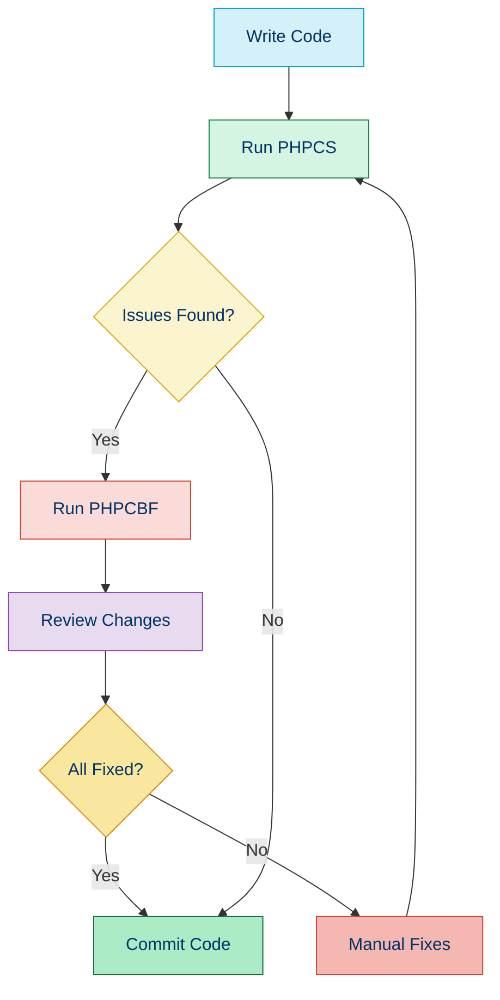

# 🔍 PHP_CodeSniffer (PHPCS)

## 📚 Overview

PHP_CodeSniffer (PHPCS) is a popular tool that detects violations of coding standards and can automatically fix many of the issues it finds. It's essential for maintaining consistent code style across a project or team.

## 🎯 Key Features

- 🔍 Detects violations of coding standards
- 🧹 Automatic code fixing with PHPCBF (PHP Code Beautifier and Fixer)
- 📏 Support for multiple coding standards (PSR-1, PSR-12, PEAR, Zend, etc.)
- 🛠️ Custom sniff development
- 🏗️ Project-specific configuration
- 🔄 Integrates with IDEs and CI tools

## ⚙️ Installation

```bash
# Install via Composer
composer require --dev squizlabs/php_codesniffer

# Verify installation
vendor/bin/phpcs --version
vendor/bin/phpcbf --version
```

## 🚀 Basic Usage

### Checking Code Style

```bash
# Check a file or directory against PSR-12
vendor/bin/phpcs --standard=PSR12 src/

# Check with detailed progress
vendor/bin/phpcs --standard=PSR12 --report=full src/

# Check specific file types
vendor/bin/phpcs --standard=PSR12 --extensions=php,inc src/
```

### Fixing Code Style

```bash
# Fix code style issues automatically
vendor/bin/phpcbf --standard=PSR12 src/

# Show what would be fixed without making changes
vendor/bin/phpcbf --standard=PSR12 --dry-run src/
```

## 🔧 Configuration

### Project Configuration File (phpcs.xml)

```xml
<?xml version="1.0"?>
<ruleset name="Custom Standard">
    <description>My custom coding standard</description>
    
    <!-- Use PSR-12 as the base -->
    <rule ref="PSR12">
        <!-- Exclude rules you don't want -->
        <exclude name="Generic.Files.LineLength"/>
    </rule>
    
    <!-- Include directories to check -->
    <file>src</file>
    <file>tests</file>
    
    <!-- Exclude patterns -->
    <exclude-pattern>*/vendor/*</exclude-pattern>
    <exclude-pattern>*/cache/*</exclude-pattern>
    
    <!-- Configure rules -->
    <rule ref="Generic.Files.LineLength">
        <properties>
            <property name="lineLimit" value="120"/>
        </properties>
    </rule>
    
    <!-- Tab indentation instead of spaces -->
    <arg name="tab-width" value="4"/>
    
    <!-- Show progress -->
    <arg value="p"/>
    
    <!-- Colors in output -->
    <arg name="colors"/>
</ruleset>
```

### Command-Line Configuration

```bash
# Specifying a custom configuration file
vendor/bin/phpcs --standard=phpcs.xml

# Ignoring specific files or directories
vendor/bin/phpcs --standard=PSR12 --ignore=*/vendor/*,*/views/* src/

# Setting tab width
vendor/bin/phpcs --standard=PSR12 --tab-width=4 src/
```

## 📝 Example: Before and After

### Original PHP File (Before)

```php
<?php
namespace App\Controllers;
class ProductController {
    function listProducts($category=null,$limit=10) {
        // Bad formatting and inconsistent indentation
      $products = $this->productRepository->findAll();
        if($category!=null) {
            $products = array_filter($products, function($product)use($category) {
                return $product->category==$category;
            });
        }
        return array_slice($products,0,$limit);
    }
}
```

### PHPCS Report Output

```
FILE: src/Controllers/ProductController.php
----------------------------------------------------------------------
FOUND 12 ERRORS AFFECTING 7 LINES
----------------------------------------------------------------------
 2 | ERROR | Missing blank line after namespace declaration
 3 | ERROR | Opening brace should be on a new line
 4 | ERROR | Missing function doc comment
 4 | ERROR | Space after function name is prohibited
 4 | ERROR | No space found after comma in function parameter
 4 | ERROR | No space found before comma in function parameter
 6 | ERROR | Line indented incorrectly; expected 8 spaces, found 6
 7 | ERROR | Expected 1 space after IF keyword; 0 found
 7 | ERROR | Expected 1 space after "!="; 0 found
 8 | ERROR | No space found after function keyword in closure declaration
 8 | ERROR | No space found before "use" keyword
 8 | ERROR | No space found after "use" keyword
----------------------------------------------------------------------
```

### Fixed PHP File (After)

```php
<?php

namespace App\Controllers;

class ProductController
{
    /**
     * List products with optional filtering
     *
     * @param string|null $category Category filter
     * @param int $limit Maximum number of products to return
     * @return array List of products
     */
    public function listProducts($category = null, $limit = 10)
    {
        // Bad formatting and inconsistent indentation
        $products = $this->productRepository->findAll();
        if ($category != null) {
            $products = array_filter($products, function ($product) use ($category) {
                return $product->category == $category;
            });
        }
        return array_slice($products, 0, $limit);
    }
}
```

## 🛠️ Available Coding Standards

PHPCS comes with several built-in coding standards:

| Standard | Description |
|----------|-------------|
| **PSR1** | Basic coding standard |
| **PSR2** | Coding style guide (deprecated in favor of PSR-12) |
| **PSR12** | Extended coding style guide |
| **PEAR** | PEAR coding standard |
| **Zend** | Zend Framework coding standard |
| **Squiz** | Squiz coding standard |
| **MySource** | MySource coding standard |

## 🧩 Custom Sniffs

### Creating a Custom Sniff

```php
<?php

namespace App\Sniffs;

use PHP_CodeSniffer\Sniffs\Sniff;
use PHP_CodeSniffer\Files\File;

class ForbiddenFunctionsSniff implements Sniff
{
    public $forbiddenFunctions = [
        'var_dump' => null,
        'dump' => null,
        'print_r' => null,
        'die' => null,
        'exit' => null,
    ];

    /**
     * Register the tokens to listen for
     *
     * @return array
     */
    public function register()
    {
        return [T_STRING];
    }

    /**
     * Process the matched token
     *
     * @param File $phpcsFile The file being scanned
     * @param int $stackPtr The position of the current token
     * @return void
     */
    public function process(File $phpcsFile, $stackPtr)
    {
        $tokens = $phpcsFile->getTokens();
        $lowerContent = strtolower($tokens[$stackPtr]['content']);

        if (array_key_exists($lowerContent, $this->forbiddenFunctions)) {
            $error = "The function %s() is forbidden; ";
            $error .= "use proper logging instead";
            $data = [$tokens[$stackPtr]['content']];
            $phpcsFile->addError($error, $stackPtr, 'Found', $data);
        }
    }
}
```

### Registering a Custom Sniff

```xml
<?xml version="1.0"?>
<ruleset name="Custom Standard">
    <description>Custom coding standard with custom sniffs</description>
    
    <rule ref="PSR12"/>
    
    <!-- Register custom sniff -->
    <rule ref="App.Functions.ForbiddenFunctions"/>
    
    <!-- Configure autoload for custom sniffs -->
    <autoload>vendor/autoload.php</autoload>
</ruleset>
```

## 🔄 Integrating PHPCS into Workflow



## 💻 IDE Integration

### PhpStorm

1. Go to **Settings → PHP → Quality Tools → PHP_CodeSniffer**
2. Set the PHP_CodeSniffer path to your vendor/bin/phpcs
3. Go to **Settings → Editor → Inspections → PHP → Quality Tools**
4. Enable PHP_CodeSniffer validation and select your coding standard

### VS Code

1. Install the **PHP Sniffer & Beautifier** extension
2. Configure the extension settings:
```json
{
    "phpSniffer.standard": "PSR12",
    "phpSniffer.executablePath": "./vendor/bin/phpcs"
}
```

## 🔄 CI/CD Integration

### GitHub Actions

```yaml
name: PHP_CodeSniffer

on:
  push:
    branches: [main]
  pull_request:
    branches: [main]

jobs:
  phpcs:
    runs-on: ubuntu-latest
    steps:
      - uses: actions/checkout@v3
      - name: Setup PHP
        uses: shivammathur/setup-php@v2
        with:
          php-version: '8.1'
          tools: composer:v2
      - name: Install dependencies
        run: composer install --prefer-dist --no-progress
      - name: Run PHPCS
        run: vendor/bin/phpcs --standard=PSR12 src/
```

### GitLab CI

```yaml
phpcs:
  image: php:8.1
  before_script:
    - apt-get update -yqq
    - apt-get install git -yqq
    - curl -sS https://getcomposer.org/installer | php -- --install-dir=/usr/local/bin --filename=composer
    - composer install
  script:
    - vendor/bin/phpcs --standard=PSR12 src/
```

## 🚫 Common Issues and Solutions

| Issue | Solution |
|-------|----------|
| Too many errors | Use `--runtime-set ignore_warnings_on_exit 1` to focus on errors |
| Need to ignore specific files | Use `--ignore=*/path/to/ignore/*` or exclude-pattern in configuration |
| Too strict rules | Customize your ruleset by excluding specific sniffs |
| False positives | Add `// phpcs:ignore` comments for specific lines |
| Large codebase | Use `--parallel=8` for faster processing on multiple cores |

## 🧭 Navigation

- [← Back to Static Analysis with PHPStan](./02a-phpstan.md)
- [→ PHP Mess Detector (PHPMD)](./02c-phpmd.md)

## 📚 Further Reading

- [PHP_CodeSniffer Documentation](https://github.com/squizlabs/PHP_CodeSniffer/wiki)
- [Creating Custom Sniffs](https://github.com/squizlabs/PHP_CodeSniffer/wiki/Coding-Standard-Tutorial)
- [PSR-12 Standard](https://www.php-fig.org/psr/psr-12/)
- [Automating Code Quality](https://laravel-news.com/automating-code-quality)
- [PHP_CodeSniffer Annotations](https://github.com/squizlabs/PHP_CodeSniffer/wiki/Advanced-Usage#ignoring-parts-of-a-file)
