# 🔎 PHP Mess Detector (PHPMD)

## 📚 Overview

PHP Mess Detector (PHPMD) is a code analysis tool that identifies potential problems in PHP code such as possible bugs, suboptimal code, overcomplicated expressions, and unused parameters, variables, and methods. It helps improve code quality by identifying "code smells" that could lead to future problems.

## 🌟 Key Features

- 🔄 Identifies complex code that might be difficult to maintain
- 🚫 Detects unused code and parameters
- ⚠️ Finds potential bugs and problematic code patterns
- 📊 Reports naming inconsistencies
- 🧪 Analyzes code quality metrics
- 🔍 Customizable rule sets

## ⚙️ Installation

```bash
# Install via Composer
composer require --dev phpmd/phpmd

# Verify installation
vendor/bin/phpmd --version
```

## 🚀 Basic Usage

```bash
# Basic command structure
vendor/bin/phpmd [path] [report format] [ruleset]

# Analyze a directory using text report format and all rulesets
vendor/bin/phpmd src text cleancode,codesize,controversial,design,naming,unusedcode

# Output to a file
vendor/bin/phpmd src text cleancode > phpmd-report.txt

# Use XML report format
vendor/bin/phpmd src xml cleancode,codesize > phpmd-report.xml

# Use HTML report format
vendor/bin/phpmd src html cleancode,codesize > phpmd-report.html
```

## 📋 Available Rulesets

PHPMD comes with the following built-in rulesets:

| Ruleset | Description | Focus |
|---------|-------------|-------|
| **cleancode** | Clean Code rules | Enforces good practices like avoiding elseif statements |
| **codesize** | Code Size rules | Identifies code complexity and size issues |
| **controversial** | Controversial rules | Rules that not everyone may agree with |
| **design** | Design rules | Finds design flaws and suboptimal implementations |
| **naming** | Naming rules | Checks for naming conventions |
| **unusedcode** | Unused Code rules | Identifies unused parameters, methods, properties |

## 📝 Example: PHPMD in Action

### Sample PHP Code with Issues

```php
<?php

namespace App\Services;

class DataProcessor
{
    private $helper;
    private $unusedProperty;

    public function __construct($helper)
    {
        $this->helper = $helper;
    }

    public function processData($data, $options, $unused)
    {
        $result = array();

        if ($options['format'] == 'json') {
            $result = json_decode($data, true);
        } else if ($options['format'] == 'xml') {
            // xml processing
            $xml = simplexml_load_string($data);
            $result = json_decode(json_encode($xml), true);
        } else if ($options['format'] == 'csv') {
            // csv processing
            $lines = explode("\n", $data);
            foreach ($lines as $line) {
                $result[] = str_getcsv($line);
            }
        } else {
            $result = $data;
        }

        return $result;
    }

    public function unusedMethod()
    {
        return true;
    }
}
```

### PHPMD Report Output

```
src/Services/DataProcessor.php:7	The field 'unusedProperty' is never used.
src/Services/DataProcessor.php:13	Avoid unused parameters such as '$unused'.
src/Services/DataProcessor.php:16	The method processData uses an else expression. Else clauses are basically not necessary and you can simplify the code by not using them.
src/Services/DataProcessor.php:18	Use elseif instead of else if.
src/Services/DataProcessor.php:23	Use elseif instead of else if.
src/Services/DataProcessor.php:38	The method unusedMethod is not used within the class.
```

### Improved Code

```php
<?php

namespace App\Services;

class DataProcessor
{
    private $helper;

    public function __construct($helper)
    {
        $this->helper = $helper;
    }

    /**
     * Process data in various formats
     *
     * @param string $data Raw data to process
     * @param array $options Processing options
     * @return array Processed data as array
     */
    public function processData($data, $options)
    {
        $format = $options['format'] ?? 'raw';
        
        if ($format === 'json') {
            return json_decode($data, true);
        }
        
        if ($format === 'xml') {
            $xml = simplexml_load_string($data);
            return json_decode(json_encode($xml), true);
        }
        
        if ($format === 'csv') {
            $lines = explode("\n", $data);
            $result = [];
            foreach ($lines as $line) {
                $result[] = str_getcsv($line);
            }
            return $result;
        }
        
        return $data;
    }
}
```

## 🔧 Configuration: phpmd.xml

```xml
<?xml version="1.0"?>
<ruleset name="Custom PHPMD ruleset"
         xmlns="http://pmd.sf.net/ruleset/1.0.0"
         xmlns:xsi="http://www.w3.org/2001/XMLSchema-instance"
         xsi:schemaLocation="http://pmd.sf.net/ruleset/1.0.0 http://pmd.sf.net/ruleset_xml_schema.xsd"
         xsi:noNamespaceSchemaLocation="http://pmd.sf.net/ruleset_xml_schema.xsd">
    <description>Custom ruleset for PHPMD</description>

    <!-- Import rulesets -->
    <rule ref="rulesets/cleancode.xml">
        <exclude name="StaticAccess" />
        <exclude name="ElseExpression" />
    </rule>
    
    <rule ref="rulesets/codesize.xml">
        <exclude name="TooManyPublicMethods" />
        <exclude name="ExcessiveMethodLength" />
    </rule>
    
    <rule ref="rulesets/design.xml" />
    <rule ref="rulesets/naming.xml" />
    <rule ref="rulesets/unusedcode.xml" />
    
    <!-- Customize rules -->
    <rule ref="rulesets/codesize.xml/ExcessiveMethodLength">
        <properties>
            <property name="minimum" value="150" />
        </properties>
    </rule>
    
    <rule ref="rulesets/codesize.xml/TooManyPublicMethods">
        <properties>
            <property name="maxmethods" value="15" />
        </properties>
    </rule>
</ruleset>
```

## 🛡️ Suppressing PHPMD Warnings

Sometimes you might want to suppress specific PHPMD warnings:

```php
/**
 * @SuppressWarnings(PHPMD.CouplingBetweenObjects)
 */
class ComplexClass
{
    // ...
}

/**
 * @SuppressWarnings(PHPMD.UnusedFormalParameter)
 */
public function methodWithRequiredParameter($unused)
{
    // ...
}
```

## 🚀 PHPMD Rules and Their Importance



```mermaid
graph TD
    A[Code Quality] --> B[Clean Code]
    A --> C[Code Size]
    A --> D[Design]
    A --> E[Naming]
    A --> F[Unused Code]
    
    B --> B1[ElseExpression]
    B --> B2[BooleanArgumentFlag]
    B --> B3[StaticAccess]
    
    C --> C1[CyclomaticComplexity]
    C --> C2[NPathComplexity]
    C --> C3[ExcessiveMethodLength]
    
    D --> D1[GotoStatement]
    D --> D2[NumberOfChildren]
    D --> D3[CouplingBetweenObjects]
    
    E --> E1[ShortVariable]
    E --> E2[LongVariable]
    E --> E3[ConstantNamingConventions]
    
    F --> F1[UnusedPrivateField]
    F --> F2[UnusedLocalVariable]
    F --> F3[UnusedFormalParameter]
    
    style A fill:#d4f1f9,stroke:#05a3c6,stroke-width:3px,color:#003366
    style B fill:#d5f5e3,stroke:#1e8449,color:#003366
    style C fill:#fadbd8,stroke:#cb4335,color:#003366
    style D fill:#e8daef,stroke:#8e44ad,color:#003366
    style E fill:#fcf3cf,stroke:#d4ac0d,color:#003366
    style F fill:#f5cba7,stroke:#d35400,color:#003366
```

## 🔄 Integrating PHPMD in Development Workflow

### Composer Script

Add PHPMD as a Composer script for easy execution:

```json
{
    "scripts": {
        "phpmd": "phpmd src html cleancode,codesize,controversial,design,naming,unusedcode > phpmd-report.html"
    }
}
```

Usage:

```bash
composer phpmd
```

### Pre-Commit Hook

Create a Git pre-commit hook to run PHPMD before committing:

```bash
#!/bin/sh
# .git/hooks/pre-commit

# Exit if any command fails
set -e

# Get staged PHP files
STAGED_PHP_FILES=$(git diff --cached --name-only --diff-filter=ACM | grep "\.php$")

if [ "$STAGED_PHP_FILES" != "" ]; then
    echo "Running PHPMD..."
    vendor/bin/phpmd "$STAGED_PHP_FILES" text cleancode,codesize,design,naming,unusedcode
fi
```

Make it executable:

```bash
chmod +x .git/hooks/pre-commit
```

### CI/CD Integration Example

```yaml
# GitHub Actions workflow
name: PHPMD

on:
  push:
    branches: [main]
  pull_request:
    branches: [main]

jobs:
  phpmd:
    runs-on: ubuntu-latest
    steps:
      - uses: actions/checkout@v3
      - name: Setup PHP
        uses: shivammathur/setup-php@v2
        with:
          php-version: '8.1'
      - name: Install dependencies
        run: composer install --prefer-dist --no-progress
      - name: Run PHPMD
        run: |
          vendor/bin/phpmd src text cleancode,codesize,controversial,design,naming,unusedcode
```

## 🛠️ Advanced Topics

### Creating Custom Rules

```php
<?php

namespace App\PHPMD\Rule;

use PHPMD\AbstractRule;
use PHPMD\Node\MethodNode;
use PHPMD\Rule\MethodAware;

class NoEchoStatementsRule extends AbstractRule implements MethodAware
{
    public function apply(MethodNode $node)
    {
        // Find all echo statements in the method
        $echoTokens = $node->findChildrenOfType('EchoStatement');
        
        if (count($echoTokens) > 0) {
            $this->addViolation(
                $node,
                [
                    $node->getName(),
                    count($echoTokens)
                ]
            );
        }
    }
}
```

Register in phpmd.xml:

```xml
<rule name="NoEchoStatements"
      message="The method {0} contains {1} echo statement(s). Use logger or response objects instead."
      class="App\PHPMD\Rule\NoEchoStatementsRule">
    <priority>1</priority>
    <description>
        Echo statements should not be used in methods. Use logger or proper response objects.
    </description>
</rule>
```

## 🧰 Common Issues and Solutions

| Issue | Solution |
|-------|----------|
| Too many violations | Start with a subset of rules and gradually add more |
| False positives | Use `@SuppressWarnings` annotations for specific methods or classes |
| Conflicting rules | Customize rule properties to match your project's needs |
| Performance issues | Run PHPMD only on changed files or with a subset of rules |
| Legacy code | Create a baseline or exclude specific directories |

## ✅ Benefits of Using PHPMD

- 📈 Improved code maintainability
- 🐞 Fewer bugs and potential issues
- 📚 Better code documentation
- 🧠 Enforced coding best practices
- 🔄 Easier refactoring
- 👥 Consistency across team members

## 🧭 Navigation

- [← Back to PHP_CodeSniffer (PHPCS)](./02b-phpcs.md)
- [→ PHP Insights](./02d-php-insights.md)

## 📚 Further Reading

- [PHPMD Official Documentation](https://phpmd.org/documentation/index.html)
- [Clean Code: A Handbook of Agile Software Craftsmanship](https://www.amazon.com/Clean-Code-Handbook-Software-Craftsmanship/dp/0132350882)
- [Code Complexity Analysis](https://phpmd.org/rules/codesize.html)
- [Creating Custom PHPMD Rules](https://phpmd.org/documentation/writing-a-phpmd-rule.html)
- [Refactoring: Improving the Design of Existing Code](https://www.amazon.com/Refactoring-Improving-Design-Existing-Code/dp/0201485672)
