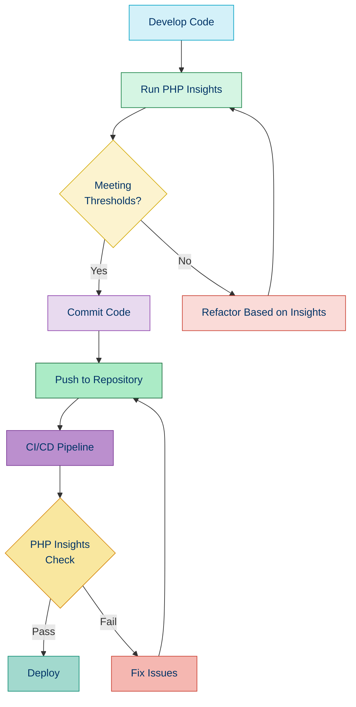

# 📊 PHP Insights

## 📚 Overview

PHP Insights is an elegant and modern tool that provides instant feedback on code quality, architecture, and complexity. It combines the functionality of several popular PHP analysis tools into a single, easy-to-use package with beautiful visualizations and actionable insights.

## 🌟 Key Features

- 📈 Code quality metrics with visual scoring
- 🔍 Architecture analysis
- 📏 Code style enforcement
- 📊 Complexity assessment
- 🔄 Built on top of established tools (PHPStan, PHPMD, PHPCS)
- ⚡ Fast analysis with detailed, actionable feedback
- 🎨 Beautiful console output with rich visuals
- 🛠️ Highly customizable

## ⚙️ Installation

```bash
# Install via Composer
composer require --dev nunomaduro/phpinsights

# For Laravel projects
composer require --dev nunomaduro/phpinsights
php artisan vendor:publish --provider="NunoMaduro\PhpInsights\Application\Adapters\Laravel\InsightsServiceProvider"
```

## 🚀 Basic Usage

```bash
# Analyze your code
vendor/bin/phpinsights

# Analyze with minimum requirements
vendor/bin/phpinsights analyse --min-quality=80 --min-complexity=80 --min-architecture=80 --min-style=80

# Analyze specific directory
vendor/bin/phpinsights analyse src/

# Format output as JSON
vendor/bin/phpinsights analyse --format=json > insights.json
```

## 📊 Example Output

When you run PHP Insights, you'll see a beautiful console output like this:

```
✨ PHP Insights
───────────────────────────────────────────────────────────────────────────────

       90.0%               95.0%               90.0%                95.0%       
        Code                Architecture         Complexity            Style      

✓ 120 passed
✕ 5 failed

[CODE] ⚠️  Class `App\Services\UserService` has 15 methods. Consider refactoring.
[ARCH] ⚠️  Coupling between objects: `App\Controllers\UserController` depends on
           too many classes (15).
[COMP] ⚠️  Cyclomatic complexity in `App\Services\ReportGenerator::generate` (25).
[COMP] ⚠️  N-Path complexity in `App\Services\ReportGenerator::generate` (200).
[STYLE]⚠️  Line exceeds maximum limit of 120 characters in `App\Models\User.php:156`.
```

## 🔧 Configuration

PHP Insights can be configured through a `phpinsights.php` file in your project root:

```php
<?php

declare(strict_types=1);

return [
    // Default preset for analyses
    'preset' => 'default',
    
    // Path to a custom configuration file
    'config-path' => null,
    
    // Composer file to use
    'composer-file' => 'composer.json',
    
    // Required minimum PHP version
    'min-quality' => 80,
    'min-complexity' => 80,
    'min-architecture' => 80,
    'min-style' => 80,
    
    // Paths to exclude from analysis
    'exclude' => [
        'vendor',
        'tests',
        'storage',
    ],
    
    // Add specific insights to include
    'add' => [
        // Examples:
        // \NunoMaduro\PhpInsights\Domain\Insights\CyclomaticComplexityIsHigh::class,
    ],
    
    // Remove specific insights from analysis
    'remove' => [
        // Examples:
        // \PHP_CodeSniffer\Standards\Generic\Sniffs\Files\LineLengthSniff::class,
        \SlevomatCodingStandard\Sniffs\TypeHints\DeclareStrictTypesSniff::class,
        \SlevomatCodingStandard\Sniffs\ControlStructures\DisallowYodaComparisonSniff::class,
    ],
    
    // Configure specific insights
    'config' => [
        \PHP_CodeSniffer\Standards\Generic\Sniffs\Files\LineLengthSniff::class => [
            'lineLimit' => 120,
            'absoluteLineLimit' => 160,
        ],
        \PhpCsFixer\Fixer\Import\OrderedImportsFixer::class => [
            'imports_order' => ['class', 'function', 'const'],
            'sort_algorithm' => 'alpha',
        ],
    ],
];
```

## 🛠️ Available Presets

PHP Insights comes with several presets for different types of projects:

| Preset | Description |
|--------|-------------|
| `default` | The default preset with universal checks |
| `laravel` | Tailored for Laravel applications |
| `symfony` | Tailored for Symfony applications |
| `magento2` | Tailored for Magento 2 projects |
| `drupal` | Tailored for Drupal projects |

You can specify a preset in the configuration file or command line:

```bash
vendor/bin/phpinsights analyse --preset=laravel
```

## 📝 Example: Before and After Refactoring

### Before (Complex Method with Issues)

```php
<?php

namespace App\Services;

class DataProcessor
{
    public function process($data)
    {
        $result = [];
        $errors = [];
        
        foreach ($data as $key => $value) {
            if ($key === 'name') {
                if (strlen($value) < 3) {
                    $errors[] = 'Name is too short';
                } elseif (strlen($value) > 50) {
                    $errors[] = 'Name is too long';
                } else {
                    $result['name'] = $value;
                }
            } elseif ($key === 'email') {
                if (!filter_var($value, FILTER_VALIDATE_EMAIL)) {
                    $errors[] = 'Invalid email';
                } else {
                    $result['email'] = $value;
                }
            } elseif ($key === 'age') {
                if (!is_numeric($value) || $value < 18 || $value > 120) {
                    $errors[] = 'Invalid age';
                } else {
                    $result['age'] = (int) $value;
                }
            } else {
                $result[$key] = $value;
            }
        }
        
        if (count($errors) > 0) {
            return ['status' => 'error', 'errors' => $errors];
        }
        
        return ['status' => 'success', 'data' => $result];
    }
}
```

### PHP Insights Report

```
✕ 3 failed

[COMP] ⚠️  Cyclomatic complexity in `App\Services\DataProcessor::process` is 14. (Maximum is 10)
[COMP] ⚠️  Method `App\Services\DataProcessor::process` has too many lines (32). (Maximum is 25)
[ARCH] ⚠️  Function `process` has a boolean flag argument $data, which is a sign of complexity.
```

### After (Refactored Based on Insights)

```php
<?php

namespace App\Services;

class DataProcessor
{
    /**
     * Process input data and validate it
     *
     * @param array $data Input data to process
     * @return array Processed data or error messages
     */
    public function process(array $data): array
    {
        $result = [];
        $errors = [];
        
        $this->processName($data, $result, $errors);
        $this->processEmail($data, $result, $errors);
        $this->processAge($data, $result, $errors);
        $this->processOtherFields($data, $result);
        
        if (!empty($errors)) {
            return ['status' => 'error', 'errors' => $errors];
        }
        
        return ['status' => 'success', 'data' => $result];
    }
    
    /**
     * Process and validate name field
     */
    private function processName(array $data, array &$result, array &$errors): void
    {
        if (!isset($data['name'])) {
            return;
        }
        
        $name = $data['name'];
        
        if (strlen($name) < 3) {
            $errors[] = 'Name is too short';
            return;
        }
        
        if (strlen($name) > 50) {
            $errors[] = 'Name is too long';
            return;
        }
        
        $result['name'] = $name;
    }
    
    /**
     * Process and validate email field
     */
    private function processEmail(array $data, array &$result, array &$errors): void
    {
        if (!isset($data['email'])) {
            return;
        }
        
        $email = $data['email'];
        
        if (!filter_var($email, FILTER_VALIDATE_EMAIL)) {
            $errors[] = 'Invalid email';
            return;
        }
        
        $result['email'] = $email;
    }
    
    /**
     * Process and validate age field
     */
    private function processAge(array $data, array &$result, array &$errors): void
    {
        if (!isset($data['age'])) {
            return;
        }
        
        $age = $data['age'];
        
        if (!is_numeric($age) || $age < 18 || $age > 120) {
            $errors[] = 'Invalid age';
            return;
        }
        
        $result['age'] = (int) $age;
    }
    
    /**
     * Process other non-validated fields
     */
    private function processOtherFields(array $data, array &$result): void
    {
        $specialFields = ['name', 'email', 'age'];
        
        foreach ($data as $key => $value) {
            if (!in_array($key, $specialFields)) {
                $result[$key] = $value;
            }
        }
    }
}
```

## 🔄 Integration in Development Workflow



## 🛠️ Customizing PHP Insights

### Creating Custom Insights

You can create custom insights for specific requirements:

```php
<?php

namespace App\Insights;

use NunoMaduro\PhpInsights\Domain\Collector;
use NunoMaduro\PhpInsights\Domain\Contracts\HasInsights;
use NunoMaduro\PhpInsights\Domain\Contracts\Insight;
use NunoMaduro\PhpInsights\Domain\Insights\Insight as InsightClass;

final class CustomInsights implements HasInsights
{
    public function getInsights(): array
    {
        return [
            ForbiddenDumpFunctions::class,
        ];
    }
    
    /**
     * Returns the collector.
     */
    public function getCollector(): Collector
    {
        return app(Collector::class);
    }
}

/**
 * Custom insight that forbids dump functions
 */
final class ForbiddenDumpFunctions extends InsightClass
{
    public function getTitle(): string
    {
        return 'Dump functions should not be used in production code';
    }
    
    public function process()
    {
        $collector = $this->getCollector();
        $nodes = $collector->getNodesWithFunctions(['dd', 'dump', 'var_dump']);
        
        foreach ($nodes as $node) {
            $this->recordIssue($node);
        }
        
        return $this;
    }
}
```

Register in your configuration:

```php
return [
    // ...
    'add' => [
        App\Insights\ForbiddenDumpFunctions::class,
    ],
];
```

## 🧭 PHP Insights vs. Other Tools

| Feature | PHP Insights | PHPStan | PHPMD | PHPCS |
|---------|-------------|---------|-------|-------|
| **Code Quality** | ✅ | ✅ | ✅ | ❌ |
| **Architecture** | ✅ | ❌ | ❌ | ❌ |
| **Complexity** | ✅ | ❌ | ✅ | ❌ |
| **Style** | ✅ | ❌ | ❌ | ✅ |
| **Visual Reports** | ✅ | ❌ | ❌ | ❌ |
| **Scoring System** | ✅ | ❌ | ❌ | ❌ |
| **Framework Support** | ✅ | ⭐* | ❌ | ❌ |
| **CI Integration** | ✅ | ✅ | ✅ | ✅ |

*Through separate packages

## 💡 Tips and Best Practices

1. **Start with lower thresholds** and gradually increase them
2. **Add PHP Insights to your CI/CD pipeline** to ensure code quality
3. **Create custom insights** for project-specific requirements
4. **Use different presets** for different types of projects
5. **Combine with other tools** for comprehensive code analysis
6. **Regularly update** to benefit from new features and improvements
7. **Exclude generated code** from analysis to avoid false positives

## 🧭 Navigation

- [← Back to PHP Mess Detector (PHPMD)](./02c-phpmd.md)
- [→ Testing Practices](../06-code-quality/03-testing-practices.md)

## 📚 Further Reading

- [PHP Insights Documentation](https://phpinsights.com/)
- [GitHub Repository](https://github.com/nunomaduro/phpinsights)
- [Integrating PHP Insights with Laravel](https://phpinsights.com/get-started.html#within-laravel)
- [Code Quality Metrics Explained](https://www.atlassian.com/continuous-delivery/software-testing/code-quality-metrics)
- [Object Calisthenics](https://williamdurand.fr/2013/06/03/object-calisthenics/)
- [Nuno Maduro's Medium Articles](https://medium.com/@nunomaduro)
