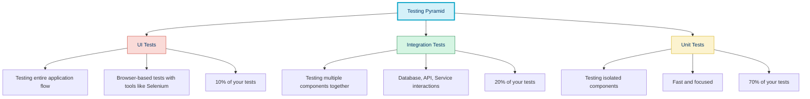
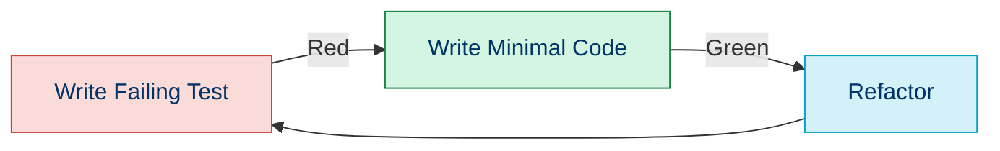

# ✅ Testing Practices in PHP

## 📚 Overview

Testing is a critical aspect of software development that ensures your code works as expected, prevents regressions, and facilitates safer refactoring. This section explores various testing approaches and best practices for PHP applications.

## 🎯 Why Testing Matters

- 🐛 **Bug Prevention**: Catch issues before they reach production
- 🔄 **Refactoring Safety**: Modify code with confidence, knowing tests will reveal issues
- 📝 **Living Documentation**: Tests serve as executable documentation for how code should work
- 👥 **Team Confidence**: New team members can understand code through tests
- 🚀 **Continuous Delivery**: Reliable tests enable faster deployment cycles

## 🧪 Types of Tests



## 🛠️ Testing Tools and Frameworks in PHP

| Tool | Type | Purpose | Difficulty |
|------|------|---------|------------|
| [PHPUnit](./03a-phpunit.md) | Unit/Integration | General-purpose testing framework | ⭐⭐⭐ |
| [Pest PHP](https://pestphp.com/) | Unit/Integration | Modern testing framework with expressive syntax | ⭐⭐ |
| [Codeception](https://codeception.com/) | All levels | Full-stack testing framework | ⭐⭐⭐⭐ |
| [Behat](https://docs.behat.org/) | Behavior-Driven | BDD testing framework | ⭐⭐⭐ |
| [PHPSpec](http://phpspec.net/) | Design-Driven | Specification-based testing | ⭐⭐⭐ |
| [Mockery](http://docs.mockery.io/) | Mocking | Mock object framework | ⭐⭐ |
| [Infection](https://infection.github.io/) | Mutation | Mutation testing framework | ⭐⭐⭐⭐ |

## 🚀 Getting Started with Testing

### Installation

```bash
# Install PHPUnit (most common)
composer require --dev phpunit/phpunit

# Create a basic phpunit.xml configuration
./vendor/bin/phpunit --generate-configuration
```

### Basic Test Structure

```php
<?php

namespace Tests\Unit;

use PHPUnit\Framework\TestCase;
use App\Calculator;

class CalculatorTest extends TestCase
{
    public function testAddReturnsCorrectSum()
    {
        // Arrange
        $calculator = new Calculator();
        
        // Act
        $result = $calculator->add(5, 3);
        
        // Assert
        $this->assertEquals(8, $result);
    }
}
```

**Output:**
```
PHPUnit 10.0.0 by Sebastian Bergmann and contributors.

.                                                                   1 / 1 (100%)

Time: 00:00.002, Memory: 4.00 MB

OK (1 test, 1 assertion)
```

## 📊 Test-Driven Development (TDD)

[Test-Driven Development](./03b-tdd.md) is a development approach where you:

1. **Write a failing test** that defines expected behavior
2. **Write minimal code** to pass the test
3. **Refactor** the code while ensuring tests still pass



## 📋 Behavior-Driven Development (BDD)

[Behavior-Driven Development](./03c-bdd.md) focuses on the behavior of the application from a user's perspective:

```gherkin
Feature: Calculator
  In order to perform basic math operations
  As a user
  I need to be able to add two numbers

  Scenario: Adding two positive numbers
    Given I have entered 5 into the calculator
    And I have entered 7 into the calculator
    When I press add
    Then the result should be 12 on the screen
```

## 🎭 Mocking and Test Doubles

[Mocking](./03d-mocking.md) allows you to isolate the code under test by replacing dependencies with controlled objects:

```php
<?php

use PHPUnit\Framework\TestCase;
use Mockery;

class OrderProcessorTest extends TestCase
{
    public function testProcessOrderCallsPaymentGateway()
    {
        // Create a mock of PaymentGateway
        $paymentGateway = Mockery::mock('PaymentGateway');
        
        // Set expectations on the mock
        $paymentGateway->shouldReceive('processPayment')
            ->once()
            ->with(100.00, '1234-5678')
            ->andReturn(true);
            
        // Inject mock into the system under test
        $orderProcessor = new OrderProcessor($paymentGateway);
        
        // Execute the method we're testing
        $result = $orderProcessor->processOrder(['amount' => 100.00, 'cardNumber' => '1234-5678']);
        
        // Verify result
        $this->assertTrue($result);
    }
    
    protected function tearDown(): void
    {
        Mockery::close();
    }
}
```

## 🧠 Testing Best Practices

1. **Test One Thing at a Time**: Each test should verify a single behavior
2. **Arrange-Act-Assert Pattern**: Structure tests clearly with setup, execution, and verification
3. **Use Descriptive Test Names**: Names should describe the behavior being tested
4. **Don't Test Implementation Details**: Test behavior, not how it's implemented
5. **Keep Tests Independent**: Tests shouldn't depend on other tests
6. **Write Fast Tests**: Slow tests discourage frequent running
7. **Use Test Data Builders**: Create helpers to set up test data
8. **Clean Up After Tests**: Reset state to avoid affecting other tests

## 📈 Test Coverage

Test coverage measures how much of your code is executed by tests:

```bash
# Generate coverage report with PHPUnit
./vendor/bin/phpunit --coverage-html coverage

# Generate coverage with Xdebug
XDEBUG_MODE=coverage ./vendor/bin/phpunit --coverage-html coverage
```

Coverage reports help identify untested code paths:

| Coverage Type | Description | Target |
|---------------|-------------|--------|
| Line Coverage | % of code lines executed | > 80% |
| Branch Coverage | % of code branches executed | > 70% |
| Path Coverage | % of possible execution paths | > 60% |
| Function Coverage | % of functions called | > 90% |

## 🔄 Continuous Testing

Integrate testing into your development workflow:

```bash
# Add to composer.json
{
    "scripts": {
        "test": "phpunit",
        "test:coverage": "XDEBUG_MODE=coverage phpunit --coverage-html coverage"
    }
}
```

### GitHub Actions Example

```yaml
name: Tests

on:
  push:
    branches: [ main ]
  pull_request:
    branches: [ main ]

jobs:
  test:
    runs-on: ubuntu-latest

    steps:
    - uses: actions/checkout@v3
    - name: Set up PHP
      uses: shivammathur/setup-php@v2
      with:
        php-version: '8.1'
        extensions: xdebug
        coverage: xdebug
        
    - name: Install dependencies
      run: composer install --prefer-dist --no-progress
      
    - name: Run tests
      run: vendor/bin/phpunit --coverage-clover coverage.xml
      
    - name: Upload coverage to Codecov
      uses: codecov/codecov-action@v3
      with:
        file: ./coverage.xml
```

## 📦 Testing Complex Applications

### Database Testing

```php
class UserRepositoryTest extends TestCase
{
    protected function setUp(): void
    {
        parent::setUp();
        // Set up test database
        $this->runMigrations();
        $this->seedTestData();
    }
    
    public function testFindUserById()
    {
        $userRepository = new UserRepository($this->db);
        $user = $userRepository->findById(1);
        
        $this->assertEquals('Jane Doe', $user->name);
        $this->assertEquals('jane@example.com', $user->email);
    }
}
```

### API Testing

```php
class ApiTest extends TestCase
{
    public function testGetUserEndpoint()
    {
        $client = new HttpClient();
        $response = $client->request('GET', '/api/users/1', [
            'headers' => ['Authorization' => 'Bearer ' . $this->token]
        ]);
        
        $this->assertEquals(200, $response->getStatusCode());
        $data = json_decode($response->getBody(), true);
        $this->assertEquals('Jane', $data['first_name']);
    }
}
```

## 🧭 Navigation

- [← Back to PHP Insights](./02d-php-insights.md)
- [→ Unit Testing with PHPUnit](./03a-phpunit.md)

## 📚 Further Reading

- [PHPUnit Documentation](https://phpunit.readthedocs.io/)
- [Pest PHP Documentation](https://pestphp.com/docs/writing-tests)
- [Test-Driven Development by Example](https://www.amazon.com/Test-Driven-Development-Kent-Beck/dp/0321146530)
- [Growing Object-Oriented Software, Guided by Tests](https://www.amazon.com/Growing-Object-Oriented-Software-Guided-Tests/dp/0321503627)
- [Practical Test-Driven Development using C#](https://www.amazon.com/Practical-Test-Driven-Development-using-Sharp/dp/1788398785)
