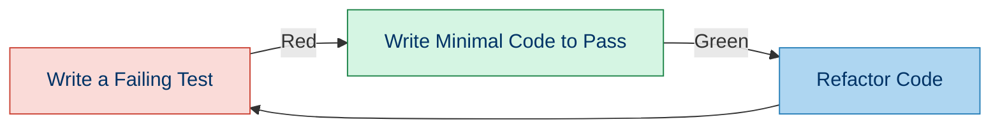
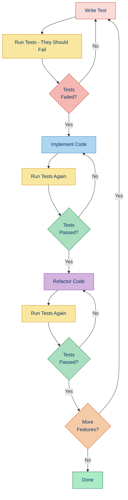

# 🔄 Test-Driven Development (TDD)

## 📚 Overview

Test-Driven Development (TDD) is a software development approach where tests are written before the actual code. The process follows a short development cycle: first, write a failing test, then implement just enough code to make it pass, and finally, refactor the code as needed.

## 🔄 The TDD Cycle



### 1. ❌ Red Phase: Write a Failing Test

Create a test that defines the functionality you want to implement.

### 2. ✅ Green Phase: Write Minimal Code to Pass

Implement just enough code to make the test pass.

### 3. 🔄 Refactor Phase: Improve the Code

Clean up your code without changing its behavior, ensuring tests still pass.

## 🌟 Benefits of TDD

- 🎯 **Focused Development**: Clear objectives before writing implementation
- 📝 **Living Documentation**: Tests document how code should work
- 🧪 **Testable Design**: Naturally leads to more modular, testable code
- 🐛 **Fewer Bugs**: Catches issues early in the development cycle
- ⚡ **Confidence in Changes**: Make changes knowing tests will catch regressions
- 📈 **Better Architecture**: Encourages loose coupling and high cohesion

## 💻 TDD Example in PHP

Let's implement a simple `StringCalculator` class using TDD approach:

### Step 1: Write the First Failing Test

```php
<?php
// tests/StringCalculatorTest.php

use PHPUnit\Framework\TestCase;

class StringCalculatorTest extends TestCase
{
    public function testEmptyStringReturnsZero()
    {
        $calculator = new StringCalculator();
        $this->assertEquals(0, $calculator->add(""));
    }
}
```

Running the test:

```
PHPUnit 10.0.0 by Sebastian Bergmann and contributors.

E                                                                   1 / 1 (100%)

Time: 00:00.002, Memory: 4.00 MB

There was 1 error:

1) StringCalculatorTest::testEmptyStringReturnsZero
Error: Class "StringCalculator" not found

ERRORS!
Tests: 1, Assertions: 0, Errors: 1.
```

### Step 2: Write Minimal Code to Pass

```php
<?php
// src/StringCalculator.php

class StringCalculator
{
    public function add(string $numbers)
    {
        return 0;
    }
}
```

Running the test:

```
PHPUnit 10.0.0 by Sebastian Bergmann and contributors.

.                                                                   1 / 1 (100%)

Time: 00:00.002, Memory: 4.00 MB

OK (1 test, 1 assertion)
```

### Step 3: Write the Next Test

```php
<?php
// tests/StringCalculatorTest.php

use PHPUnit\Framework\TestCase;

class StringCalculatorTest extends TestCase
{
    public function testEmptyStringReturnsZero()
    {
        $calculator = new StringCalculator();
        $this->assertEquals(0, $calculator->add(""));
    }
    
    public function testSingleNumberReturnsValue()
    {
        $calculator = new StringCalculator();
        $this->assertEquals(5, $calculator->add("5"));
    }
}
```

Running the test:

```
PHPUnit 10.0.0 by Sebastian Bergmann and contributors.

.F                                                                  2 / 2 (100%)

Time: 00:00.003, Memory: 4.00 MB

There was 1 failure:

1) StringCalculatorTest::testSingleNumberReturnsValue
Failed asserting that 0 matches expected 5.

FAILURES!
Tests: 2, Assertions: 2, Failures: 1.
```

### Step 4: Update Code to Pass

```php
<?php
// src/StringCalculator.php

class StringCalculator
{
    public function add(string $numbers)
    {
        if (empty($numbers)) {
            return 0;
        }
        
        return intval($numbers);
    }
}
```

Running the test:

```
PHPUnit 10.0.0 by Sebastian Bergmann and contributors.

..                                                                  2 / 2 (100%)

Time: 00:00.002, Memory: 4.00 MB

OK (2 tests, 2 assertions)
```

### Step 5: Add Another Test

```php
<?php
// tests/StringCalculatorTest.php

use PHPUnit\Framework\TestCase;

class StringCalculatorTest extends TestCase
{
    // Previous tests...
    
    public function testTwoNumbersCommaDelimitedReturnsSum()
    {
        $calculator = new StringCalculator();
        $this->assertEquals(8, $calculator->add("5,3"));
    }
}
```

Running the test:

```
PHPUnit 10.0.0 by Sebastian Bergmann and contributors.

..F                                                                 3 / 3 (100%)

Time: 00:00.003, Memory: 4.00 MB

There was 1 failure:

1) StringCalculatorTest::testTwoNumbersCommaDelimitedReturnsSum
Failed asserting that 5 matches expected 8.

FAILURES!
Tests: 3, Assertions: 3, Failures: 1.
```

### Step 6: Update Code Again

```php
<?php
// src/StringCalculator.php

class StringCalculator
{
    public function add(string $numbers)
    {
        if (empty($numbers)) {
            return 0;
        }
        
        if (strpos($numbers, ',') !== false) {
            $parts = explode(',', $numbers);
            return array_sum(array_map('intval', $parts));
        }
        
        return intval($numbers);
    }
}
```

Running the test:

```
PHPUnit 10.0.0 by Sebastian Bergmann and contributors.

...                                                                 3 / 3 (100%)

Time: 00:00.002, Memory: 4.00 MB

OK (3 tests, 3 assertions)
```

### Step 7: Refactor

```php
<?php
// src/StringCalculator.php

class StringCalculator
{
    public function add(string $numbers)
    {
        if (empty($numbers)) {
            return 0;
        }
        
        $parts = explode(',', $numbers);
        return array_sum(array_map('intval', $parts));
    }
}
```

Running the test confirms refactoring didn't break anything:

```
PHPUnit 10.0.0 by Sebastian Bergmann and contributors.

...                                                                 3 / 3 (100%)

Time: 00:00.002, Memory: 4.00 MB

OK (3 tests, 3 assertions)
```

## 🚀 TDD Patterns and Practices

### The FIRST Principles

Good tests should be:

- **F**ast: Tests should run quickly
- **I**ndependent: Tests shouldn't depend on each other
- **R**epeatable: Same results every time
- **S**elf-validating: Pass or fail without manual interpretation
- **T**imely: Written at the right time (before code in TDD)

### Red-Green-Refactor in Detail

| Phase | Focus | Actions |
|-------|-------|---------|
| Red | What? | Write a failing test that defines the behavior you want |
| Green | How? | Write minimal code to make the test pass |
| Refactor | How well? | Improve the code while keeping tests green |

### Common TDD Strategies

#### 1. Triangulation

Write tests with different inputs to force more generalized solutions:

```php
public function testAddOneNumber() { /* ... */ }
public function testAddTwoNumbers() { /* ... */ }
public function testAddMultipleNumbers() { /* ... */ }
```

#### 2. Fake It Till You Make It

Start with hardcoded returns then gradually make them real:

```php
// Version 1: Fake it
public function calculate() { return 42; }

// Version 2: Make it more real
public function calculate() { return $this->baseValue * 2; }
```

#### 3. Obvious Implementation

When the solution is clear, write a more complete implementation directly.

## ⚠️ Common TDD Pitfalls

1. **Testing Implementation Details**: Focus on behavior, not internal details
2. **Brittle Tests**: Tests should tolerate reasonable changes
3. **Over-mocking**: Excessive mocks lead to tests coupled to implementation
4. **Test-Code-Refactor**: Forgetting the refactor step
5. **Perfectionism**: Writing too many tests before implementation

## 🧠 TDD for Different Types of Code

### Pure Functions

Easiest to test - given inputs, expect specific outputs:

```php
public function testFullNameConcatenation()
{
    $formatter = new NameFormatter();
    $result = $formatter->formatFullName('John', 'Doe');
    $this->assertEquals('John Doe', $result);
}
```

### Object State

Test how methods change object state:

```php
public function testCartAddItem()
{
    $cart = new ShoppingCart();
    $cart->addItem('product1', 2, 10.00);
    
    $this->assertEquals(2, $cart->getTotalItems());
    $this->assertEquals(20.00, $cart->getTotalPrice());
}
```

### Collaborations

Test how objects work together:

```php
public function testOrderProcessing()
{
    $paymentGateway = $this->createMock(PaymentGateway::class);
    $paymentGateway->expects($this->once())
                  ->method('charge')
                  ->with(100.00)
                  ->willReturn(true);
    
    $orderProcessor = new OrderProcessor($paymentGateway);
    $result = $orderProcessor->process(['amount' => 100.00]);
    
    $this->assertTrue($result);
}
```

## 🛠️ TDD Workflow Integration



## 🧭 Navigation

- [← Back to Unit Testing with PHPUnit](./03a-phpunit.md)
- [→ Behavior-Driven Development](./03c-bdd.md)

## 📚 Further Reading

- [Test-Driven Development: By Example](https://www.amazon.com/Test-Driven-Development-Kent-Beck/dp/0321146530) by Kent Beck
- [Growing Object-Oriented Software, Guided by Tests](https://www.amazon.com/Growing-Object-Oriented-Software-Guided-Tests/dp/0321503627) by Steve Freeman and Nat Pryce
- [Clean Code: A Handbook of Agile Software Craftsmanship](https://www.amazon.com/Clean-Code-Handbook-Software-Craftsmanship/dp/0132350882) by Robert C. Martin
- [The Art of Unit Testing](https://www.amazon.com/Art-Unit-Testing-examples/dp/1617290890) by Roy Osherove
- [Test-Driven PHP](https://leanpub.com/test-driven-php) by Justin Searls
