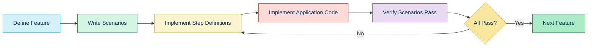
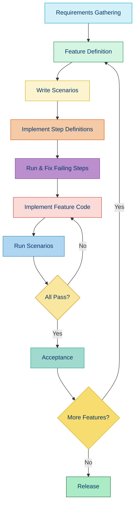

# 🧪 Behavior-Driven Development (BDD)

## 📚 Overview

Behavior-Driven Development (BDD) is an extension of Test-Driven Development (TDD) that emphasizes collaboration between developers, QA, and non-technical stakeholders. BDD focuses on defining the behavior of a system from the user's perspective using natural language that non-programmers can understand.

## 🌟 Key Principles

- 🗣️ **Shared Language**: Uses a ubiquitous language understood by all team members
- 👥 **Collaboration**: Brings together technical and business perspectives
- 🧩 **Outside-In Development**: Starts with user behavior and works inward
- 📝 **Living Documentation**: Tests serve as specifications and documentation

## 🔄 BDD Process



## 🛠️ BDD Frameworks in PHP

| Framework | Feature | Popularity | Difficulty |
|-----------|---------|------------|------------|
| [Behat](https://docs.behat.org/) | Cucumber-style BDD | High | ⭐⭐⭐ |
| [Codeception](https://codeception.com/) | All-in-one testing | Medium | ⭐⭐⭐ |
| [PHPSpec](http://phpspec.net/) | Spec-style BDD | Medium | ⭐⭐⭐ |
| [Pest](https://pestphp.com/) | Modern, expressive | Growing | ⭐⭐ |

## 📝 BDD with Behat

### Installation

```bash
# Install Behat via Composer
composer require --dev behat/behat
```

### Project Initialization

```bash
# Initialize Behat in your project
vendor/bin/behat --init
```

This creates a basic structure:

```
features/
├── bootstrap/
│   └── FeatureContext.php
└── .gitignore
```

### Writing Features

Features are written in Gherkin syntax, a business-readable language:

```gherkin
# features/calculator.feature
Feature: String Calculator
  In order to calculate the sum of numbers
  As a user
  I need to be able to get the sum of a comma-delimited string of numbers

  Scenario: Empty string returns zero
    Given I have a string calculator
    When I calculate the sum of ""
    Then I should get 0

  Scenario: Single number returns its value
    Given I have a string calculator
    When I calculate the sum of "5"
    Then I should get 5

  Scenario: Two numbers returns their sum
    Given I have a string calculator
    When I calculate the sum of "2,3"
    Then I should get 5
```

### Implementing Step Definitions

Step definitions connect the Gherkin scenarios to your code:

```php
<?php
// features/bootstrap/FeatureContext.php

use Behat\Behat\Context\Context;
use Behat\Gherkin\Node\PyStringNode;

class FeatureContext implements Context
{
    private $calculator;
    private $result;
    
    /**
     * @Given I have a string calculator
     */
    public function iHaveAStringCalculator()
    {
        $this->calculator = new StringCalculator();
    }

    /**
     * @When I calculate the sum of :arg1
     */
    public function iCalculateTheSumOf($arg1)
    {
        $this->result = $this->calculator->add($arg1);
    }

    /**
     * @Then I should get :arg1
     */
    public function iShouldGet($arg1)
    {
        if ($this->result != $arg1) {
            throw new \Exception("Actual result {$this->result} doesn't match expected result {$arg1}");
        }
    }
}
```

### Application Code

```php
<?php
// src/StringCalculator.php

class StringCalculator
{
    public function add(string $numbers): int
    {
        if (empty($numbers)) {
            return 0;
        }
        
        $values = explode(',', $numbers);
        return array_sum(array_map('intval', $values));
    }
}
```

### Running Behat

```bash
vendor/bin/behat
```

Output:

```
Feature: String Calculator
  In order to calculate the sum of numbers
  As a user
  I need to be able to get the sum of a comma-delimited string of numbers

  Scenario: Empty string returns zero         # features/calculator.feature:6
    Given I have a string calculator          # FeatureContext::iHaveAStringCalculator()
    When I calculate the sum of ""            # FeatureContext::iCalculateTheSumOf()
    Then I should get 0                       # FeatureContext::iShouldGet()

  Scenario: Single number returns its value   # features/calculator.feature:11
    Given I have a string calculator          # FeatureContext::iHaveAStringCalculator()
    When I calculate the sum of "5"           # FeatureContext::iCalculateTheSumOf()
    Then I should get 5                       # FeatureContext::iShouldGet()

  Scenario: Two numbers returns their sum     # features/calculator.feature:16
    Given I have a string calculator          # FeatureContext::iHaveAStringCalculator()
    When I calculate the sum of "2,3"         # FeatureContext::iCalculateTheSumOf()
    Then I should get 5                       # FeatureContext::iShouldGet()

3 scenarios (3 passed)
9 steps (9 passed)
0m0.03s (7.86Mb)
```

## 📊 BDD with PHPSpec

PHPSpec focuses on the design and behavior specification of objects:

### Installation

```bash
# Install PHPSpec
composer require --dev phpspec/phpspec
```

### Generating a Specification

```bash
vendor/bin/phpspec describe App/Calculator
```

This generates:

```php
<?php
// spec/App/CalculatorSpec.php

namespace spec\App;

use App\Calculator;
use PhpSpec\ObjectBehavior;

class CalculatorSpec extends ObjectBehavior
{
    function it_is_initializable()
    {
        $this->shouldHaveType(Calculator::class);
    }
}
```

### Writing Specifications

```php
<?php
// spec/App/CalculatorSpec.php

namespace spec\App;

use App\Calculator;
use PhpSpec\ObjectBehavior;

class CalculatorSpec extends ObjectBehavior
{
    function it_is_initializable()
    {
        $this->shouldHaveType(Calculator::class);
    }
    
    function it_adds_two_numbers()
    {
        $this->add(2, 3)->shouldReturn(5);
    }
    
    function it_subtracts_one_number_from_another()
    {
        $this->subtract(5, 2)->shouldReturn(3);
    }
    
    function it_multiplies_two_numbers()
    {
        $this->multiply(3, 4)->shouldReturn(12);
    }
    
    function it_divides_one_number_by_another()
    {
        $this->divide(10, 2)->shouldReturn(5);
    }
    
    function it_throws_exception_when_dividing_by_zero()
    {
        $this->shouldThrow(\InvalidArgumentException::class)
             ->duringDivide(5, 0);
    }
}
```

### Generating the Class

```bash
vendor/bin/phpspec run
```

PHPSpec will suggest creating the class:

```
> App\Calculator
  - is initializable
  - it adds two numbers
    exception: Call to undefined method App\Calculator::add()
  ...

Do you want me to create `App\Calculator` for you? [Y/n]
```

After generating the class, PHPSpec will help you implement methods:

```php
<?php
// src/App/Calculator.php

namespace App;

class Calculator
{
    public function add($a, $b)
    {
        return $a + $b;
    }
    
    public function subtract($a, $b)
    {
        return $a - $b;
    }
    
    public function multiply($a, $b)
    {
        return $a * $b;
    }
    
    public function divide($a, $b)
    {
        if ($b === 0) {
            throw new \InvalidArgumentException('Cannot divide by zero');
        }
        return $a / $b;
    }
}
```

## 🧠 BDD vs. TDD

| Aspect | BDD | TDD |
|--------|-----|-----|
| Focus | Business behavior | Technical implementation |
| Language | Natural language | Programming language |
| Audience | Developers, Business, QA | Primarily developers |
| Starting Point | User stories | API design |
| Scope | Often larger feature scope | Often smaller unit scope |
| Primary Goal | Ensure features meet business needs | Ensure code works as expected |

## 💪 BDD Best Practices

### 1. Focus on Business Value

```gherkin
# Good
Feature: Shopping Cart Checkout
  In order to purchase items
  As a customer
  I need to be able to checkout my cart

# Less good
Feature: CartController
  Testing the CartController functionality
```

### 2. Use Descriptive Scenarios

```gherkin
# Good
Scenario: Customer with sufficient funds completes purchase
  Given I have products in my cart
  And I have sufficient funds in my account
  When I complete the checkout process
  Then my order should be processed
  And my account should be debited
  
# Less good
Scenario: Checkout works
  Given I have a cart
  When I checkout
  Then it should work
```

### 3. Use Domain Language

```gherkin
# Good (using domain terms)
Given I have added 2 items to my shopping basket
When I proceed to checkout
Then I should see the order summary

# Less good (technical details)
Given I have called the addItem method twice
When I POST to /checkout
Then the response should contain JSON
```

### 4. Keep Scenarios Independent

Each scenario should be able to run independently without relying on the state from other scenarios.

### 5. Follow Given-When-Then Pattern

- **Given**: Setup the context (preconditions)
- **When**: Action being tested
- **Then**: Verify outcomes
- **And/But**: Additional context/actions/verifications

## 🔄 BDD in the Development Workflow



## 🧭 Navigation

- [← Back to Test-Driven Development](./03b-tdd.md)
- [→ Mocking and Test Doubles](./03d-mocking.md)

## 📚 Further Reading

- [BDD in Action](https://www.manning.com/books/bdd-in-action) by John Ferguson Smart
- [The Cucumber Book](https://pragprog.com/titles/hwcuc2/the-cucumber-book-second-edition/) by Matt Wynne and Aslak Hellesøy
- [Behat Documentation](https://docs.behat.org/en/latest/)
- [PHPSpec Documentation](http://phpspec.net/en/stable/manual/introduction.html)
- [Specification by Example](https://www.manning.com/books/specification-by-example) by Gojko Adzic
- [BDD with Cucumber](http://cucumber.io/docs/bdd/) - General BDD principles
