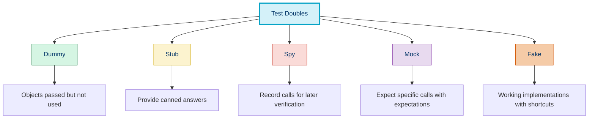
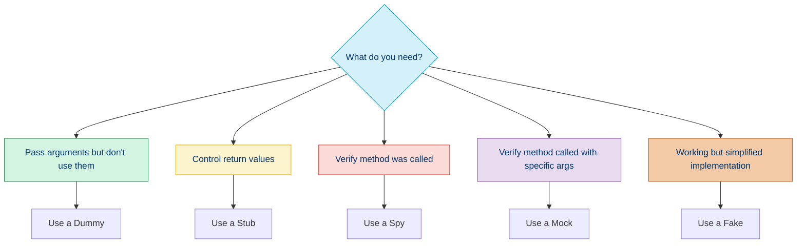

# 🎭 Mocking and Test Doubles

## 📚 Overview

Mocking is a technique used in unit testing to isolate the code under test by replacing dependencies with controlled objects called test doubles. This approach allows you to focus on testing a specific unit of code without worrying about its dependencies.

## 🧩 Types of Test Doubles



### 1️⃣ Dummy Objects

Dummy objects are passed around but never actually used. They are just used to fill parameter lists.

```php
class DummyLogger implements LoggerInterface
{
    public function log($message, $level = 'info') {
        // Do nothing
    }
}

$service = new UserService(new DummyLogger());
```

### 2️⃣ Stubs

Stubs provide canned answers to calls made during the test, usually not responding at all to anything outside what's programmed for the test.

```php
$userRepository = $this->createStub(UserRepository::class);
$userRepository->method('findById')
              ->willReturn(new User(1, 'John Doe', 'john@example.com'));

$service = new UserService($userRepository);
$user = $service->getUserById(1); // Will return our stubbed user
```

### 3️⃣ Spies

Spies record calls that are made to them, so you can make assertions about them.

```php
class EmailSpy implements EmailSender
{
    public $sentEmails = [];
    
    public function send($to, $subject, $body)
    {
        $this->sentEmails[] = [
            'to' => $to,
            'subject' => $subject,
            'body' => $body
        ];
    }
}

$spy = new EmailSpy();
$service = new NotificationService($spy);
$service->notifyUser($user);

// Assert that an email was sent
$this->assertCount(1, $spy->sentEmails);
$this->assertEquals($user->email, $spy->sentEmails[0]['to']);
```

### 4️⃣ Mocks

Mocks are pre-programmed with expectations which form a specification of the calls they are expected to receive.

```php
$paymentGateway = $this->createMock(PaymentGateway::class);
$paymentGateway->expects($this->once())
              ->method('processPayment')
              ->with($this->equalTo(100.50), $this->equalTo('4111111111111111'))
              ->willReturn(true);

$orderProcessor = new OrderProcessor($paymentGateway);
$result = $orderProcessor->process(['amount' => 100.50, 'card' => '4111111111111111']);

// The test will fail if processPayment is not called exactly once with the specified arguments
```

### 5️⃣ Fakes

Fakes have working implementations, but typically take some shortcut which makes them unsuitable for production.

```php
class FakeUserRepository implements UserRepositoryInterface
{
    private $users = [];
    
    public function add(User $user)
    {
        $this->users[$user->id] = $user;
    }
    
    public function findById($id)
    {
        return $this->users[$id] ?? null;
    }
    
    public function findAll()
    {
        return array.values($this->users);
    }
}

// Use the fake in tests
$repository = new FakeUserRepository();
$repository->add(new User(1, 'John Doe', 'john@example.com'));

$service = new UserService($repository);
$user = $service->getUserById(1);
```

## 🛠️ Mocking Tools in PHP

| Tool | Features | Integration | Difficulty |
|------|----------|-------------|------------|
| PHPUnit's Built-in Mocking | Basic mocking and stubbing | Native to PHPUnit | ⭐⭐ |
| [Mockery](http://docs.mockery.io/) | More powerful, flexible mocking | Works with PHPUnit | ⭐⭐⭐ |
| [Prophecy](https://github.com/phpspec/prophecy) | Object-oriented, fluent API | Used by PHPSpec, works with PHPUnit | ⭐⭐⭐ |
| [PHP-Mock](https://github.com/php-mock/php-mock) | Mock global functions | Works with PHPUnit | ⭐⭐⭐⭐ |

## 💻 Using PHPUnit's Built-in Mocking

### Creating a Mock Object

```php
// Create a mock for the UserRepository class
$repository = $this->createMock(UserRepository::class);
```

### Stubbing Methods

```php
// Configure the mock to return a specific value when findById is called
$user = new User(1, 'John Doe', 'john@example.com');
$repository->method('findById')
          ->willReturn($user);

// Now calling findById will return our configured user
$result = $repository->findById(1); // $result === $user
```

### Setting Expectations

```php
// Expect that save() will be called exactly once with any User object
$repository->expects($this->once())
          ->method('save')
          ->with($this->isInstanceOf(User::class));

// The test will fail if save() is not called exactly once with a User object
```

### Argument Matching

```php
// Match specific arguments
$repository->expects($this->once())
          ->method('findByNameAndAge')
          ->with(
              $this->equalTo('John'),
              $this->greaterThan(18)
          );
```

### Configuring Return Values

```php
// Simple return value
$repository->method('count')->willReturn(5);

// Return values based on arguments
$repository->method('findById')
          ->willReturnCallback(function ($id) {
              if ($id === 1) {
                  return new User(1, 'John');
              }
              return null;
          });

// Throwing exceptions
$repository->method('save')
          ->willThrowException(new DatabaseException('Connection lost'));
```

## 🧩 Using Mockery

### Installation

```bash
composer require --dev mockery/mockery
```

### Creating Mocks

```php
use Mockery;

// Create a mock
$repository = Mockery::mock(UserRepository::class);

// Clean up after tests
protected function tearDown(): void
{
    Mockery::close();
}
```

### Stubbing Methods

```php
$user = new User(1, 'John Doe');

$repository->shouldReceive('findById')
          ->with(1)
          ->andReturn($user);
```

### Method Expectations

```php
$repository->shouldReceive('save')
          ->once()
          ->with(Mockery::type(User::class))
          ->andReturn(true);
```

### Argument Constraints

```php
$repository->shouldReceive('findByFilters')
          ->with(
              Mockery::hasKey('status'),
              Mockery::type('array')
          )
          ->andReturn([$user]);
```

### Spies

```php
$spy = Mockery::spy(EmailSender::class);

// Code that should trigger the email sending
$service = new NotificationService($spy);
$service->sendNotification();

// Verify afterward
$spy->shouldHaveReceived('send')->once();
```

## 🎯 Common Mocking Scenarios

### 1. Mocking Database Access

```php
public function testFindUserByEmail()
{
    // Arrange
    $userRepository = $this->createMock(UserRepository::class);
    $userRepository->method('findByEmail')
                  ->with('john@example.com')
                  ->willReturn(new User(1, 'John Doe', 'john@example.com'));
    
    $userService = new UserService($userRepository);
    
    // Act
    $user = $userService->getUserByEmail('john@example.com');
    
    // Assert
    $this->assertInstanceOf(User::class, $user);
    $this->assertEquals('John Doe', $user->name);
}
```

### 2. Mocking External API Calls

```php
public function testProcessPayment()
{
    // Arrange
    $paymentApiClient = $this->createMock(PaymentApiClient::class);
    $paymentApiClient->method('charge')
                    ->with(100.00, '4111111111111111')
                    ->willReturn([
                        'success' => true,
                        'transaction_id' => 'tx_123456'
                    ]);
    
    $paymentProcessor = new PaymentProcessor($paymentApiClient);
    
    // Act
    $result = $paymentProcessor->processPayment(100.00, '4111111111111111');
    
    // Assert
    $this->assertTrue($result->isSuccessful());
    $this->assertEquals('tx_123456', $result->getTransactionId());
}
```

### 3. Mocking File System Operations

```php
public function testSaveFileContents()
{
    // Arrange
    $filesystem = $this->createMock(Filesystem::class);
    $filesystem->expects($this->once())
              ->method('write')
              ->with('/path/to/file.txt', 'Hello World')
              ->willReturn(true);
    
    $fileManager = new FileManager($filesystem);
    
    // Act
    $result = $fileManager->saveContent('/path/to/file.txt', 'Hello World');
    
    // Assert
    $this->assertTrue($result);
}
```

### 4. Mocking Time-Dependent Code

```php
public function testAppointmentScheduling()
{
    // Arrange - mock the current time provider
    $timeProvider = $this->createMock(TimeProvider::class);
    $timeProvider->method('now')
                ->willReturn(new DateTime('2023-06-15 10:00:00'));
    
    $scheduler = new AppointmentScheduler($timeProvider);
    
    // Act
    $isAvailable = $scheduler->isTimeSlotAvailable('2023-06-15 14:00:00');
    
    // Assert
    $this->assertTrue($isAvailable);
}
```

## ⚠️ Mocking Pitfalls and Best Practices

### 1. Don't Mock What You Don't Own

Avoid mocking third-party libraries directly. Instead:
- Create wrappers around external dependencies
- Mock your wrapper classes

```php
// Instead of mocking AWS SDK directly
$s3Client = $this->createMock(\Aws\S3\S3Client::class); // Fragile!

// Create and mock a wrapper
interface FileStorage {
    public function store($path, $contents);
    public function retrieve($path);
}

class S3Storage implements FileStorage {
    private $s3Client;
    
    // Implementation...
}

// Then in tests
$storage = $this->createMock(FileStorage::class);
```

### 2. Avoid Excessive Mocking

Too many mocks can lead to tests that don't verify much:

```php
// Excessive mocking - testing implementation details
public function testTooManyMocks()
{
    $mock1 = $this->createMock(Dependency1::class);
    $mock2 = $this->createMock(Dependency2::class);
    $mock3 = $this->createMock(Dependency3::class);
    
    $mock1->method('doSomething')->willReturn('result1');
    $mock2->method('process')->willReturn('result2');
    $mock3->method('generate')->willReturn('result3');
    
    $service = new Service($mock1, $mock2, $mock3);
    $result = $service->run();
    
    $this->assertEquals('expected', $result);
}
```

### 3. Mocking vs Integration Tests

Use the right type of test for the job:

| Test Type | When to Use | Example |
|-----------|-------------|---------|
| Unit Test with Mocks | Testing business logic in isolation | Testing calculation algorithms |
| Integration Tests | Testing integration between components | Testing database repository with real DB |
| End-to-End Tests | Testing complete user flows | Testing API endpoints |

### 4. Test Doubles Should Behave Like Real Objects

Mocks should respect the same contracts as real objects:

```php
// Bad - this stub doesn't respect the contract
$repository->method('findAll')
          ->willReturn('Not an array of users');

// Good - respects the expected return type
$repository->method('findAll')
          ->willReturn([$user1, $user2]);
```

## 📊 When to Use Each Type of Test Double



## 🧭 Navigation

- [← Back to Behavior-Driven Development](./03c-bdd.md)
- [→ Code Improvement](./04-code-improvement.md)

## 📚 Further Reading

- [PHPUnit Documentation: Test Doubles](https://phpunit.readthedocs.io/en/9.5/test-doubles.html)
- [Mockery Documentation](http://docs.mockery.io/en/latest/)
- [Martin Fowler: Mocks Aren't Stubs](https://martinfowler.com/articles/mocksArentStubs.html)
- [Test Double Patterns](https://www.infoq.com/articles/test-doubles-patterns/)
- [Growing Object-Oriented Software, Guided by Tests](https://www.amazon.com/Growing-Object-Oriented-Software-Guided-Tests/dp/0321503627)
