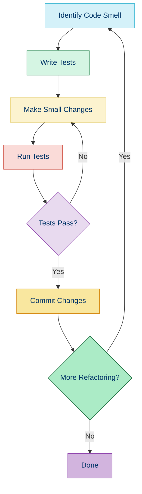

# 🛠️ Code Improvement

## 📚 Overview

Code improvement, often referred to as refactoring, is the process of restructuring existing code without changing its external behavior. The goal is to improve non-functional attributes of software such as readability, complexity, maintainability, and extensibility.

## 🎯 Why Improve Code?

- 📈 **Technical Debt Reduction**: Eliminate accumulated shortcuts and workarounds
- 🧩 **Enhanced Maintainability**: Make code easier to understand and modify
- 🚀 **Improved Performance**: Optimize code efficiency and execution speed
- 🔄 **Better Extensibility**: Create code that's easier to extend with new features
- 🧪 **Fewer Bugs**: Clean code tends to have fewer defects
- 👥 **Team Productivity**: Well-structured code improves development velocity

## 🔄 The Refactoring Process



## 🧠 Key Code Improvement Concepts

### 1. Code Smells

Code smells are symptoms in the code that may indicate deeper problems. They are not bugs—they don't prevent the code from working—but they suggest weaknesses in design that may slow development or increase the risk of bugs in the future.

[Common Code Smells →](./04b-code-smells.md)

### 2. Refactoring Principles

Refactoring should follow certain principles to ensure safety and effectiveness:

- ✅ **Test First**: Ensure you have tests covering the code before refactoring
- 🔍 **Small Steps**: Make small, incremental changes rather than large rewrites
- 🔄 **Regular Testing**: Run tests after each change to confirm functionality
- 📊 **Measurable Improvements**: Have clear goals for what you're improving
- 📝 **Documentation**: Keep track of the changes being made

[Refactoring Principles →](./04a-refactoring-principles.md)

### 3. Refactoring Techniques

Specific, proven techniques for transforming code safely:

- 📦 **Extract Method**: Break down large methods into smaller, focused ones
- 🔄 **Replace Conditional with Polymorphism**: Use inheritance instead of switches
- 🧩 **Introduce Parameter Object**: Replace long parameter lists with objects
- 🏗️ **Extract Class**: Split large classes into smaller, more cohesive ones

[Refactoring Techniques →](./04c-refactoring-techniques.md)

## 📝 Before and After Refactoring Example

### Before (Complex Method)

```php
function calculateTotal($items, $customer, $promoCode = null) {
    $total = 0;
    $tax = 0;
    
    foreach ($items as $item) {
        $total += $item['price'] * $item['quantity'];
    }
    
    if ($promoCode === 'SUMMER10') {
        $total = $total * 0.9; // 10% discount
    } else if ($promoCode === 'WINTER20') {
        $total = $total * 0.8; // 20% discount
    } else if ($promoCode === 'SPECIAL15') {
        $total = $total * 0.85; // 15% discount
    }
    
    if ($customer['type'] === 'premium') {
        $total = $total * 0.85; // Additional 15% for premium customers
    } else if ($customer['type'] === 'vip') {
        $total = $total * 0.8; // Additional 20% for VIP customers
    }
    
    if ($customer['state'] === 'CA') {
        $tax = $total * 0.0725; // California tax
    } else if ($customer['state'] === 'NY') {
        $tax = $total * 0.045; // New York tax
    } else if ($customer['state'] === 'TX') {
        $tax = $total * 0.0625; // Texas tax
    }
    
    return [
        'subtotal' => $total,
        'tax' => $tax,
        'total' => $total + $tax
    ];
}
```

### After (Refactored)

```php
class OrderCalculator
{
    private $taxCalculator;
    private $discountCalculator;
    
    public function __construct(
        TaxCalculator $taxCalculator,
        DiscountCalculator $discountCalculator
    ) {
        $this->taxCalculator = $taxCalculator;
        $this->discountCalculator = $discountCalculator;
    }
    
    public function calculateTotal(array $items, Customer $customer, ?string $promoCode = null): array
    {
        $subtotal = $this->calculateSubtotal($items);
        $discountedSubtotal = $this->applyDiscounts($subtotal, $customer, $promoCode);
        $tax = $this->taxCalculator->calculateTax($discountedSubtotal, $customer->getState());
        
        return [
            'subtotal' => $discountedSubtotal,
            'tax' => $tax,
            'total' => $discountedSubtotal + $tax
        ];
    }
    
    private function calculateSubtotal(array $items): float
    {
        return array_reduce($items, function($total, $item) {
            return $total + ($item['price'] * $item['quantity']);
        }, 0);
    }
    
    private function applyDiscounts(float $subtotal, Customer $customer, ?string $promoCode): float
    {
        $afterPromo = $this->discountCalculator->applyPromoCode($subtotal, $promoCode);
        return $this->discountCalculator->applyCustomerDiscount($afterPromo, $customer->getType());
    }
}

interface TaxCalculator
{
    public function calculateTax(float $amount, string $state): float;
}

class USTaxCalculator implements TaxCalculator
{
    private $taxRates = [
        'CA' => 0.0725,
        'NY' => 0.045,
        'TX' => 0.0625,
        // Other states...
    ];
    
    public function calculateTax(float $amount, string $state): float
    {
        return $amount * ($this->taxRates[$state] ?? 0);
    }
}

interface DiscountCalculator
{
    public function applyPromoCode(float $amount, ?string $promoCode): float;
    public function applyCustomerDiscount(float $amount, string $customerType): float;
}

class StandardDiscountCalculator implements DiscountCalculator
{
    private $promoCodes = [
        'SUMMER10' => 0.1,
        'WINTER20' => 0.2,
        'SPECIAL15' => 0.15,
        // Other promo codes...
    ];
    
    private $customerDiscounts = [
        'premium' => 0.15,
        'vip' => 0.2,
        // Other customer types...
    ];
    
    public function applyPromoCode(float $amount, ?string $promoCode): float
    {
        if (null === $promoCode || !isset($this->promoCodes[$promoCode])) {
            return $amount;
        }
        
        return $amount * (1 - $this->promoCodes[$promoCode]);
    }
    
    public function applyCustomerDiscount(float $amount, string $customerType): float
    {
        if (!isset($this->customerDiscounts[$customerType])) {
            return $amount;
        }
        
        return $amount * (1 - $this->customerDiscounts[$customerType]);
    }
}
```

## 🛠️ Tools for Code Improvement

| Tool | Purpose | Integration | Difficulty |
|------|---------|-------------|------------|
| [PHP Insights](https://phpinsights.com/) | Code quality analysis | CLI, CI/CD | ⭐⭐ |
| [PHPStan](https://phpstan.org/) | Static analysis | CLI, CI/CD | ⭐⭐⭐ |
| [PHPMD](https://phpmd.org/) | Detects code smells | CLI, CI/CD | ⭐⭐⭐ |
| [PHP-CS-Fixer](https://github.com/FriendsOfPHP/PHP-CS-Fixer) | Fix coding standards | CLI, IDE, CI/CD | ⭐⭐ |
| [PHP_CodeSniffer](https://github.com/squizlabs/PHP_CodeSniffer) | Detect coding standard violations | CLI, IDE, CI/CD | ⭐⭐ |
| [Rector](https://github.com/rectorphp/rector) | Automated refactoring | CLI, CI/CD | ⭐⭐⭐ |

## 🔄 Integrating Code Improvement into Workflow

```mermaid
graph LR
    A[Code Review] --> B[Identify Issues]
    B --> C[Create Refactoring Task]
    C --> D[Write/Update Tests]
    D --> E[Refactor Code]
    E --> F[Verify Tests Pass]
    F --> G[Code Review]
    G --> H[Merge]
    
    style A fill:#d4f1f9,stroke:#05a3c6,color:#003366
    style B fill:#d5f5e3,stroke:#1e8449,color:#003366
    style C fill:#fcf3cf,stroke:#d4ac0d,color:#003366
    style D fill:#fadbd8,stroke:#cb4335,color:#003366
    style E fill:#e8daef,stroke:#8e44ad,color:#003366
    style F fill:#f9e79f,stroke:#d68910,color:#003366
    style G fill:#abebc6,stroke:#186a3b,color:#003366
    style H fill:#d2b4de,stroke:#8e44ad,color:#003366
```



## 💡 Tips for Successful Code Improvement

1. **Prioritize Technical Debt**: Focus on areas that cause the most pain or risk
2. **Refactor in Small Batches**: Avoid big-bang refactoring that disrupts development
3. **Follow the Boy Scout Rule**: Always leave the code better than you found it
4. **Use Automated Tools**: Let tools identify common issues and even fix them
5. **Maintain a Test Suite**: Good tests provide safety for refactoring
6. **Document Decisions**: Record the reasoning behind significant refactoring choices
7. **Measure Improvements**: Use metrics to verify the benefits of refactoring
8. **Balance with Features**: Find a sustainable rhythm between features and refactoring

## 🧭 Navigation

- [← Back to Mocking and Test Doubles](./03d-mocking.md)
- [→ Refactoring Principles](./04a-refactoring-principles.md)

## 📚 Further Reading

- [Refactoring: Improving the Design of Existing Code](https://martinfowler.com/books/refactoring.html) by Martin Fowler
- [Clean Code: A Handbook of Agile Software Craftsmanship](https://www.amazon.com/Clean-Code-Handbook-Software-Craftsmanship/dp/0132350882) by Robert C. Martin
- [Working Effectively with Legacy Code](https://www.amazon.com/Working-Effectively-Legacy-Michael-Feathers/dp/0131177052) by Michael Feathers
- [Refactoring.guru](https://refactoring.guru/) - Catalog of refactoring techniques and code smells
- [Object Calisthenics](https://williamdurand.fr/2013/06/03/object-calisthenics/) - 9 rules for better object-oriented code
