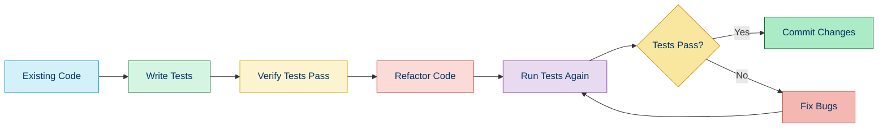
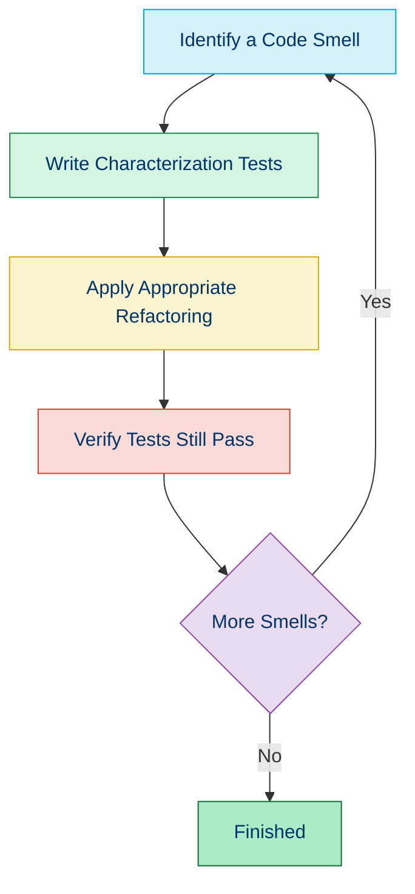

# 📜 Refactoring Principles

## 📚 Overview

Refactoring is the process of restructuring existing code without changing its external behavior. It's a disciplined approach to cleaning up code that minimizes the chances of introducing bugs. This document covers key principles to follow when refactoring PHP code.

## 🧭 Core Principles of Refactoring

### 1. 🛡️ Keep Changes Small

Make incremental changes instead of large-scale rewrites. Small changes are:
- Easier to understand
- Less likely to introduce bugs
- Simpler to review
- Quicker to test

```php
// Instead of refactoring an entire class at once,
// break it down into steps:

// Step 1: Extract a method
// Step 2: Rename variables for clarity
// Step 3: Remove duplication
// Step 4: Extract a class
// etc.
```

### 2. ✅ Test Before Refactoring

Ensure you have adequate tests that verify the code's current behavior before making changes.



### 3. 🧪 Test After Each Change

Run your tests after each small refactoring step to ensure you haven't changed behavior.

```bash
# Example workflow
git checkout -b refactor-user-service
# Make a small change
phpunit tests/UserServiceTest.php
# If tests pass, commit the change
git commit -m "Refactor: Extract method to validate user input"
# Make another small change
phpunit tests/UserServiceTest.php
# Repeat...
```

### 4. 🧩 One Refactoring at a Time

Focus on one type of improvement at a time:

| Phase | Focus | Example |
|-------|-------|---------|
| 1 | Remove duplication | Extract duplicate code into shared methods |
| 2 | Improve naming | Rename variables and methods for clarity |
| 3 | Simplify conditionals | Replace nested if statements with guard clauses |
| 4 | Reorganize code | Extract related functionality into classes |

### 5. 📊 Understand the Code First

Before refactoring, ensure you understand what the code is supposed to do.

```php
// Add comments to clarify the existing logic before refactoring
public function processOrder($orderId) 
{
    $order = $this->orderRepository->find($orderId);
    
    // First check: Is the order valid?
    if (!$order || $order->getStatus() === 'cancelled') {
        throw new InvalidOrderException();
    }
    
    // Second check: Is there enough inventory?
    foreach ($order->getItems() as $item) {
        if ($item->getQuantity() > $this->inventoryService->getStock($item->getProductId())) {
            throw new InsufficientInventoryException();
        }
    }
    
    // Main logic: Process the payment
    $result = $this->paymentGateway->charge(
        $order->getTotal(),
        $order->getPaymentDetails()
    );
    
    // Update order status based on payment result
    if ($result->isSuccessful()) {
        $order->setStatus('paid');
        $this->orderRepository->save($order);
        $this->notificationService->sendOrderConfirmation($order);
        return true;
    } else {
        $order->setStatus('payment_failed');
        $order->setStatusMessage($result->getErrorMessage());
        $this->orderRepository->save($order);
        return false;
    }
}
```

### 6. 🎯 Have a Clear Goal

Define what specific aspect of the code you're trying to improve:

- Reducing complexity
- Enhancing readability
- Improving performance
- Enabling extension
- Fixing technical debt

### 7. 🧰 Use IDE Refactoring Tools

Modern IDEs offer automated refactoring tools that perform changes safely:

| Operation | PhpStorm | VS Code (with extensions) |
|-----------|----------|--------------------------|
| Rename | Shift+F6 | F2 |
| Extract Method | Ctrl+Alt+M | Right-click → Refactor... |
| Extract Variable | Ctrl+Alt+V | Right-click → Refactor... |
| Extract Constant | Ctrl+Alt+C | Right-click → Refactor... |
| Move Class | F6 | Right-click → Move... |

### 8. 📝 Document Why, Not What

When making significant refactorings, document the reasoning:

```php
/**
 * Customer entity class
 * 
 * @note Refactored from array-based customer data to a proper entity class 
 * to improve type safety and encapsulation (2023-06-05)
 */
class Customer
{
    private $id;
    private $name;
    private $email;
    
    // ...
}
```

## 🔄 Common Refactoring Sequences



### Example Sequence: Fixing a Large Method

1. **Identify the issue**: Method is too long (> 20 lines)
2. **Add tests**: Ensure current behavior is verified
3. **Extract methods**: Break down into smaller, focused methods
4. **Improve naming**: Give extracted methods clear, descriptive names
5. **Reorganize**: Consider if methods belong in another class
6. **Verify**: Run tests to confirm behavior hasn't changed

## 📝 Refactoring Example

### Before

```php
public function processCheckout($userId, $cartId, $addressId, $paymentMethodId)
{
    $user = $this->userRepository->find($userId);
    if (!$user) {
        throw new UserNotFoundException();
    }
    
    $cart = $this->cartRepository->find($cartId);
    if (!$cart || $cart->getUserId() !== $userId) {
        throw new CartNotFoundException();
    }
    
    if (count($cart->getItems()) === 0) {
        throw new EmptyCartException();
    }
    
    $address = $this->addressRepository->find($addressId);
    if (!$address || $address->getUserId() !== $userId) {
        throw new AddressNotFoundException();
    }
    
    $paymentMethod = $this->paymentMethodRepository->find($paymentMethodId);
    if (!$paymentMethod || $paymentMethod->getUserId() !== $userId) {
        throw new PaymentMethodNotFoundException();
    }
    
    $order = new Order();
    $order->setUser($user);
    $order->setAddress($address);
    $order->setPaymentMethod($paymentMethod);
    
    $totalPrice = 0;
    foreach ($cart->getItems() as $cartItem) {
        $product = $this->productRepository->find($cartItem->getProductId());
        $price = $product->getPrice() * $cartItem->getQuantity();
        $totalPrice += $price;
        
        $orderItem = new OrderItem();
        $orderItem->setProduct($product);
        $orderItem->setQuantity($cartItem->getQuantity());
        $orderItem->setPrice($price);
        $order->addItem($orderItem);
    }
    
    $order->setTotalPrice($totalPrice);
    
    $paymentResult = $this->paymentGateway->process(
        $paymentMethod->getToken(),
        $totalPrice
    );
    
    if ($paymentResult->isSuccessful()) {
        $order->setStatus('paid');
        $this->orderRepository->save($order);
        $this->cartRepository->clear($cartId);
        $this->emailService->sendOrderConfirmation($order);
        return $order;
    } else {
        throw new PaymentFailedException($paymentResult->getErrorMessage());
    }
}
```

### After (Refactored Step by Step)

```php
public function processCheckout($userId, $cartId, $addressId, $paymentMethodId)
{
    $user = $this->validateAndGetUser($userId);
    $cart = $this->validateAndGetCart($userId, $cartId);
    $address = $->validateAndGetAddress($userId, $addressId);
    $paymentMethod = $this->validateAndGetPaymentMethod($userId, $paymentMethodId);
    
    $order = $this->createOrderFromCart($user, $cart, $address, $paymentMethod);
    
    $this->processPayment($order, $paymentMethod);
    
    $this->finalizeOrder($order, $cartId);
    
    return $order;
}

private function validateAndGetUser($userId)
{
    $user = $this->userRepository->find($userId);
    if (!$user) {
        throw new UserNotFoundException();
    }
    return $user;
}

private function validateAndGetCart($userId, $cartId)
{
    $cart = $this->cartRepository->find($cartId);
    if (!$cart || $cart->getUserId() !== $userId) {
        throw new CartNotFoundException();
    }
    
    if (count($cart->getItems()) === 0) {
        throw new EmptyCartException();
    }
    
    return $cart;
}

private function validateAndGetAddress($userId, $addressId)
{
    $address = $this->addressRepository->find($addressId);
    if (!$address || $address->getUserId() !== $userId) {
        throw new AddressNotFoundException();
    }
    return $address;
}

private function validateAndGetPaymentMethod($userId, $paymentMethodId)
{
    $paymentMethod = $this->paymentMethodRepository->find($paymentMethodId);
    if (!$paymentMethod || $paymentMethod->getUserId() !== $userId) {
        throw new PaymentMethodNotFoundException();
    }
    return $paymentMethod;
}

private function createOrderFromCart($user, $cart, $address, $paymentMethod)
{
    $order = new Order();
    $order->setUser($user);
    $order->setAddress($address);
    $order->setPaymentMethod($paymentMethod);
    
    $totalPrice = $this->addItemsToOrder($order, $cart);
    $order->setTotalPrice($totalPrice);
    
    return $order;
}

private function addItemsToOrder($order, $cart)
{
    $totalPrice = 0;
    foreach ($cart->getItems() as $cartItem) {
        $product = $this->productRepository->find($cartItem->getProductId());
        $price = $product->getPrice() * $cartItem->getQuantity();
        $totalPrice += $price;
        
        $orderItem = new OrderItem();
        $orderItem->setProduct($product);
        $orderItem->setQuantity($cartItem->getQuantity());
        $orderItem->setPrice($price);
        $order->addItem($orderItem);
    }
    
    return $totalPrice;
}

private function processPayment($order, $paymentMethod)
{
    $paymentResult = $this->paymentGateway->process(
        $paymentMethod->getToken(),
        $order->getTotalPrice()
    );
    
    if (!$paymentResult->isSuccessful()) {
        throw new PaymentFailedException($paymentResult->getErrorMessage());
    }
    
    return $paymentResult;
}

private function finalizeOrder($order, $cartId)
{
    $order->setStatus('paid');
    $this->orderRepository->save($order);
    $this->cartRepository->clear($cartId);
    $this->emailService->sendOrderConfirmation($order);
}
```

## ⚠️ Warning Signs During Refactoring

| Sign | What It Means | What To Do |
|------|---------------|------------|
| 🚩 Tests start failing | You've changed behavior | Revert and make smaller changes |
| 🚩 Refactoring introduces more complexity | You might be on the wrong track | Reconsider your approach |
| 🚩 Code getting more tightly coupled | You're decreasing maintainability | Focus on proper abstraction |
| 🚩 You need to modify many tests | You're likely changing behavior | Ensure you're preserving the interface |
| 🚩 You don't understand parts of the code | Missing knowledge could lead to bugs | Study the code more or consult others |

## 📊 Measuring Refactoring Success

| Metric | How to Measure | Target |
|--------|----------------|--------|
| Cyclomatic Complexity | Use tools like PhpMetrics or PHPMD | Decrease by 10-20% |
| Method Length | Lines of code per method | < 20 lines per method |
| Class Cohesion | Related functionality together | High cohesion within classes |
| Coupling | Dependencies between classes | Loose coupling between classes |
| Test Coverage | PHPUnit with coverage report | Maintain or increase coverage |
| Code Duplication | PHP Copy/Paste Detector | Reduce duplicated code |

## 🧭 Navigation

- [← Back to Code Improvement](./04-code-improvement.md)
- [→ Common Code Smells](./04b-code-smells.md)

## 📚 Further Reading

- [Refactoring.guru](https://refactoring.guru/refactoring) - Catalog of refactoring techniques
- [Working Effectively with Legacy Code](https://www.amazon.com/Working-Effectively-Legacy-Michael-Feathers/dp/0131177052) by Michael Feathers
- [Refactoring: Improving the Design of Existing Code](https://martinfowler.com/books/refactoring.html) by Martin Fowler
- [PHP Refactoring Browser](https://github.com/QafooLabs/php-refactoring-browser) - CLI tool for PHP refactoring
- [Object Calisthenics](https://williamdurand.fr/2013/06/03/object-calisthenics/) - 9 rules for better object-oriented code
