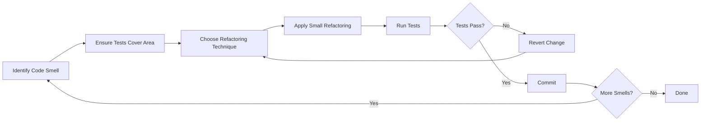

# Common Code Smells

Code smells are patterns in code that indicate potential problems. They are not bugs or errors, but rather signs that suggest deeper issues in design and implementation. Understanding these smells is crucial for identifying areas that need refactoring.

## 📋 Table of Contents

<div class="toc">

| Category | Code Smells |
|:---------|:------------|
| **[Bloaters](#1-bloaters)** | [Long Method](#long-method) · [Large Class](#large-class) · [Primitive Obsession](#primitive-obsession) · [Long Parameter List](#long-parameter-list) |
| **[OO Abusers](#2-object-orientation-abusers)** | [Switch Statements](#switch-statements) · [Temporary Field](#temporary-field) · [Refused Bequest](#refused-bequest) |
| **[Change Preventers](#3-change-preventers)** | [Divergent Change](#divergent-change) · [Shotgun Surgery](#shotgun-surgery) · [Parallel Inheritance](#parallel-inheritance-hierarchies) |
| **[Dispensables](#4-dispensables)** | [Duplicated Code](#duplicated-code) · [Dead Code](#dead-code) · [Speculative Generality](#speculative-generality) |
| **[Couplers](#5-couplers)** | [Feature Envy](#feature-envy) · [Inappropriate Intimacy](#inappropriate-intimacy) · [Message Chains](#message-chains) · [Middle Man](#middle-man) |
| **[PHP-Specific](#php-specific-code-smells)** | [Misuse of isset/empty](#misuse-of-isset-or-empty) · [Static Methods Abuse](#static-methods-abuse) · [Superglobals Access](#superglobals-access) |
| **[Tools & Techniques](#detecting-code-smells)** | [Manual Reviews](#detecting-code-smells) · [Automated Tools](#detecting-code-smells) · [Workflow](#refactoring-workflow) · [Tools for Detecting Code Smells](#tools-for-detecting-code-smells) |

</div>

## What Are Code Smells?

Code smells are surface indications that usually correspond to deeper design problems. The term was popularized by Martin Fowler and Kent Beck in their book "Refactoring: Improving the Design of Existing Code."

<a id="1-bloaters"></a>
## 1️⃣ Bloaters

These are code elements that have grown too large or complex over time.

<a id="long-method"></a>
### 🔴 Long Method

<div style="border-left: 4px solid #f44336; padding-left: 15px;">
Methods that have too many lines of code.
</div>

<table>
<tr>
<th width="50%">Example 1</th>
<th width="50%">Example 2</th>
</tr>
<tr>
<td>

```php
public function processOrder($orderId) 
{
    // 100+ lines of code doing many different things
    // ...validation
    // ...database operations
    // ...email notifications
    // ...logging
    // ...etc.
}
```

</td>
<td>

```php
class OrderReport {
    public function generateReport(Order $order) {
        $result = "Order #" . $order->getId() . "\n";
        $result .= "Date: " . $order->getDate()->format('Y-m-d') . "\n";
        $result .= "Customer: " . $order->getCustomer()->getName() . "\n";
        $result .= "Items:\n";
        
        foreach ($order->getItems() as $item) {
            $result .= "  - " . $item->getName() . ": $" . $item->getPrice() . "\n";
        }
        
        $result .= "Total: $" . $order->getTotal() . "\n";
        return $result;
    }
}
```

</td>
</tr>
</table>

**Solution**: 
- 🔧 [Extract Method](./04c-refactoring-techniques.md#-extract-method)
- 🔧 [Extract Class](./04c-refactoring-techniques.md#-extract-class)

<a id="large-class"></a>
### 🔴 Large Class

<div style="border-left: 4px solid #f44336; padding-left: 15px;">
Classes that try to do too much.
</div>

<table>
<tr>
<th width="50%">Example 1</th>
<th width="50%">Example 2</th>
</tr>
<tr>
<td>

```php
class UserManager 
{
    // Dozens of methods
    // Handles authentication, profile management, 
    // permissions, notifications, etc.
}
```

</td>
<td>

```php
class Order {
    private $id;
    private $date;
    private $customer;
    private $items = [];
    private $total;
    
    public function getId() { return $this->id; }
    public function getDate() { return $this->date; }
    public function getCustomer() { return $this->customer; }
    public function getItems() { return $this->items; }
    public function getTotal() { return $this->total; }
    
    public function addItem(Item $item) {
        $this->items[] = $item;
        $this->total += $item->getPrice();
    }
    
    // Many more methods...
    
    public function generateReport() {
        // Report generation logic
    }
}
```

</td>
</tr>
</table>

**Solution**: 
- 🔧 [Extract Class](./04c-refactoring-techniques.md#-extract-class)
- 🔧 [Extract Interface](./04c-refactoring-techniques.md#extract-interface)
- 🔧 Extract Superclass

<a id="primitive-obsession"></a>
### 🔴 Primitive Obsession

<div style="border-left: 4px solid #f44336; padding-left: 15px;">
Using primitive types instead of small objects for simple tasks.
</div>

<table>
<tr>
<th width="50%">❌ Bad Practice</th>
<th width="50%">✅ Good Practice</th>
</tr>
<tr>
<td>

```php
// Using primitives
$user->setAddress('123 Main St', 'Apt 4B', 
                  'New York', 'NY', 
                  '10001', 'USA');
```

</td>
<td>

```php
// Using objects
$address = new Address('123 Main St', 'Apt 4B', 
                       'New York', 'NY', 
                       '10001', 'USA');
$user->setAddress($address);
```

</td>
</tr>
</table>

**Another Example:**

```php
class Order {
    private $id;
    private $date;
    private $customerName;    // Primitive string
    private $customerEmail;   // Primitive string
    private $items = [];
    private $total;
    
    // Should use Customer object instead of separate fields
}
```

**Solution**: 
- 🔧 [Replace Data Value with Object](./04c-refactoring-techniques.md#-replace-array-with-object)
- 🔧 [Extract Class](./04c-refactoring-techniques.md#-extract-class)

<a id="long-parameter-list"></a>
### 🔴 Long Parameter List

<div style="border-left: 4px solid #f44336; padding-left: 15px;">
Methods with too many parameters.
</div>

```php
function createUser($name, $email, $password, $address, $phone, $birthDate, $role, $department) 
{
    // ...
}
```

**Solution**: 
- 🔧 [Introduce Parameter Object](./04c-refactoring-techniques.md#-introduce-parameter-object)
- 🔧 Preserve Whole Object

<hr>

<a id="2-object-orientation-abusers"></a>
## 2️⃣ Object-Orientation Abusers

These smells violate principles of object-oriented programming.

<a id="switch-statements"></a>
### 🔴 Switch Statements

<div style="border-left: 4px solid #f44336; padding-left: 15px;">
Complex conditional logic that would be better handled with polymorphism.
</div>

```php
function calculatePrice($productType) 
{
    switch($productType) {
        case 'book':
            return $this->price * 0.9; // 10% discount
        case 'electronic':
            return $this->price * 0.95; // 5% discount
        case 'clothing':
            if ($this->season == 'winter') {
                return $this->price * 0.8; // 20% discount
            }
            return $this->price;
        default:
            return $this->price;
    }
}
```

**Solution**: 
- 🔧 [Replace Conditional with Polymorphism](./04c-refactoring-techniques.md#-replace-conditional-with-polymorphism)

<a id="temporary-field"></a>
### 🔴 Temporary Field

<div style="border-left: 4px solid #f44336; padding-left: 15px;">
Class fields that are only used in certain situations.
</div>

```php
class Order 
{
    private $customer;
    private $products;
    private $tempTaxCalculation; // Only used during checkout
    
    // ...
}
```

**Solution**: 
- 🔧 [Extract Class](./04c-refactoring-techniques.md#-extract-class)
- 🔧 Introduce Null Object

<a id="refused-bequest"></a>
### 🔴 Refused Bequest

<div style="border-left: 4px solid #f44336; padding-left: 15px;">
Subclasses that don't want or need all the methods and properties inherited from their parents.
</div>

```php
class Bird 
{
    public function fly() { /* ... */ }
    public function eat() { /* ... */ }
}

class Penguin extends Bird 
{
    public function fly() 
    {
        throw new Exception("Penguins can't fly!");
    }
}
```

**Solution**: 
- 🔧 [Replace Inheritance with Delegation](./04c-refactoring-techniques.md#replace-inheritance-with-delegation)
- 🔧 [Extract Interface](./04c-refactoring-techniques.md#extract-interface)

<hr>

<a id="3-change-preventers"></a>
## 3️⃣ Change Preventers

These smells make software difficult to change.

<a id="divergent-change"></a>
### 🔴 Divergent Change

<div style="border-left: 4px solid #f44336; padding-left: 15px;">
When one class is modified for different reasons.
</div>

```php
class UserService 
{
    // Changes when user authentication changes
    public function login() { /* ... */ }
    public function logout() { /* ... */ }
    
    // Changes when user profile changes
    public function updateProfile() { /* ... */ }
    public function viewProfile() { /* ... */ }
    
    // Changes when notification settings change
    public function enableNotifications() { /* ... */ }
    public function disableNotifications() { /* ... */ }
}
```

**Solution**: 
- 🔧 [Extract Class](./04c-refactoring-techniques.md#-extract-class)

<a id="shotgun-surgery"></a>
### 🔴 Shotgun Surgery

<div style="border-left: 4px solid #f44336; padding-left: 15px;">
When a single change requires modifications to many different classes.
</div>

```php
// Adding a new field 'phone' requires changes in:
// - User class
// - UserRepository
// - UserController
// - DatabaseSchema
// - UserRegistrationForm
// - UserProfileView
// - API endpoints
// - etc.
```

**Solution**: 
- 🔧 [Move Method](./04c-refactoring-techniques.md#-move-method)
- 🔧 Move Field
- 🔧 Inline Class

<a id="parallel-inheritance-hierarchies"></a>
### 🔴 Parallel Inheritance Hierarchies

<div style="border-left: 4px solid #f44336; padding-left: 15px;">
When every time you create a subclass of one class, you also have to create a subclass of another.
</div>

```php
class Shape { /* ... */ }
class Circle extends Shape { /* ... */ }
class Square extends Shape { /* ... */ }

class ShapeRenderer { /* ... */ }
class CircleRenderer extends ShapeRenderer { /* ... */ }
class SquareRenderer extends ShapeRenderer { /* ... */ }
```

**Solution**: 
- 🔧 [Move Method](./04c-refactoring-techniques.md#-move-method)
- 🔧 Move Field

<hr>

<a id="4-dispensables"></a>
## 4️⃣ Dispensables

These are unnecessary complications that can be removed from code.

<a id="duplicated-code"></a>
### 🔴 Duplicated Code

<div style="border-left: 4px solid #f44336; padding-left: 15px;">
The same code structure in multiple places.
</div>

<table>
<tr>
<th width="50%">Example 1</th>
<th width="50%">Example 2</th>
</tr>
<tr>
<td>

```php
function validateUser($user) 
{
    if (empty($user->name)) {
        throw new Exception("Name is required");
    }
    if (empty($user->email)) {
        throw new Exception("Email is required");
    }
    // ...
}
```

</td>
<td>

```php
function validateProduct($product) 
{
    if (empty($product->name)) {
        throw new Exception("Name is required");
    }
    if (empty($product->sku)) {
        throw new Exception("SKU is required");
    }
    // ...
}
```

</td>
</tr>
</table>

**Solution**: 
- 🔧 [Extract Method](./04c-refactoring-techniques.md#-extract-method)
- 🔧 Pull Up Method
- 🔧 Form Template Method

<a id="dead-code"></a>
### 🔴 Dead Code

<div style="border-left: 4px solid #f44336; padding-left: 15px;">
Code that is no longer called or used.
</div>

```php
class User 
{
    // This method is never called anywhere
    public function legacyAuthentication() 
    {
        // ...
    }
}
```

**Solution**: 
- 🔧 Delete unused code

<a id="speculative-generality"></a>
### 🔴 Speculative Generality

<div style="border-left: 4px solid #f44336; padding-left: 15px;">
Code written for future use that's not actually needed.
</div>

```php
interface PaymentProcessor 
{
    public function process($payment);
    public function refund($payment);
    public function partial($payment, $amount);
    public function recurring($payment, $schedule);
    // Only the 'process' method is actually used
}
```

**Solution**: 
- 🔧 Collapse Hierarchy
- 🔧 Inline Class
- 🔧 Remove Parameter

<hr>

<a id="5-couplers"></a>
## 5️⃣ Couplers

These smells create excessive coupling between classes.

<a id="feature-envy"></a>
### 🔴 Feature Envy

<div style="border-left: 4px solid #f44336; padding-left: 15px;">
A method that seems more interested in another class than the one it's in.
</div>

<table>
<tr>
<th width="50%">Example 1</th>
<th width="50%">Example 2</th>
</tr>
<tr>
<td>

```php
class Order 
{
    private $customer;
    
    public function printCustomerDetails() 
    {
        echo "Name: " . $this->customer->getName() . "\n";
        echo "Email: " . $this->customer->getEmail() . "\n";
        echo "Address: " . $this->customer->getAddress()->format() . "\n";
    }
}
```

</td>
<td>

```php
class OrderReport {
    public function generateReport(Order $order) {
        $result = "Order #" . $order->getId() . "\n";
        $result .= "Date: " . $order->getDate()->format('Y-m-d') . "\n";
        $result .= "Customer: " . $order->getCustomer()->getName() . "\n";
        $result .= "Items:\n";
        
        foreach ($order->getItems() as $item) {
            $result .= "  - " . $item->getName() . ": $" . $item->getPrice() . "\n";
        }
        
        $result .= "Total: $" . $order->getTotal() . "\n";
        return $result;
    }
}
```

</td>
</tr>
</table>

**Solution**: 
- 🔧 [Move Method](./04c-refactoring-techniques.md#-move-method)
- 🔧 [Extract Method](./04c-refactoring-techniques.md#-extract-method)

<a id="inappropriate-intimacy"></a>
### 🔴 Inappropriate Intimacy

<div style="border-left: 4px solid #f44336; padding-left: 15px;">
Classes that know too much about each other's internal details.
</div>

```php
class ShoppingCart 
{
    public function checkout() 
    {
        foreach ($this->items as $item) {
            $product = $item->getProduct();
            // Directly accessing private product data
            $this->total += $product->price * $item->quantity;
            $product->stock -= $item->quantity;
        }
    }
}
```

**Solution**: 
- 🔧 [Move Method](./04c-refactoring-techniques.md#-move-method)
- 🔧 Move Field
- 🔧 Change Bidirectional Association to Unidirectional

<a id="message-chains"></a>
### 🔴 Message Chains

<div style="border-left: 4px solid #f44336; padding-left: 15px;">
When a client has to navigate through multiple objects to perform an operation.
</div>

```php
$street = $company->getManager()->getDepartment()->getAddress()->getStreet();
```

**Solution**: 
- 🔧 Hide Delegate
- 🔧 [Extract Method](./04c-refactoring-techniques.md#-extract-method)

<a id="middle-man"></a>
### 🔴 Middle Man

<div style="border-left: 4px solid #f44336; padding-left: 15px;">
A class that delegates most of its work to another class.
</div>

<table>
<tr>
<th>Example</th>
</tr>
<tr>
<td>

```php
class Department {
    private $manager;
    
    public function getManager() {
        return $this->manager;
    }
}

class Person {
    private $department;
    
    public function getDepartment() {
        return $this->department;
    }
    
    // Middle man method
    public function getManager() {
        return $this->getDepartment()->getManager();
    }
}

// Client code
$manager = $person->getManager();
```

</td>
</tr>
</table>

**Solution**: 
- 🔧 Remove Middle Man
- 🔧 Inline Method

<hr>

<a id="php-specific-code-smells"></a>
## 🐘 PHP-Specific Code Smells

These smells are particularly common in PHP codebases.

<a id="misuse-of-isset-or-empty"></a>
### 🔴 Misuse of `isset()` or `empty()`

<div style="border-left: 4px solid #f44336; padding-left: 15px;">
Complex nested isset() calls or using isset() where explicit null comparison is clearer.
</div>

<table>
<tr>
<th width="50%">❌ Problematic</th>
<th width="50%">✅ Better Approach</th>
</tr>
<tr>
<td>

```php
if (isset($user) && isset($user['profile']) && 
    isset($user['profile']['preferences'])) {
    $theme = $user['profile']['preferences']['theme'] ?? 'default';
}
```

</td>
<td>

```php
$theme = $user['profile']['preferences']['theme'] ?? 'default';
```

</td>
</tr>
</table>

**Solution**: 
- 🔧 Use the null coalescing operator (`??`) and optional chaining where appropriate

<a id="static-methods-abuse"></a>
### 🔴 Static Methods Abuse

<div style="border-left: 4px solid #f44336; padding-left: 15px;">
Overuse of static methods, especially those that maintain state.
</div>

```php
class User {
    private static $lastLoggedInUser;
    
    public static function login($username, $password) {
        // Login logic
        self::$lastLoggedInUser = $username;
    }
    
    public static function getLastLoggedInUser() {
        return self::$lastLoggedInUser;
    }
}
```

**Solution**: 
- 🔧 Use dependency injection and instance methods

<a id="superglobals-access"></a>
### 🔴 Superglobals Access

<div style="border-left: 4px solid #f44336; padding-left: 15px;">
Direct access to $_GET, $_POST, etc. throughout codebase with no validation.
</div>

```php
function saveUser() {
    $db = new Database();
    $db->query("INSERT INTO users (name, email) VALUES ('" . 
               $_POST['name'] . "', '" . $_POST['email'] . "')");
}
```

**Solution**: 
- 🔧 Use request objects or abstraction layer

<hr>

<a id="detecting-code-smells"></a>
## 🔍 Detecting Code Smells

### Manual Code Reviews

Regular peer code reviews are one of the best ways to identify code smells. Use a checklist based on common code smells to guide the review process.

### Automated Tools

<div class="tools" style="display: flex; gap: 20px;">

<div style="flex: 1; padding: 15px; -background-color: #f5f5f5; border-radius: 5px;">
<h4>PHP Mess Detector</h4>

```bash
./vendor/bin/phpmd src/ text codesize,controversial,design,naming,unusedcode
```

</div>

<div style="flex: 1; padding: 15px; -background-color: #f5f5f5; border-radius: 5px;">
<h4>PHP CodeSniffer</h4>
Can check for some code smells through custom rules.
</div>

<div style="flex: 1; padding: 15px; -background-color: #f5f5f5; border-radius: 5px;">
<h4>SonarQube</h4>
Enterprise-level code quality platform with PHP support.
</div>

</div>

### IDE Plugins

- PHPStorm has built-in code inspections
- Visual Studio Code with PHP Intelephense provides quality hints

<a id="refactoring-workflow"></a>
## 🔄 Refactoring Workflow



<a id="tools-for-detecting-code-smells"></a>
## 🛠️ Tools for Detecting Code Smells

| Tool | Purpose | Example Command |
|------|---------|----------------|
| [PHP Mess Detector](https://phpmd.org/) | Analyzes code for code smells | `phpmd src/ text cleancode,codesize,design` |
| [PHP Copy/Paste Detector](https://github.com/sebastianbergmann/phpcpd) | Finds duplicated code | `phpcpd src/` |
| [PHP_CodeSniffer](https://github.com/squizlabs/PHP_CodeSniffer) | Detects violations of coding standard | `phpcs --standard=PSR12 src/` |
| [PHPStan](https://phpstan.org/) | Static analysis | `phpstan analyse src/` |
| [Psalm](https://psalm.dev/) | Static analysis with focus on types | `psalm --show-info=true src/` |

## 🧭 Navigation

- [← Back to Refactoring Principles](./04a-refactoring-principles.md)
- [→ Refactoring Techniques](./04c-refactoring-techniques.md)

<a id="further-reading"></a>
## 📚 Further Reading

- [Refactoring.guru: Code Smells](https://refactoring.guru/smells)
- [Clean Code: A Handbook of Agile Software Craftsmanship](https://www.amazon.com/Clean-Code-Handbook-Software-Craftsmanship/dp/0132350882) by Robert C. Martin
- [Refactoring: Improving the Design of Existing Code](https://www.amazon.com/Refactoring-Improving-Design-Existing-Code/dp/0201485672) by Martin Fowler
- [Object-Oriented Metrics in Practice](https://www.amazon.com/Object-Oriented-Metrics-Practice-Efficiency-Maintainability/dp/3540244298) by Michele Lanza and Radu Marinescu
- [PHPDoc: Advanced Code Intelligence](https://docs.phpdoc.org/)
