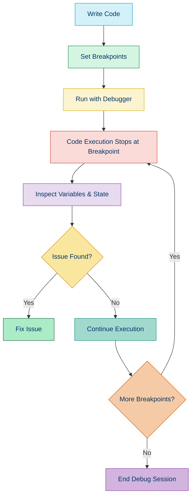
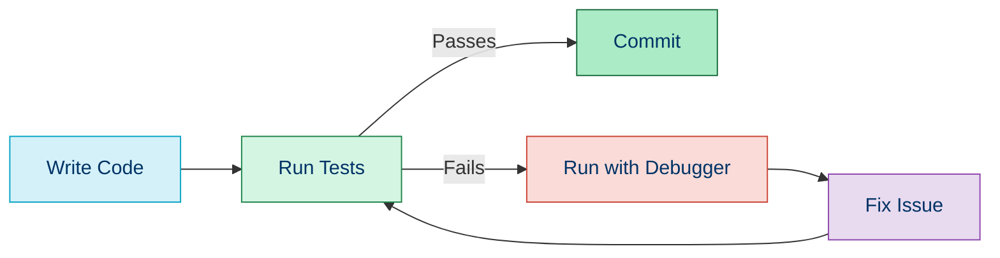

# 🐛 Debugging and Profiling

## 📚 Overview

Debugging and profiling are essential skills for PHP developers to identify and resolve issues in their applications. Debugging helps find and fix bugs, while profiling helps identify performance bottlenecks and optimize code execution.

## 🎯 Why Debugging and Profiling Matter

- 🔍 **Find Bugs Faster**: Locate the exact source of errors
- ⚡ **Optimize Performance**: Identify and eliminate bottlenecks
- 🧠 **Understand Code Flow**: Gain insights into how your application runs
- 💰 **Reduce Costs**: Better performance means fewer server resources
- 😊 **Improve User Experience**: Faster, bug-free applications lead to happier users

## 🛠️ Debugging Techniques

### Basic Debugging Methods

| Technique | Description | Example |
|-----------|-------------|---------|
| Error Reporting | Configure PHP to show all errors | `error_reporting(E_ALL);` |
| Print Debugging | Output variables to see their values | `var_dump($variable);` |
| Error Logging | Write errors to log files | `error_log('Debug message');` |
| Try-Catch Blocks | Catch and handle exceptions | `try { ... } catch (Exception $e) { ... }` |

### Advanced Debugging with Xdebug

[Xdebug](./05b-xdebug.md) is a powerful PHP extension that provides advanced debugging capabilities:

- Step debugging (breakpoints)
- Stack traces
- Function tracing
- Code coverage analysis
- Profiling

```php
// Example of using Xdebug to show a more readable var_dump
var_dump($complexObject); // With Xdebug, this provides collapsible, formatted output
```

### IDE Integration

Modern IDEs support interactive debugging with Xdebug:

- Set breakpoints
- Step through code
- Inspect variables
- Evaluate expressions
- View call stack



## 📊 Profiling Techniques

Profiling helps identify performance bottlenecks in your application by measuring:

- Execution time of functions and methods
- Memory usage
- Database query performance
- External API call times
- Resource usage patterns

### Basic Profiling Methods

```php
// Timing Code Execution
$start = microtime(true);

// Code to profile
performComplexOperation();

$end = microtime(true);
$executionTime = ($end - $start) * 1000; // Convert to milliseconds
echo "Execution time: {$executionTime}ms";

// Memory Usage
$memoryBefore = memory_get_usage();

// Code to profile
$largeArray = createLargeDataStructure();

$memoryAfter = memory_get_usage();
$memoryUsed = ($memoryAfter - $memoryBefore) / 1024 / 1024; // Convert to MB
echo "Memory used: {$memoryUsed}MB";
```

### Advanced Profiling Tools

| Tool | Purpose | Integration | 
|------|---------|-------------|
| [Xdebug Profiler](./05b-xdebug.md) | Generate detailed function-level profiles | PHP extension |
| [Blackfire.io](https://blackfire.io/) | Comprehensive performance testing | Service + PHP extension |
| [Tideways](https://tideways.com/) | Application Performance Monitoring | Service + PHP extension |
| [XHProf](https://github.com/phacility/xhprof) | Hierarchical profiler for PHP | PHP extension |
| [New Relic](https://newrelic.com/) | Full-stack observability platform | Service + PHP extension |

### What to Look For When Profiling

1. **Hot Spots**: Functions that consume the most CPU time
2. **Memory Leaks**: Growing memory usage over time
3. **N+1 Query Problems**: Multiple database queries in loops
4. **Expensive External Calls**: Slow API or service integrations
5. **Heavy Framework Components**: Middleware or plugins that slow the application

## 📝 Common Debugging Scenarios

### 1. Database Query Issues

```php
// Before: Hard to debug database issues
$result = $db->query("SELECT * FROM users WHERE id = $userId");

// After: Add error handling and debugging
try {
    $stmt = $db->prepare("SELECT * FROM users WHERE id = ?");
    $stmt->execute([$userId]);
    $result = $stmt->fetch();
    
    if (!$result) {
        $this->logger->warning("User not found", ['userId' => $userId]);
        return null;
    }
    
    return $result;
} catch (PDOException $e) {
    $this->logger->error("Database error", [
        'exception' => $e->getMessage(),
        'query' => $stmt->queryString,
        'params' => [$userId]
    ]);
    throw new DatabaseException("Failed to fetch user: " . $e->getMessage());
}
```

### 2. API Integration

```php
// Before: Hard to debug API issues
$response = file_get_contents("https://api.example.com/data");
$data = json_decode($response);

// After: Add error handling and debugging
try {
    $startTime = microtime(true);
    
    $context = stream_context_create([
        'http' => [
            'timeout' => 5,
            'header' => "Authorization: Bearer {$this->apiKey}\r\n"
        ]
    ]);
    
    $response = file_get_contents("https://api.example.com/data", false, $context);
    $executionTime = microtime(true) - $startTime;
    
    if ($response === false) {
        $error = error_get_last();
        $this->logger->error("API request failed", ['error' => $error['message']]);
        throw new ApiException("Failed to connect to API");
    }
    
    $data = json_decode($response, true);
    
    if (json_last_error() !== JSON_ERROR_NONE) {
        $this->logger->error("Invalid JSON response", ['error' => json_last_error_msg()]);
        throw new ApiException("Invalid API response format");
    }
    
    $this->logger->info("API request successful", [
        'execution_time' => $executionTime,
        'response_size' => strlen($response)
    ]);
    
    return $data;
} catch (Exception $e) {
    $this->logger->error("API request exception", ['exception' => $e->getMessage()]);
    throw $e;
}
```

## 🎓 Debugging and Profiling in Practice

### [Debugging Strategy](./05a-debugging-strategies.md)

Learn a systematic approach to debugging PHP applications with different strategies for different types of bugs.

### [Xdebug Setup and Usage](./05b-xdebug.md)

Master step debugging with Xdebug, the most powerful debugging tool in the PHP ecosystem.

### [Profiling Tools and Techniques](./05c-profiling-tools.md)

Explore different profiling tools and learn how to interpret their output to make informed optimization decisions.

## 🔄 Integrating Debugging into Development Workflow



## 💡 Debugging Tips

1. **Reproduce First**: Always try to reproduce the bug consistently before debugging
2. **Isolate the Issue**: Narrow down the scope of what could be causing the problem
3. **Check Logs**: Server logs, application logs, and error logs are your best friends
4. **Validate Assumptions**: Don't assume variables contain what you expect - verify
5. **Use Version Control**: Compare with previous working versions
6. **Binary Search Method**: For large codebases, comment out half the code at a time to find issues
7. **Rubber Duck Debugging**: Explain the problem to an inanimate object (or colleague)
8. **Take Breaks**: Fresh eyes often spot issues that tired ones miss

## 🧭 Navigation

- [← Back to Refactoring Techniques](./04c-refactoring-techniques.md)
- [→ Debugging Strategies](./05a-debugging-strategies.md)

## 📚 Further Reading

- [Xdebug Documentation](https://xdebug.org/docs/)
- [Blackfire.io Documentation](https://blackfire.io/docs/introduction)
- [The Art of Debugging](https://www.nostarch.com/debugging.htm)
- [PHP Performance Optimization](https://www.phpperformance.com/)
- [Profiling PHP Applications](https://www.php.net/manual/en/book.performance.php)
