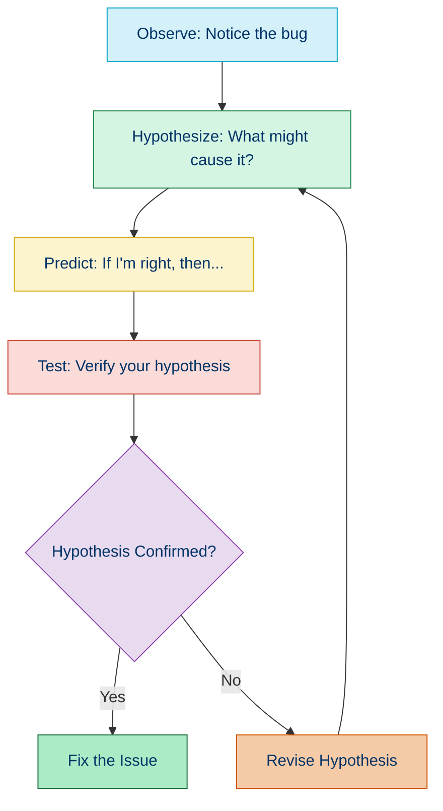
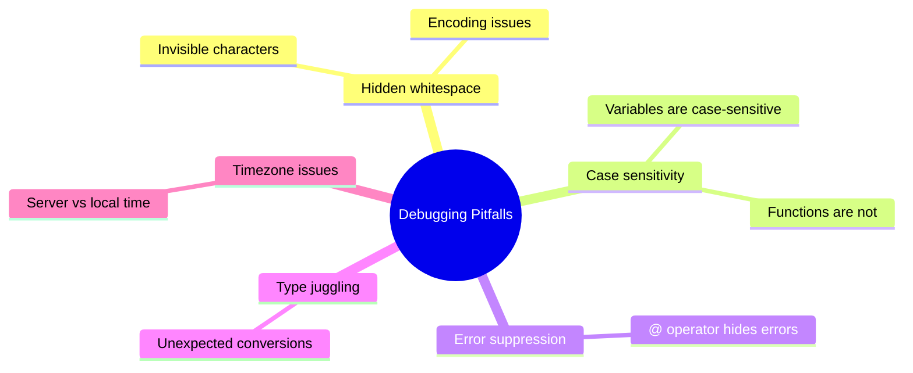

# 🕵️ Debugging Strategies

## 📑 Quick Navigation

| Section | Description |
|---------|-------------|
| [📚 Overview](#overview) | Introduction to debugging approaches |
| [🧪 Scientific Method](#the-scientific-method-for-debugging) | Systematic debugging process |
| [🛠️ Common Strategies](#️common-debugging-strategies) | Key debugging techniques |
| [🪓 Common Bug Types](#common-bug-types-and-strategies) | Types of bugs and how to tackle them |
| [🔧 PHP-Specific Tools](#php-specific-debugging-tools) | Debugging tools for PHP |
| [🧠 Advanced Techniques](#advanced-debugging-techniques) | Advanced debugging approaches |

<a id="overview"></a>
## 📚 Overview

Effective debugging requires a systematic approach rather than random trial and error. This guide presents various debugging strategies and methodologies that can help you identify and fix issues efficiently in PHP applications.

<a id="the-scientific-method-for-debugging"></a>
## 🧪 The Scientific Method for Debugging

Just like scientific experiments, debugging can follow a methodical process:



<a id="common-debugging-strategies"></a>
## 🛠️ Common Debugging Strategies

### 1. 🔍 Binary Search Method

This approach is ideal for narrowing down problems in large codebases:

1. Comment out half of your code (while maintaining syntax validity)
2. If the bug disappears, it's in the commented section; if not, it's in the uncommented section
3. Focus on the problematic half and repeat the process until you find the exact issue

### 2. 🧹 Bottom-Up Strategy

Start from the symptom and work backwards:

1. Identify where the error appears (e.g., an error message or incorrect output)
2. Analyze the values at that point
3. Trace backwards to see where the incorrect values originated
4. Continue until you find the root cause

```php
function debugBottomUp($result) {
    echo "Final result: $result\n"; // Start here - examine the incorrect output
    
    // Examine intermediate values
    $intermediateValue = calculateIntermediate();
    echo "Intermediate value: $intermediateValue\n";
    
    // Examine input values
    $inputValue = getInput();
    echo "Input value: $inputValue\n";
    
    // Now you can see if the issue is with the input, calculation, or final result
}
```

### 3. 🏗️ Top-Down Strategy

Start from the inputs and follow the execution flow:

1. Verify the input data is correct
2. Trace the execution path step by step
3. Examine each transformation of the data
4. Continue until you find where things go wrong

```php
function processOrder($orderId) {
    // Start here - verify input
    echo "Processing order: $orderId\n"; 
    
    // Verify data loading
    $order = $this->orderRepository->find($orderId);
    var_dump($order); // Is the order data correct?
    
    // Verify calculations
    $totalPrice = $this->calculateTotalPrice($order);
    echo "Total price: $totalPrice\n"; // Is the calculation correct?
    
    // Continue through all processing steps...
}
```

### 4. 🧠 Divide and Conquer

Break complex problems into smaller, more manageable parts:

1. Isolate the bug by creating a minimal test case
2. Remove unnecessary code and dependencies
3. Focus on the core functionality that contains the bug
4. Fix the isolated issue and then reintegrate the solution

```php
// Instead of debugging the entire application
function isolatedTest() {
    // Set up minimal test environment
    $user = new User(['id' => 1, 'name' => 'Test']);
    
    // Execute only the specific function with issue
    $result = calculateUserDiscount($user);
    
    // Verify result
    echo "Expected: 10%, Got: $result%\n";
}
```

<a id="common-bug-types-and-strategies"></a>
## 🪓 Common Bug Types and Strategies

### 1. 🧩 Logic Errors

These occur when code runs without error but produces incorrect results.

**Strategy:**
- Use assertions to verify assumptions
- Add intermediate output to check values
- Trace execution path with logging
- Manually walk through the algorithm on paper

```php
function calculateDiscount($price, $discountPercent) {
    // Debug assertion
    assert($discountPercent >= 0 && $discountPercent <= 100, 'Discount percentage out of range');
    
    // Add debug output for important variables
    echo "Price: $price, Discount: $discountPercent%\n";
    
    // Original calculation
    $discount = $price * ($discountPercent / 100);
    
    // Verify calculation result
    echo "Calculated discount: $discount\n";
    
    return $price - $discount;
}
```

### 2. 🔤 Syntax Errors

PHP usually catches these with clear error messages.

**Strategy:**
- Check the exact line mentioned in the error
- Look for missing semicolons, brackets, or quotes
- Check for typos in variable or function names
- Validate your PHP version compatibility

### 3. ⚡ Runtime Errors

Errors that occur during execution, like undefined variables or incorrect types.

**Strategy:**
- Check variable initialization before use
- Verify array keys exist before accessing them
- Use defensive coding with isset() and empty()
- Add typehints and return types

```php
// Before: Prone to errors
function processUser($userData) {
    $email = $userData['email'];
    return sendEmail($email, 'Welcome!');
}

// After: Defensive coding
function processUser(array $userData): bool {
    // Verify data existence
    if (!isset($userData['email'])) {
        error_log('Missing email in user data');
        return false;
    }
    
    $email = $userData['email'];
    return sendEmail($email, 'Welcome!');
}
```

### 4. 🔌 Integration Errors

Problems that appear when components interact.

**Strategy:**
- Verify data formats at integration points
- Test components in isolation, then together
- Check for API changes or version mismatches
- Monitor network and service communication

```php
function callExternalApi($data) {
    // Log outgoing request for debugging
    $this->logger->debug('API request', ['data' => $data]);
    
    $response = $this->apiClient->send($data);
    
    // Log response for debugging
    $this->logger->debug('API response', ['response' => $response]);
    
    return $response;
}
```

<a id="php-specific-debugging-tools"></a>
## 🔧 PHP-Specific Debugging Tools

### 📝 Error Reporting Configuration

```php
// Development environment
ini_set('display_errors', 1);
ini_set('display_startup_errors', 1);
error_reporting(E_ALL);

// Production environment
ini_set('display_errors', 0);
error_reporting(E_ALL & ~E_DEPRECATED & ~E_STRICT);
ini_set('log_errors', 1);
ini_set('error_log', '/path/to/error.log');
```

### 🚨 Custom Error Handlers

```php
function customErrorHandler($errno, $errstr, $errfile, $errline) {
    $message = date('Y-m-d H:i:s') . " - Error [$errno] $errstr - $errfile:$errline\n";
    error_log($message, 3, 'app-errors.log');
    
    // For non-fatal errors, return true to continue execution
    return true;
}

set_error_handler('customErrorHandler');
```

### ⚠️ Custom Exception Handlers

```php
function customExceptionHandler($exception) {
    // Log the exception
    $message = date('Y-m-d H:i:s') . ' - Exception: ' . $exception->getMessage() . 
               ' in ' . $exception->getFile() . ':' . $exception->getLine() . "\n";
    error_log($message, 3, 'app-exceptions.log');
    
    // Display user-friendly message in production
    if (getenv('APP_ENV') === 'production') {
        echo "An error occurred. Please try again later.";
    } else {
        // Show detailed error in development
        echo "<h1>Exception:</h1>";
        echo "<p>" . htmlspecialchars($exception->getMessage()) . "</p>";
        echo "<pre>" . htmlspecialchars($exception->getTraceAsString()) . "</pre>";
    }
}

set_exception_handler('customExceptionHandler');
```

### 🔍 Debug Backtrace

```php
function debugHere($message = 'Debug point reached') {
    $trace = debug_backtrace();
    $caller = isset($trace[1]) ? $trace[1] : $trace[0];
    
    echo "<pre>DEBUG: $message\n";
    echo "File: {$caller['file']}\n";
    echo "Line: {$caller['line']}\n";
    echo "Function: {$caller['function']}\n";
    echo "Arguments: ";
    print_r($caller['args']);
    echo "</pre>";
}

// Usage
function complexFunction($param1, $param2) {
    // ... code ...
    debugHere('Checking values');
    // ... more code ...
}
```

<a id="advanced-debugging-techniques"></a>
## 🧠 Advanced Debugging Techniques

### 📊 Logging with Context

```php
class Logger {
    public function log($level, $message, array $context = []) {
        $timestamp = date('Y-m-d H:i:s');
        $contextString = json_encode($context);
        file_put_contents(
            'app.log', 
            "[$timestamp] [$level] $message $contextString\n", 
            FILE_APPEND
        );
    }
}

// Usage
$logger = new Logger();
$logger->log('INFO', 'User logged in', [
    'user_id' => 123,
    'ip' => '192.168.1.1',
    'success' => true
]);
```

### 🌐 Remote Debugging

For debugging production issues without affecting users:

```php
// Add a special debug parameter for authorized users
function isDebugModeAuthorized() {
    $debugToken = $_GET['debug_token'] ?? '';
    $validToken = getenv('DEBUG_SECRET_TOKEN');
    $allowedIps = ['127.0.0.1', '192.168.1.100'];
    
    return $debugToken === $validToken && in_array($_SERVER['REMOTE_ADDR'], $allowedIps);
}

// Usage
if (isDebugModeAuthorized()) {
    // Enable detailed error output for this request only
    ini_set('display_errors', 1);
    error_reporting(E_ALL);
    
    // Add debug toolbar or additional logging
    require_once 'debug-toolbar.php';
}
```

### 🔄 Interactive Debugging with PsySH

[PsySH](https://psysh.org/) is an interactive debugger and REPL for PHP:

```bash
# Install PsySH
composer require --dev psy/psysh

# Use in your code
<?php
require_once 'vendor/autoload.php';

function complexFunction() {
    $data = [/* complex data structure */];
    
    // Start interactive shell in the middle of execution
    eval(\Psy\sh());
    
    return processData($data);
}
```

<a id="debugging-performance-issues"></a>
## 🐢 Debugging Performance Issues

### Identifying Slow Code

```php
// Measure execution time of a specific function
$start = microtime(true);
someFunction();
$end = microtime(true);
echo "Execution time: " . ($end - $start) . " seconds\n";
```

### Memory Profiling

```php
// Check memory usage
echo memory_get_usage() . " bytes\n";

// Check peak memory usage
echo memory_get_peak_usage() . " bytes\n";
```

<a id="debugging-environment-specific-issues"></a>
## Debugging Environment-Specific Issues

### Debugging Production Issues

For safely debugging production environments:

1. Use proper logging instead of print statements
2. Set up error reporting to log instead of display
3. Implement feature flags to enable debug modes for specific users
4. Consider using Application Performance Monitoring (APM) tools

### Environment Differences

When dealing with environment-specific issues:

1. Compare environment configurations
2. Check PHP versions and extensions
3. Verify database connections and credentials
4. Check file permissions and access rights

<a id="common-php-debugging-pitfalls"></a>
## 🚩 Common PHP Debugging Pitfalls



## 🧭 Navigation

- [← Back to Debugging and Profiling](./05-debugging-profiling.md)
- [→ Xdebug Setup and Usage](./05b-xdebug.md)

## 📚 Further Reading

- [The Pragmatic Programmer](https://pragprog.com/titles/tpp20/the-pragmatic-programmer-20th-anniversary-edition/) - Contains excellent chapters on debugging
- [Debugging: The 9 Indispensable Rules](https://www.amazon.com/Debugging-Indispensable-Software-Hardware-Problems/dp/0814474578)
- [PHP Error Handling](https://www.php.net/manual/en/book.errorfunc.php)
- [PHP Debugging Best Practices](https://stackify.com/php-debugging-guide/)
- [Monolog Documentation](https://seldaek.github.io/monolog/) - Advanced logging library for PHP
