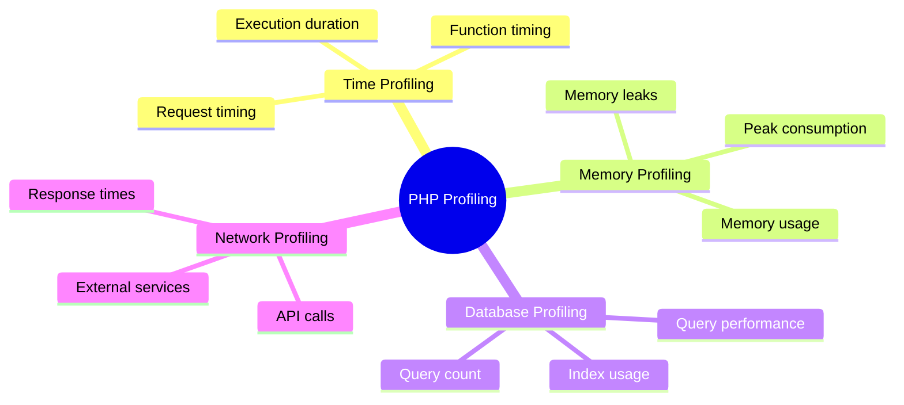

# 📊 Performance Profiling

Performance profiling is the process of analyzing your PHP application to identify bottlenecks and optimize code execution. This guide covers various techniques and tools for effective profiling.

## 🤔 Why Profile Your PHP Code?

- **🔍 Identify bottlenecks**: Find the slowest parts of your application
- **⚡ Optimize resource usage**: Reduce memory consumption and execution time
- **😃 Improve user experience**: Create faster, more responsive applications
- **📈 Scale efficiently**: Make your application handle more traffic with the same resources
- **Make informed decisions**: Base optimization efforts on data, not assumptions

## 🧩 Types of Profiling



## 🛠️ Basic Profiling Techniques

### Using microtime()

The simplest way to measure execution time:

```php
$startTime = microtime(true);
// Code to profile
$endTime = microtime(true);
$executionTime = $endTime - $startTime;
echo "Execution time: " . ($executionTime * 1000) . " ms\n";
```

Output:
```
Execution time: 123.45 ms
```

### Tracking Memory Usage

```php
$startMemory = memory_get_usage();
// Code to profile
$endMemory = memory_get_usage();
$memoryUsed = $endMemory - $startMemory;
echo "Memory used: " . ($memoryUsed / 1024 / 1024) . " MB\n";

// Peak memory usage
echo "Peak memory: " . (memory_get_peak_usage() / 1024 / 1024) . " MB\n";
```

Output:
```
Memory used: 2.34 MB
```

### Profiling Function Calls

Create a simple profiling wrapper:

```php
function profileFunction(callable $func, array $args = []) {
    $start = microtime(true);
    $result = $func(...$args);
    $end = microtime(true);
    
    echo "Function executed in " . ($end - $start) * 1000 . " ms\n";
    return $result;
}

// Usage
$result = profileFunction('processData', [$data]);
```

## 🔧 Profiling Tools

### 1. Xdebug Profiler

[Xdebug](https://xdebug.org/) provides a comprehensive profiling feature that generates Cachegrind files for analysis.

**Setup:**
```ini
xdebug.mode=profile
xdebug.output_dir=/path/to/profiles
xdebug.profiler_output_name=cachegrind.out.%p
```

**Triggering:**
- Add `?XDEBUG_PROFILE=1` to URLs
- Set `XDEBUG_PROFILE=1` cookie
- Use `xdebug_start_profile()` and `xdebug_stop_profile()` in code

**Analysis Tools:**
- KCachegrind (Linux)
- QCachegrind (macOS/Windows)
- Webgrind (Browser-based)

**Example Screenshot:**


### 2. Blackfire.io

[Blackfire](https://blackfire.io/) is a professional profiling and continuous performance testing tool that provides detailed insights and recommendations.

**Key Features:**
- Call graphs with time and memory metrics
- Comparison between profiles
- Recommendations for performance improvements
- Low overhead profiling
- CI/CD integration

**Example Code Integration:**
```php
// Start profiling a specific section
$probe = new \Blackfire\Probe();
$probe->enable();

// Code to profile
doSomething();

// Stop profiling
$probe->disable();
```

### 3. Tideways

[Tideways](https://tideways.com/) offers application performance monitoring and profiling for PHP applications.

**Key Features:**
- Real-time monitoring
- Automated profiling
- Database query analysis
- Error tracking
- API and endpoint monitoring

### 4. XHProf

[XHProf](https://github.com/phacility/xhprof) is a function-level hierarchical profiler for PHP.

**Example Usage:**
```php
// Start profiling
xhprof_enable(XHPROF_FLAGS_CPU | XHPROF_FLAGS_MEMORY);

// Your code here
process_request();

// End profiling and get data
$xhprof_data = xhprof_disable();

// Save it for later analysis
$xhprof_runs = new XHProfRuns_Default();
$run_id = $xhprof_runs->save_run($xhprof_data, "test_run");
```

### 5. New Relic

[New Relic](https://newrelic.com/) provides comprehensive application performance monitoring, including PHP profiling.

**Key Features:**
- Full-stack observability
- Transaction traces
- Database monitoring
- Custom instrumentation
- External service monitoring

### 6. DIY Profiling with Microtime

For simple cases, you can implement basic profiling using PHP's built-in functions:

```php
class SimpleProfiler {
    private $startTimes = [];
    private $memoryUsage = [];
    private $results = [];
    
    public function start($section) {
        $this->startTimes[$section] = microtime(true);
        $this->memoryUsage[$section] = memory_get_usage();
    }
    
    public function end($section) {
        if (!isset($this->startTimes[$section])) {
            throw new Exception("Section '$section' was not started");
        }
        
        $this->results[$section] = [
            'time' => microtime(true) - $this->startTimes[$section],
            'memory' => memory_get_usage() - $this->memoryUsage[$section],
        ];
        
        unset($this->startTimes[$section]);
        unset($this->memoryUsage[$section]);
    }
    
    public function getResults() {
        return $this->results;
    }
    
    public function printResults() {
        echo "<pre>Profiling Results:\n";
        foreach ($this->results as $section => $data) {
            echo sprintf("%s: %.6fs, %.2f MB\n", 
                $section,
                $data['time'],
                $data['memory'] / 1024 / 1024
            );
        }
        echo "</pre>";
    }
}

// Usage
$profiler = new SimpleProfiler();

$profiler->start('database-query');
$results = $db->query("SELECT * FROM large_table");
$profiler->end('database-query');

$profiler->start('processing');
foreach ($results as $row) {
    processRow($row);
}
$profiler->end('processing');

$profiler->printResults();
```

## 📱 Framework-Specific Profiling

### Laravel

Laravel provides several tools for profiling:

```php
// Measure execution time
$executionTime = app('Illuminate\Foundation\Application')
    ->make('Illuminate\Support\Benchmark')
    ->measure(function () {
        // Code to measure
    });

// Query logging
DB::enableQueryLog();
// Run your queries
$queries = DB::getQueryLog();

// Laravel Debugbar
// composer require barryvdh/laravel-debugbar --dev
```

### Symfony

Symfony includes the Profiler in development environments:

```php
// Enable the profiler in a controller
$profiler = $this->get('profiler');
$profiler->enable();

// Access the profiler data
$profile = $profiler->collect(new Request(), new Response());
```

## 📊 Database Profiling

### MySQL Query Profiling

```sql
-- Enable profiling
SET profiling = 1;

-- Run your query
SELECT * FROM users WHERE status = 'active';

-- View profile data
SHOW PROFILES;

-- Get detailed information
SHOW PROFILE FOR QUERY 1;
```

Output:
```
+----------+------------+--------------------------+
| Query_ID | Duration   | Query                    |
+----------+------------+--------------------------+
| 1        | 0.00156700 | SELECT * FROM users...  |
+----------+------------+--------------------------+
```

### PDO Query Timing

```php
$start = microtime(true);
$stmt = $pdo->prepare("SELECT * FROM users WHERE status = ?");
$stmt->execute(['active']);
$results = $stmt->fetchAll();
$end = microtime(true);

echo "Query executed in " . ($end - $start) * 1000 . " ms\n";
```

## API and External Service Profiling

```php
$start = microtime(true);
$response = file_get_contents('https://api.example.com/data');
$end = microtime(true);

echo "API request took " . ($end - $start) * 1000 . " ms\n";
```

For more detailed HTTP profiling, use libraries like Guzzle with middleware:

```php
use GuzzleHttp\Client;
use GuzzleHttp\HandlerStack;
use GuzzleHttp\Middleware;

$container = [];
$history = Middleware::history($container);

$stack = HandlerStack::create();
$stack->push($history);

$client = new Client(['handler' => $stack]);
$client->get('https://api.example.com/data');

// Analyze the requests
foreach ($container as $transaction) {
    $request = $transaction['request'];
    $response = $transaction['response'];
    $time = $transaction['options']['on_stats'](/* stats object */);
    
    echo "Request to {$request->getUri()} took {$time} ms\n";
}
```

## 🧪 Common Performance Issues and Solutions

### N+1 Query Problem

**Problem**: Making a database query for each item in a result set.

**Solution**: Use eager loading or JOIN queries.

```php
// ❌ Bad - N+1 queries
$users = User::all();
foreach ($users as $user) {
    $posts = $user->posts; // Each call makes a new query
}

// ✅ Good - 2 queries with eager loading
$users = User::with('posts')->get();
foreach ($users as $user) {
    $posts = $user->posts; // Already loaded
}
```

### Memory Leaks

**Problem**: Memory usage grows over time without being released.

**Solutions**:
- Unset variables when done
- Use generators for large datasets
- Process data in chunks

```php
// ❌ Bad - loads all records into memory
$users = User::all();

// ✅ Good - processes in chunks
User::chunk(100, function ($users) {
    foreach ($users as $user) {
        // Process each user
    }
});
```

### Unnecessary Function Calls

**Problem**: Calling expensive functions repeatedly.

**Solution**: Cache results or move calls outside loops.

```php
// Bad
foreach ($items as $item) {
    $settings = getSettings(); // Expensive call in each iteration
    // Use settings
}

// Good
$settings = getSettings(); // Call once
foreach ($items as $item) {
    // Use settings
}
```

## 🧠 Memory Profiling Techniques

### Memory Usage Tracking

```php
function checkMemoryUsage($marker = 'Current') {
    static $last = 0;
    
    $current = memory_get_usage();
    $peak = memory_get_peak_usage();
    
    $diff = $current - $last;
    $last = $current;
    
    echo sprintf(
        "%s: Current: %.2f MB (%.2f MB diff), Peak: %.2f MB\n",
        $marker,
        $current / 1024 / 1024,
        $diff / 1024 / 1024,
        $peak / 1024 / 1024
    );
}

// Usage
checkMemoryUsage('Start');

$data = [];
for ($i = 0; $i < 100000; $i++) {
    $data[] = "Item $i";
}
checkMemoryUsage('After array creation');

$data = null; // Free memory
checkMemoryUsage('After cleanup');
```

### Object Counting

```php
class ObjectCounter {
    private static $counts = [];
    
    public static function increment($className) {
        if (!isset(self::$counts[$className])) {
            self::$counts[$className] = 0;
        }
        self::$counts[$className]++;
    }
    
    public static function decrement($className) {
        if (isset(self::$counts[$className])) {
            self::$counts[$className]--;
        }
    }
    
    public static function getCounts() {
        return self::$counts;
    }
    
    public static function printReport() {
        echo "<pre>Object Counts:\n";
        arsort(self::$counts);
        foreach (self::$counts as $class => $count) {
            echo sprintf("%s: %d instances\n", $class, $count);
        }
        echo "</pre>";
    }
}

// In your classes
class TrackedObject {
    public function __construct() {
        ObjectCounter::increment(get_class($this));
    }
    
    public function __destruct() {
        ObjectCounter::decrement(get_class($this));
    }
}

class User extends TrackedObject {
    // Your class implementation
}

// Usage
$users = [];
for ($i = 0; $i < 1000; $i++) {
    $users[] = new User();
}

ObjectCounter::printReport();
```

## 📊 Performance Testing

### Benchmark Helper

```php
function benchmark($callback, $iterations = 1000, $description = '') {
    $start = microtime(true);
    $peakMemoryBefore = memory_get_peak_usage();
    
    for ($i = 0; $i < $iterations; $i++) {
        $callback();
    }
    
    $time = microtime(true) - $start;
    $avgTime = $time / $iterations;
    $peakMemoryAfter = memory_get_peak_usage();
    $memoryIncrease = $peakMemoryAfter - $peakMemoryBefore;
    
    echo sprintf(
        "%s: %.6f sec total, %.9f sec per iteration, %.2f KB memory increase\n",
        $description ?: "Benchmark",
        $time,
        $avgTime,
        $memoryIncrease / 1024
    );
}

// Usage
benchmark(function() {
    // Method 1
    $str = '';
    for ($i = 0; $i < 1000; $i++) {
        $str .= $i;
    }
}, 10000, 'String concatenation');

benchmark(function() {
    // Method 2
    $parts = [];
    for ($i = 0; $i < 1000; $i++) {
        $parts[] = $i;
    }
    $str = implode('', $parts);
}, 10000, 'Array implode');
```

## 🎓 Interpreting Profiling Results

### What to Look For

1. **Hot Spots**: Functions/methods consuming the most execution time
2. **Call Counts**: Functions called an excessive number of times
3. **Memory Peaks**: Points where memory usage spikes
4. **I/O Operations**: Database queries, file system operations, API calls
5. **Recursive Calls**: Functions calling themselves too deeply

### Example Profile Analysis

```
Function               | Calls   | Self Time | Total Time | Memory
-----------------------+---------+-----------+------------+----------
process_request        | 1       | 0.001s    | 1.500s     | 0.1 MB
└─ get_user_data       | 1       | 0.020s    | 0.050s     | 0.2 MB
└─ calculate_results   | 1       | 0.100s    | 0.900s     | 1.5 MB
   └─ fetch_items      | 100     | 0.800s    | 0.800s     | 1.0 MB
└─ render_template     | 1       | 0.200s    | 0.550s     | 0.5 MB
   └─ format_output    | 50      | 0.350s    | 0.350s     | 0.3 MB
```

**Analysis:**
1. `fetch_items` is called 100 times, consuming 0.8s (53% of total) - potential N+1 problem
2. `format_output` called 50 times, an opportunity for optimization
3. `calculate_results` uses the most memory - check for memory inefficiencies

## 🚀 Profiling in Different Environments

### Development Profiling

- Use interactive tools (Xdebug, Blackfire)
- Focus on detailed function-level profiling
- Profile specific sections of code for optimization

### Staging/QA Profiling

- Use production-like data volumes
- Focus on full request profiling
- Test under realistic load conditions
- Identify issues before they reach production

### Production Profiling

- Use low-overhead tools (Tideways, New Relic)
- Sample a portion of traffic rather than profiling everything
- Focus on real-user monitoring
- Set up alerts for performance regressions

## 🔄 Integrating Profiling into CI/CD

```yaml
# GitHub Actions example with Blackfire
name: Performance Testing

on:
  pull_request:
    branches: [ main ]

jobs:
  blackfire:
    runs-on: ubuntu-latest
    steps:
      - uses: actions/checkout@v3

      - name: Setup PHP
        uses: shivammathur/setup-php@v2
        with:
          php-version: '8.1'
          extensions: blackfire
          
      - name: Setup Blackfire
        uses: blackfireio/github-action@v1
        with:
          client-id: ${{ secrets.BLACKFIRE_CLIENT_ID }}
          client-token: ${{ secrets.BLACKFIRE_CLIENT_TOKEN }}
          
      - name: Install dependencies
        run: composer install

      - name: Run performance tests
        run: |
          blackfire run --reference=main --samples=3 \
            php tests/performance/scenario.php
```

## 📝 Profiling Best Practices

1. **Profile in a realistic environment**: Use production-like data and configuration
2. **Focus on the critical path**: Identify and optimize the most frequently used code paths
3. **Establish baselines**: Measure before and after optimization to verify improvements
4. **Don't prematurely optimize**: Profile first, then optimize based on data
5. **Look for big wins**: Focus on the biggest bottlenecks for maximum impact
6. **Consider trade-offs**: Some optimizations may make code harder to maintain

## 🧭 Navigation

- [← Back to Xdebug Setup and Usage](./05b-xdebug.md)
- [→ Continuous Integration](./06-continuous-integration.md)

## 📚 Further Reading

- [Profiling PHP Applications](https://www.php.net/manual/en/features.profiler.php)
- [Blackfire Documentation](https://blackfire.io/docs/introduction)
- [Advanced PHP Performance Optimization](https://www.phpperformance.com/)
- [High Performance PHP](https://www.oreilly.com/library/view/high-performance-php/9781492048114/)
- [Database Performance Optimization](https://use-the-index-luke.com/)