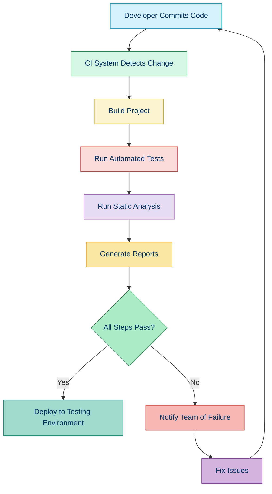

# 🔄 Continuous Integration

## 📚 Overview

Continuous Integration (CI) is a development practice where developers integrate their code changes into a shared repository frequently, preferably several times a day. Each integration is verified by automated builds and tests to detect problems early.

## 🎯 Benefits of Continuous Integration

- 🚀 **Early Bug Detection**: Find issues before they affect the rest of the team
- 🎭 **Reduced Integration Issues**: Smaller, more frequent integrations reduce merge conflicts
- ✅ **Automated Testing**: Ensures all tests are consistently run for every change
- 📊 **Code Quality Monitoring**: Track quality metrics over time
- 🛠️ **Consistent Build Process**: Everyone uses the same build process
- 👥 **Improved Team Collaboration**: Shared responsibility for code quality
- ⏱️ **Faster Release Cycles**: More confidence in making releases

## 🔄 The CI Process



## 🛠️ CI Tools for PHP Projects

| Tool | Type | Hosted/Self-Hosted | PHP Focus | Best For |
|------|------|-------------------|-----------|----------|
| [GitHub Actions](./06b-github-actions.md) | Cloud | Hosted | Medium | GitHub repositories |
| [GitLab CI/CD](https://docs.gitlab.com/ee/ci/) | Cloud | Both | Medium | GitLab repositories |
| [CircleCI](https://circleci.com/) | Cloud | Hosted | Medium | Complex workflows |
| [Jenkins](https://jenkins.io/) | Server | Self-hosted | Low | Custom infrastructure |
| [Travis CI](https://travis-ci.com/) | Cloud | Hosted | High | Open source projects |
| [Bitbucket Pipelines](https://bitbucket.org/product/features/pipelines) | Cloud | Hosted | Medium | Bitbucket repositories |

## 📋 Key Components of PHP CI Pipelines

### 1. Version Control Integration

CI systems connect to your repository to detect new commits:

```yaml
# GitHub Actions example
on:
  push:
    branches: [ main, develop ]
  pull_request:
    branches: [ main, develop ]
```

### 2. Environment Setup

Configure the PHP environment needed for your project:

```yaml
# GitHub Actions example
steps:
  - name: Setup PHP
    uses: shivammathur/setup-php@v2
    with:
      php-version: '8.1'
      extensions: mbstring, intl, pdo_mysql
      coverage: xdebug
```

### 3. Dependency Installation

Install your project's dependencies:

```yaml
# GitHub Actions example
- name: Install dependencies
  run: composer install --prefer-dist --no-progress
```

### 4. Build Process

Run any build tasks required by your project:

```yaml
# GitHub Actions example
- name: Build assets
  run: |
    npm install
    npm run build
```

### 5. Automated Testing

Run your test suite to verify functionality:

```yaml
# GitHub Actions example
- name: Run tests
  run: vendor/bin/phpunit
```

### 6. Code Quality Checks

Run static analysis and other quality checks:

```yaml
# GitHub Actions example
- name: Run PHPStan
  run: vendor/bin/phpstan analyse src tests
  
- name: Run PHP_CodeSniffer
  run: vendor/bin/phpcs src
```

### 7. Artifact Generation

Generate and store build artifacts:

```yaml
# GitHub Actions example
- name: Generate API documentation
  run: vendor/bin/phpdoc -d src -t build/docs
  
- name: Upload documentation artifact
  uses: actions/upload-artifact@v3
  with:
    name: api-docs
    path: build/docs
```

### 8. Deployment (for CD)

If the build and tests pass, deploy to a target environment:

```yaml
# GitHub Actions example
- name: Deploy to staging
  if: github.ref == 'refs/heads/develop' && success()
  run: |
    echo "${{ secrets.SSH_KEY }}" > deploy_key
    chmod 600 deploy_key
    ssh -i deploy_key user@staging.example.com 'cd /var/www/app && git pull'
```

## 🚀 Getting Started with CI

### Basic GitHub Actions Workflow for PHP

```yaml
name: PHP CI

on:
  push:
    branches: [ main ]
  pull_request:
    branches: [ main ]

jobs:
  build:
    runs-on: ubuntu-latest
    
    steps:
    - uses: actions/checkout@v3
    
    - name: Setup PHP
      uses: shivammathur/setup-php@v2
      with:
        php-version: '8.1'
        extensions: mbstring, intl
        coverage: xdebug
    
    - name: Validate composer.json
      run: composer validate --strict
    
    - name: Install dependencies
      run: composer install --prefer-dist --no-progress
    
    - name: Run static analysis
      run: composer run-script phpstan
    
    - name: Run coding standards check
      run: composer run-script phpcs
    
    - name: Run tests
      run: composer run-script test
```

### Basic GitLab CI Configuration

```yaml
stages:
  - test
  - analyze
  - build

cache:
  paths:
    - vendor/

test:
  stage: test
  image: php:8.1
  before_script:
    - apt-get update -yqq
    - apt-get install git unzip -yqq
    - curl -sS https://getcomposer.org/installer | php -- --install-dir=/usr/local/bin --filename=composer
    - composer install
  script:
    - vendor/bin/phpunit --coverage-text --colors=never

analyze:
  stage: analyze
  image: php:8.1
  before_script:
    - apt-get update -yqq
    - apt-get install git unzip -yqq
    - curl -sS https://getcomposer.org/installer | php -- --install-dir=/usr/local/bin --filename=composer
    - composer install
  script:
    - vendor/bin/phpstan analyse src tests
    - vendor/bin/phpcs src

build:
  stage: build
  image: php:8.1
  before_script:
    - apt-get update -yqq
    - apt-get install git unzip -yqq
    - curl -sS https://getcomposer.org/installer | php -- --install-dir=/usr/local/bin --filename=composer
    - composer install --no-dev
  script:
    - echo "Building app"
  artifacts:
    paths:
      - vendor/
      - public/
```

## 🧰 Best Practices for PHP CI

### 1. Fast Feedback Loop

Organize your CI pipeline for quick initial feedback:

```yaml
jobs:
  quick_checks:
    runs-on: ubuntu-latest
    steps:
      - uses: actions/checkout@v3
      - name: PHP Syntax Check
        run: find src -name "*.php" -exec php -l {} \;
      - name: Composer Validate
        run: composer validate
```

### 2. Matrix Testing

Test across multiple PHP versions and dependencies:

```yaml
jobs:
  test:
    runs-on: ubuntu-latest
    strategy:
      matrix:
        php-versions: ['7.4', '8.0', '8.1']
        dependencies: ['lowest', 'highest']
        
    steps:
    - uses: actions/checkout@v3
    - name: Setup PHP
      uses: shivammathur/setup-php@v2
      with:
        php-version: ${{ matrix.php-versions }}
    
    - name: Install dependencies (lowest)
      if: matrix.dependencies == 'lowest'
      run: composer update --prefer-lowest --prefer-stable --no-interaction
      
    - name: Install dependencies (highest)
      if: matrix.dependencies == 'highest'
      run: composer update --no-interaction
      
    - name: Run tests
      run: vendor/bin/phpunit
```

### 3. Caching Dependencies

Cache dependencies to speed up builds:

```yaml
- name: Get composer cache directory
  id: composer-cache
  run: echo "dir=$(composer config cache-files-dir)" >> $GITHUB_OUTPUT

- name: Cache dependencies
  uses: actions/cache@v3
  with:
    path: ${{ steps.composer-cache.outputs.dir }}
    key: ${{ runner.os }}-composer-${{ hashFiles('**/composer.lock') }}
    restore-keys: ${{ runner.os }}-composer-
```

### 4. Parallel Jobs

Run independent tasks in parallel:

```yaml
jobs:
  tests:
    runs-on: ubuntu-latest
    steps:
      # Run PHPUnit tests
  
  static_analysis:
    runs-on: ubuntu-latest
    steps:
      # Run PHPStan
  
  coding_standards:
    runs-on: ubuntu-latest
    steps:
      # Run PHP_CodeSniffer
```

### 5. Quality Gates

Enforce quality standards before merging:

```yaml
- name: Check code coverage
  run: |
    COVERAGE=$(vendor/bin/phpunit --coverage-text | grep "Lines" | awk '{ print $2 }' | sed 's/%//')
    if (( $(echo "$COVERAGE < 80" | bc -l) )); then
      echo "Code coverage is below 80% ($COVERAGE%)"
      exit 1
    fi
```

## 📈 Monitoring and Reporting

### 1. Test Results

Publish test results for better visibility:

```yaml
- name: Run tests
  run: vendor/bin/phpunit --log-junit test-results.xml
  
- name: Publish test results
  uses: EnricoMi/publish-unit-test-result-action@v2
  with:
    files: test-results.xml
```

### 2. Code Coverage

Generate and publish code coverage reports:

```yaml
- name: Generate coverage report
  run: XDEBUG_MODE=coverage vendor/bin/phpunit --coverage-clover coverage.xml
  
- name: Upload coverage to Codecov
  uses: codecov/codecov-action@v3
  with:
    files: coverage.xml
```

### 3. Static Analysis

Share static analysis results:

```yaml
- name: Run PHPStan with GitHub annotations
  uses: staabm/annotate-pull-request-from-checkstyle@v1
  with:
    tool-name: PHPStan
    checkstyle-file: ./phpstan-results.xml
    only-pr-files: true
```

## 🔍 In-Depth CI Topics

For more detailed information, check out these specific guides:

- [CI/CD Workflows](./06a-ci-workflows.md) - Design patterns for CI/CD workflows
- [GitHub Actions for PHP](./06b-github-actions.md) - Detailed GitHub Actions configurations for PHP
- [Quality Gates](./06c-quality-gates.md) - Enforcing quality standards in CI

## 🧭 Navigation

- [← Back to Security Best Practices](./06-security-best-practices.md)
- [→ CI/CD Workflows](./06a-ci-workflows.md)

## 📚 Further Reading

- [Continuous Integration: Improving Software Quality and Reducing Risk](https://martinfowler.com/articles/continuousIntegration.html)
- [GitHub Actions Documentation](https://docs.github.com/en/actions)
- [GitLab CI/CD Documentation](https://docs.gitlab.com/ee/ci/)
- [Jenkins Documentation](https://www.jenkins.io/doc/)
- [Travis CI Documentation](https://docs.travis-ci.com/)
