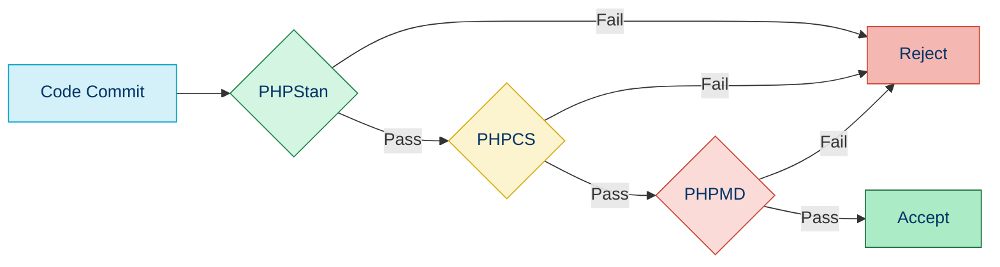

# 🚦 Quality Gates

## 📚 Overview

Quality Gates are checkpoints in your development workflow that enforce predefined quality criteria. Code can only progress to the next stage (e.g., from development to testing or from testing to production) if it passes all the defined quality gates.

## 🎯 Purpose of Quality Gates

- ✅ **Prevent Low-Quality Code**: Block code that doesn't meet standards
- 🛡️ **Protect Critical Environments**: Ensure only high-quality code reaches production
- 📊 **Measure Code Quality**: Provide objective metrics for code quality
- 🔄 **Enforce Continuous Improvement**: Set increasingly stricter standards over time
- 👥 **Create Team Accountability**: Everyone is responsible for code quality

## 🚧 Types of Quality Gates

### 1️⃣ Static Analysis Gates

These gates analyze code without executing it, checking for potential bugs, code style issues, and other quality metrics.



#### Example: PHPStan Gate

```yaml
# GitHub Actions workflow
- name: PHPStan Quality Gate
  run: |
    vendor/bin/phpstan analyse src --level=5 --no-progress --error-format=github
    if [ $? -ne 0 ]; then
      echo "PHPStan quality gate failed"
      exit 1
    fi
```

#### Example: PHPCS Gate

```yaml
# GitHub Actions workflow
- name: PHPCS Quality Gate
  run: |
    vendor/bin/phpcs --standard=PSR12 src
    if [ $? -ne 0 ]; then
      echo "PHPCS quality gate failed"
      exit 1
    fi
```

### 2️⃣ Testing Gates

These gates ensure that tests pass with sufficient coverage.

#### Example: PHPUnit Gate with Coverage

```yaml
# GitHub Actions workflow
- name: PHPUnit Quality Gate
  run: |
    XDEBUG_MODE=coverage vendor/bin/phpunit --coverage-text --coverage-clover=coverage.xml
    COVERAGE=$(cat coverage.xml | grep -o 'line-rate="[0-9]\.[0-9]*"' | grep -o '[0-9]\.[0-9]*')
    COVERAGE_PERCENTAGE=$(echo "$COVERAGE * 100" | bc)
    echo "Code coverage: ${COVERAGE_PERCENTAGE}%"
    if (( $(echo "$COVERAGE_PERCENTAGE < 80" | bc -l) )); then
      echo "Coverage is below 80%"
      exit 1
    fi
```

### 3️⃣ Security Gates

These gates scan for security vulnerabilities and fail if issues are found.

#### Example: Composer Audit Gate

```yaml
# GitHub Actions workflow
- name: Security Quality Gate
  run: |
    composer audit
    if [ $? -ne 0 ]; then
      echo "Security vulnerabilities found in dependencies"
      exit 1
    fi
```

#### Example: PHP Security Checker

```yaml
# GitHub Actions workflow
- name: Security Check
  uses: symfonycorp/security-checker-action@v4
  with:
    lock: composer.lock
```

### 4️⃣ Performance Gates

These gates measure and enforce performance metrics.

#### Example: Performance Testing Gate

```yaml
# GitHub Actions workflow
- name: Performance Quality Gate
  run: |
    vendor/bin/phpbench run --report=aggregate --progress=dots
    RESULT=$?
    if [ $RESULT -ne 0 ]; then
      echo "Performance benchmarks failed"
      exit 1
    fi
    
    # Check if any test is 20% slower than baseline
    vendor/bin/phpbench run --report=aggregate --progress=dots | grep -q "20%"
    if [ $? -eq 0 ]; then
      echo "Performance regression detected"
      exit 1
    fi
```

## 🔧 Implementing Quality Gates in CI/CD

### GitHub Actions Implementation

```yaml
name: Quality Gates

on:
  pull_request:
    branches: [ main, develop ]

jobs:
  quality-gates:
    runs-on: ubuntu-latest
    
    steps:
    - uses: actions/checkout@v3
    
    - name: Setup PHP
      uses: shivammathur/setup-php@v2
      with:
        php-version: '8.1'
        coverage: xdebug
        tools: composer:v2, phpunit, phpstan, phpcs, phpmd
    
    - name: Install dependencies
      run: composer install --prefer-dist --no-progress

    # Gate 1: Syntax Check
    - name: Syntax Check
      run: |
        echo "Running PHP syntax check..."
        find src -type f -name "*.php" -exec php -l {} \; | (! grep -v "No syntax errors detected")
        if [ ${PIPESTATUS[1]} -eq 0 ]; then
          echo "Syntax errors found!"
          exit 1
        fi
    
    # Gate 2: Code Style
    - name: Code Style Check
      run: |
        echo "Running code style check..."
        vendor/bin/phpcs --standard=PSR12 src
    
    # Gate 3: Static Analysis
    - name: Static Analysis
      run: |
        echo "Running static analysis..."
        vendor/bin/phpstan analyse src --level=5
    
    # Gate 4: Unit Tests
    - name: Unit Tests
      run: |
        echo "Running unit tests..."
        XDEBUG_MODE=coverage vendor/bin/phpunit --coverage-text --coverage-clover=coverage.xml
    
    # Gate 5: Code Coverage
    - name: Code Coverage Check
      run: |
        echo "Checking code coverage..."
        COVERAGE=$(grep -o 'lines: [0-9\.]*' coverage.xml | grep -o '[0-9\.]*')
        COVERAGE_PERCENTAGE=$(echo "$COVERAGE * 100" | bc)
        echo "Code coverage: ${COVERAGE_PERCENTAGE}%"
        
        if (( $(echo "$COVERAGE_PERCENTAGE < 80" | bc -l) )); then
          echo "Coverage is below 80%"
          exit 1
        fi
    
    # Gate 6: Security Check
    - name: Security Check
      run: |
        echo "Running security checks..."
        composer audit --no-dev
```

### GitLab CI Implementation

```yaml
stages:
  - quality
  - test
  - deploy

variables:
  MINIMUM_COVERAGE: 80

syntax-check:
  stage: quality
  script:
    - find src -type f -name "*.php" -exec php -l {} \; | (! grep -v "No syntax errors detected")
    - if [ ${PIPESTATUS[1]} -eq 0 ]; then exit 1; fi

code-style:
  stage: quality
  script:
    - vendor/bin/phpcs --standard=PSR12 src

static-analysis:
  stage: quality
  script:
    - vendor/bin/phpstan analyse src --level=5

unit-tests:
  stage: test
  script:
    - vendor/bin/phpunit --coverage-text --coverage-clover=coverage.xml
  artifacts:
    paths:
      - coverage.xml

coverage-check:
  stage: test
  needs:
    - unit-tests
  script:
    - COVERAGE=$(grep -o 'lines: [0-9\.]*' coverage.xml | grep -o '[0-9\.]*')
    - COVERAGE_PERCENTAGE=$(echo "$COVERAGE * 100" | bc)
    - echo "Code coverage is ${COVERAGE_PERCENTAGE}%"
    - |
      if (( $(echo "$COVERAGE_PERCENTAGE < $MINIMUM_COVERAGE" | bc -l) )); then
        echo "Coverage is below ${MINIMUM_COVERAGE}%"
        exit 1
      fi

security-check:
  stage: test
  script:
    - composer audit --no-dev

deploy:
  stage: deploy
  script:
    - echo "Deploying application..."
  only:
    - main
  when: on_success
```

## 📈 Visualizing Quality Gates

### SonarQube Quality Gate

SonarQube provides a comprehensive quality gate system that can be integrated with your CI/CD pipeline:

```yaml
# GitHub Actions with SonarQube
- name: SonarQube Scan
  uses: SonarSource/sonarqube-scan-action@master
  env:
    SONAR_TOKEN: ${{ secrets.SONAR_TOKEN }}
    SONAR_HOST_URL: ${{ secrets.SONAR_HOST_URL }}
  with:
    args: >
      -Dsonar.projectKey=my-php-project
      -Dsonar.php.coverage.reportPaths=coverage.xml
      -Dsonar.php.tests.reportPath=test-report.xml

- name: SonarQube Quality Gate check
  uses: sonarsource/sonarqube-quality-gate-action@master
  # Force to fail step after specific time
  timeout-minutes: 5
  env:
    SONAR_TOKEN: ${{ secrets.SONAR_TOKEN }}
    SONAR_HOST_URL: ${{ secrets.SONAR_HOST_URL }}
```

### Quality Gate Badges

Add quality gate status badges to your README for visibility:

```markdown
[]()
[]()
[]()
```

## 🧰 Quality Gate Tools for PHP Projects

| Tool | Purpose | Configuration |
|------|---------|--------------|
| [PHPStan](https://phpstan.org/) | Static analysis | `phpstan.neon` |
| [PHP_CodeSniffer](https://github.com/squizlabs/PHP_CodeSniffer) | Code style | `phpcs.xml` |
| [PHP Mess Detector](https://phpmd.org/) | Code quality | `phpmd.xml` |
| [PHPUnit](https://phpunit.de/) | Testing | `phpunit.xml` |
| [PHP Copy/Paste Detector](https://github.com/sebastianbergmann/phpcpd) | Duplicate code | Command line args |
| [Psalm](https://psalm.dev/) | Type checking | `psalm.xml` |
| [SonarQube](https://www.sonarqube.org/) | Comprehensive analysis | `sonar-project.properties` |
| [Codecov](https://about.codecov.io/) | Coverage reporting | `.codecov.yml` |

## 🚀 Best Practices for Quality Gates

### 1. Start Simple and Gradually Increase

Begin with basic quality gates and gradually increase standards:

```yaml
# Phase 1: Basic gates
- name: PHPStan Level 3
  run: vendor/bin/phpstan analyse src --level=3

# Later, in Phase 2
- name: PHPStan Level 5
  run: vendor/bin/phpstan analyse src --level=5

# Eventually, in Phase 3
- name: PHPStan Level 8
  run: vendor/bin/phpstan analyse src --level=8
```

### 2. Define Quality Thresholds in Configuration

Store quality thresholds in configuration files:

```yaml
# quality-gates.yml
thresholds:
  coverage:
    lines: 80
    classes: 90
    methods: 85
  complexity:
    max_per_method: 15
    max_per_class: 50
  duplication:
    max_percentage: 5
```

### 3. Document Quality Gate Requirements

Create clear documentation for your quality gates:

```markdown
# Quality Gate Requirements

## Code Coverage
- Minimum line coverage: 80%
- Minimum class coverage: 90%
- Minimum method coverage: 85%

## Static Analysis
- PHPStan Level: 5
- No PHP_CodeSniffer warnings or errors (PSR-12)
- No PHP Mess Detector warnings

## Performance
- No performance regression > 5%
- Maximum execution time: 100ms for unit tests
```

### 4. Make Quality Gate Results Visible

Share quality gate results with the team:

```yaml
- name: Generate quality report
  run: |
    echo "# Quality Gate Results" > quality-report.md
    echo "## Code Coverage" >> quality-report.md
    echo "$(vendor/bin/phpunit --coverage-text | grep -A5 "Summary")" >> quality-report.md
    echo "## Static Analysis" >> quality-report.md
    echo "PHPStan Level: 5 ✅" >> quality-report.md
    echo "PHPCS: PSR-12 ✅" >> quality-report.md

- name: Upload quality report
  uses: actions/upload-artifact@v3
  with:
    name: quality-report
    path: quality-report.md
```

### 5. Define Quality Gate Ownership

Clearly define who is responsible for maintaining quality gates:

```yaml
# CODEOWNERS file
/.github/workflows/quality-gates.yml @quality-team
/phpstan.neon @senior-developers
/phpcs.xml @coding-standard-owners
/tests/ @test-team
```

## 🔍 Handling Quality Gate Failures

### Providing Clear Feedback

When a quality gate fails, provide clear feedback about what failed and how to fix it:

```yaml
- name: PHPStan Quality Gate
  id: phpstan
  run: |
    vendor/bin/phpstan analyse src --error-format=github || {
      echo "::error::PHPStan quality gate failed. Please fix the errors above."
      echo "::error::For help, see: https://phpstan.org/user-guide/getting-started"
      exit 1
    }
```

### Allowing Temporary Exceptions

Sometimes you need to temporarily bypass a quality gate:

```yaml
- name: PHPStan Quality Gate
  if: ${{ !contains(github.event.head_commit.message, '[skip-phpstan]') }}
  run: vendor/bin/phpstan analyse src --level=5
```

## 🧭 Navigation

- [← Back to GitHub Actions](./06b-github-actions.md)
- [→ Back to Code Quality Index](./README.md)

## 📚 Further Reading

- [SonarQube Quality Gates Documentation](https://docs.sonarqube.org/latest/user-guide/quality-gates/)
- [Continuous Inspection with Quality Gates](https://www.thoughtworks.com/insights/blog/continuous-inspection-quality-gates-continuous-delivery)
- [Quality Gates in DevOps](https://www.atlassian.com/continuous-delivery/principles/quality-gates)
- [Code Quality Metrics Explained](https://www.perforce.com/blog/sca/what-code-quality-understanding-software-quality-metrics)
- [Implementing Gates in CI/CD Pipelines](https://www.jetbrains.com/teamcity/ci-cd-guide/concepts/quality-gates/)
