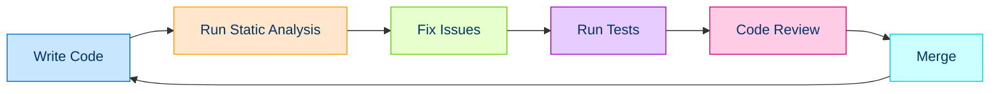

# 🏆 Code Quality and Standards in PHP

This section covers essential aspects of maintaining high-quality PHP code through standards, tools, and practices.

## 📚 Overview

Writing clean, maintainable, and robust PHP code requires following established standards and using the right tools for analysis, testing, and continuous improvement. This section explores various aspects of code quality in PHP development.

## 📋 Topics Covered

### 1. [Coding Standards](./01-coding-standards.md) 📏
   - [PSR Standards Overview](./01a-psr-standards.md)
   - [PSR-1: Basic Coding Standard](./01b-psr-1.md)
   - [PSR-12: Extended Coding Style](./01c-psr-12.md)
   - [PSR-4: Autoloading Standard](./01d-psr-4.md)

### 2. [Code Analysis Tools](./02-code-analysis-tools.md) 🔍
   - [Static Analysis Tools](./02-static-analysis.md)
   - [Static Analysis with PHPStan](./02a-phpstan.md)
   - [PHP_CodeSniffer (PHPCS)](./02b-phpcs.md)
   - [PHP Mess Detector (PHPMD)](./02c-phpmd.md)
   - [PHP Insights](./02d-php-insights.md)

### 3. [Testing Practices](./03-testing-practices.md) ✅
   - [Unit Testing with PHPUnit](./03a-phpunit.md)
   - [Test-Driven Development](./03b-tdd.md)
   - [Behavior-Driven Development](./03c-bdd.md)
   - [Mocking and Test Doubles](./03d-mocking.md)

### 4. [Code Improvement](./04-code-improvement.md) 🛠️
   - [Refactoring Principles](./04a-refactoring-principles.md)
   - [Common Code Smells](./04b-code-smells.md)
   - [Refactoring Techniques](./04c-refactoring-techniques.md)

### 5. [Debugging and Profiling](./05-debugging-profiling.md) 🐛
   - [PHP Debugging Techniques](./05a-debugging-strategies.md)
   - [Xdebug](./05b-xdebug.md)
   - [Performance Profiling](./05c-profiling.md)

### 6. [Continuous Integration](./06-continuous-integration.md) 🔄
   - [CI Workflows for PHP](./06a-ci-workflows.md)
   - [GitHub Actions for PHP](./06b-github-actions.md)
   - [Quality Gates](./06c-quality-gates.md)

## ⭐ Why Code Quality Matters

High-quality code results in:
- ✅ **Fewer bugs**
- 🧩 **Easier maintenance**
- 👥 **Better collaboration** between developers
- 🌱 **More sustainable** software projects

By adopting standards and best practices, you can significantly improve your codebase's quality and longevity.

## 🔄 Code Quality Workflow

## 🧰 Recommended Tools Overview

| Tool | Purpose | Integration | Difficulty |
|------|---------|-------------|------------|
| 🔍 **PHPCS** | Coding standards enforcement | CLI, IDE, CI/CD | ⭐⭐ |
| 🔎 **PHPMD** | Code quality analysis | CLI, IDE, CI/CD | ⭐⭐⭐ |
| 🕵️ **PHPStan** | Static analysis | CLI, IDE, CI/CD | ⭐⭐⭐ |
| 📊 **Psalm** | Static analysis | CLI, IDE, CI/CD | ⭐⭐⭐ |
| ✅ **PHPUnit** | Testing | CLI, CI/CD | ⭐⭐⭐ |
| 🧹 **PHP-CS-Fixer** | Automatically fix code style | CLI, IDE, CI/CD | ⭐⭐ |
| 🐞 **Xdebug** | Debugging and profiling | PHP Extension, IDE | ⭐⭐⭐⭐ |

Each topic in this section will provide practical examples of how to implement these standards and tools in your PHP projects.

---

## 🧭 Navigation

- [← Main PHP OOP Learning Path](../README.md)
- [→ Coding Standards](./01-coding-standards.md)

## 📚 Further Reading

- [PHP: The Right Way - Code Style Guide](https://phptherightway.com/#code_style_guide)
- [PHP-FIG: PHP Standards Recommendations](https://www.php-fig.org/psr/)
- [Clean Code: A Handbook of Agile Software Craftsmanship](https://www.amazon.com/Clean-Code-Handbook-Software-Craftsmanship/dp/0132350882)
- [Laravel Best Practices](https://github.com/alexeymezenin/laravel-best-practices)
